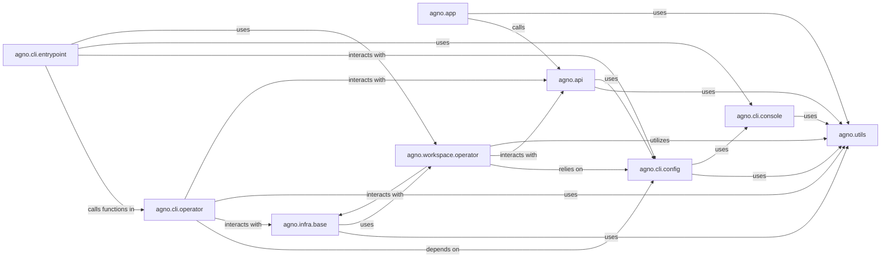

## Component Details

This component provides the external interfaces for interacting with the Agno system, encompassing how users and external systems access, configure, and deploy Agno applications. It integrates web APIs, chat platform integrations, and command-line tools for comprehensive project and infrastructure management.

### agno.app
This component provides the core framework for building and serving various application types within Agno, including web APIs (FastAPI, AGUI) and chat platform integrations (Slack, WhatsApp). It defines the `BaseAPIApp` for common functionalities like initialization, serving, and registration with the Agno platform. Its subclasses (`FastAPIApp`, `SlackAPI`, `WhatsappAPI`, `AGUIApp`) represent concrete application types.

**Related Classes/Methods**:

- <a href="https://github.com/agno-agi/agno/blob/master/libs/agno/agno/app/base.py#L0-L0" target="_blank" rel="noopener noreferrer">`agno.app.base` (0:0)</a>
- <a href="https://github.com/agno-agi/agno/blob/master/libs/agno/agno/app/fastapi/app.py#L0-L0" target="_blank" rel="noopener noreferrer">`agno.app.fastapi.app` (0:0)</a>
- <a href="https://github.com/agno-agi/agno/blob/master/libs/agno/agno/app/slack/app.py#L0-L0" target="_blank" rel="noopener noreferrer">`agno.app.slack.app` (0:0)</a>
- <a href="https://github.com/agno-agi/agno/blob/master/libs/agno/agno/app/whatsapp/app.py#L0-L0" target="_blank" rel="noopener noreferrer">`agno.app.whatsapp.app` (0:0)</a>
- <a href="https://github.com/agno-agi/agno/blob/master/libs/agno/agno/app/agui/app.py#L0-L0" target="_blank" rel="noopener noreferrer">`agno.app.agui.app` (0:0)</a>

### agno.cli.entrypoint
This module acts as the primary command-line interface for the Agno system, parsing user commands and orchestrating their execution. It defines and dispatches various CLI operations for system setup, initialization, resource management (start, stop, patch, restart), and configuration.

**Related Classes/Methods**:

- <a href="https://github.com/agno-agi/agno/blob/master/libs/agno/agno/cli/entrypoint.py#L0-L0" target="_blank" rel="noopener noreferrer">`agno.cli.entrypoint` (0:0)</a>

### agno.cli.operator
This component implements the core operational logic for CLI commands, handling the initialization of the Agno environment and managing system resources. It interacts with configuration, infrastructure, and workspace components to execute tasks like starting, stopping, and patching resources.

**Related Classes/Methods**:

- <a href="https://github.com/agno-agi/agno/blob/master/libs/agno/agno/cli/operator.py#L0-L0" target="_blank" rel="noopener noreferrer">`agno.cli.operator` (0:0)</a>

### agno.workspace.operator
This component is responsible for the complete lifecycle management of user workspaces within Agno. It provides functionalities for creating, setting up, starting, stopping, updating, deleting, and activating workspaces, serving as a central hub for user project management.

**Related Classes/Methods**:

- <a href="https://github.com/agno-agi/agno/blob/master/libs/agno/agno/workspace/operator.py#L0-L0" target="_blank" rel="noopener noreferrer">`agno.workspace.operator` (0:0)</a>

### agno.infra.base
This foundational component offers base utilities for interacting with the project's infrastructure, particularly for managing files, configurations, and secrets within the workspace. It provides an abstraction layer for infrastructure-related operations, with specialized subclasses (`InfraApp`, `DbApp`, `InfraResource`, `InfraResources`) for applications, databases, and general resources.

**Related Classes/Methods**:

- <a href="https://github.com/agno-agi/agno/blob/master/libs/agno/agno/infra/base.py#L0-L0" target="_blank" rel="noopener noreferrer">`agno.infra.base` (0:0)</a>
- <a href="https://github.com/agno-agi/agno/blob/master/libs/agno/agno/infra/app.py#L0-L0" target="_blank" rel="noopener noreferrer">`agno.infra.app` (0:0)</a>
- <a href="https://github.com/agno-agi/agno/blob/master/libs/agno/agno/infra/db_app.py#L0-L0" target="_blank" rel="noopener noreferrer">`agno.infra.db_app` (0:0)</a>
- <a href="https://github.com/agno-agi/agno/blob/master/libs/agno/agno/infra/resource.py#L0-L0" target="_blank" rel="noopener noreferrer">`agno.infra.resource` (0:0)</a>
- <a href="https://github.com/agno-agi/agno/blob/master/libs/agno/agno/infra/resources.py#L0-L0" target="_blank" rel="noopener noreferrer">`agno.infra.resources` (0:0)</a>

### agno.api
This component serves as the client for interacting with the external Agno platform API. It encapsulates the logic for various platform services, including application creation, user management, workspace operations, and schema definitions for API communication. It includes sub-modules like `agno.api.app`, `agno.api.user`, and `agno.api.workspace`.

**Related Classes/Methods**:

- `agno.api` (0:0)
- <a href="https://github.com/agno-agi/agno/blob/master/libs/agno/agno/api/app.py#L0-L0" target="_blank" rel="noopener noreferrer">`agno.api.app` (0:0)</a>
- <a href="https://github.com/agno-agi/agno/blob/master/libs/agno/agno/api/user.py#L0-L0" target="_blank" rel="noopener noreferrer">`agno.api.user` (0:0)</a>
- <a href="https://github.com/agno-agi/agno/blob/master/libs/agno/agno/api/workspace.py#L0-L0" target="_blank" rel="noopener noreferrer">`agno.api.workspace` (0:0)</a>

### agno.cli.config
This component is dedicated to managing the configuration settings for the Agno CLI. It handles the loading, saving, and updating of configuration data, particularly concerning workspace settings and overall CLI behavior.

**Related Classes/Methods**:

- <a href="https://github.com/agno-agi/agno/blob/master/libs/agno/agno/cli/config.py#L0-L0" target="_blank" rel="noopener noreferrer">`agno.cli.config` (0:0)</a>

### agno.cli.console
This utility component standardizes and manages all command-line console output for the Agno CLI. It provides functions for displaying informational messages, headings, subheadings, and error messages to the user, ensuring consistent communication.

**Related Classes/Methods**:

- <a href="https://github.com/agno-agi/agno/blob/master/libs/agno/agno/cli/console.py#L0-L0" target="_blank" rel="noopener noreferrer">`agno.cli.console` (0:0)</a>

### agno.utils
This comprehensive collection provides general-purpose utility functions utilized across various Agno components. It includes functionalities for logging, common data manipulations, file system operations, Git interactions, JSON/YAML I/O, environment variable loading, and project metadata handling.

**Related Classes/Methods**:

- `agno.utils` (0:0)

### [FAQ](https://github.com/CodeBoarding/GeneratedOnBoardings/tree/main?tab=readme-ov-file#faq)