```mermaid
graph LR
    AgentKnowledge["AgentKnowledge"]
    Reader["Reader"]
    ChunkingStrategy["ChunkingStrategy"]
    Embedder["Embedder"]
    VectorDb["VectorDb"]
    Memory["Memory"]
    MemoryManager["MemoryManager"]
    MemoryDb["MemoryDb"]
    Models["Models"]
    KnowledgeTools["KnowledgeTools"]
    AgentKnowledge -- "utilizes" --> Reader
    AgentKnowledge -- "stores and retrieves from" --> VectorDb
    Reader -- "passes content to" --> ChunkingStrategy
    Reader -- "provides data to" --> AgentKnowledge
    ChunkingStrategy -- "utilizes" --> Embedder
    ChunkingStrategy -- "outputs chunks to" --> AgentKnowledge
    Embedder -- "interacts with" --> Models
    Embedder -- "provides embeddings to" --> VectorDb
    VectorDb -- "receives and stores embeddings from" --> AgentKnowledge
    VectorDb -- "returns search results to" --> AgentKnowledge
    Memory -- "relies on" --> MemoryManager
    Memory -- "interacts with" --> Models
    MemoryManager -- "interacts with" --> MemoryDb
    MemoryManager -- "is utilized by" --> Memory
    MemoryDb -- "stores data from" --> MemoryManager
    MemoryDb -- "retrieves data for" --> MemoryManager
    Models -- "are utilized by" --> Embedder
    Models -- "are utilized by" --> Memory
    KnowledgeTools -- "queries" --> AgentKnowledge
    KnowledgeTools -- "provides interface for" --> Agent
    click Memory href "https://github.com/CodeBoarding/GeneratedOnBoardings/blob/main//agno/Memory.md" "Details"
```

## Component Details

The `Knowledge & Memory Management` subsystem is critical for enabling agents and teams to ingest, process, store, and retrieve information, as well as manage their conversational and long-term memories. This overview identifies the core components that facilitate these capabilities, explaining their purpose and interactions.

### AgentKnowledge
The central orchestrator for knowledge management. It coordinates the ingestion process (reading, chunking, embedding) and facilitates the retrieval of relevant knowledge for agents. It provides methods to add documents, search the knowledge base, and manage knowledge sources.

**Related Classes/Methods**:

- <a href="https://github.com/agno-agi/agno/blob/master/libs/agno/agno/knowledge/agent.py#L14-L665" target="_blank" rel="noopener noreferrer">`agno.knowledge.agent.AgentKnowledge` (14:665)</a>

### Reader
Defines the interface for reading and loading content from various sources (e.g., PDF, CSV, Markdown, URLs). Concrete implementations handle specific file types or data origins, providing the initial input for knowledge ingestion.

**Related Classes/Methods**:

- <a href="https://github.com/agno-agi/agno/blob/master/libs/agno/agno/document/reader/base.py#L10-L53" target="_blank" rel="noopener noreferrer">`agno.document.reader.base.Reader` (10:53)</a>

### ChunkingStrategy
Defines the interface for breaking down large documents into smaller, manageable "chunks" suitable for embedding and retrieval. Various strategies implement different chunking logic to optimize for search and context.

**Related Classes/Methods**:

- <a href="https://github.com/agno-agi/agno/blob/master/libs/agno/agno/document/chunking/strategy.py#L6-L30" target="_blank" rel="noopener noreferrer">`agno.document.chunking.strategy.ChunkingStrategy` (6:30)</a>

### Embedder
Defines the interface for converting text chunks into numerical vector representations (embeddings). These embeddings are crucial for enabling semantic search and similarity comparisons within vector databases.

**Related Classes/Methods**:

- <a href="https://github.com/agno-agi/agno/blob/master/libs/agno/agno/embedder/base.py#L5-L14" target="_blank" rel="noopener noreferrer">`agno.embedder.base.Embedder` (5:14)</a>

### VectorDb
Defines the interface for interacting with vector databases. This includes storing document embeddings and their associated metadata, as well as performing similarity searches to retrieve relevant information based on vector proximity.

**Related Classes/Methods**:

- <a href="https://github.com/agno-agi/agno/blob/master/libs/agno/agno/vectordb/base.py#L6-L95" target="_blank" rel="noopener noreferrer">`agno.vectordb.base.VectorDb` (6:95)</a>

### Memory
The core component for managing the long-term and short-term memory of agents and teams. It provides a higher-level interface for interacting with memory, including adding new memories, retrieving relevant memories, and potentially summarizing conversational history.

**Related Classes/Methods**:

- <a href="https://github.com/agno-agi/agno/blob/master/libs/agno/agno/memory/v2/memory.py#L80-L1112" target="_blank" rel="noopener noreferrer">`agno.memory.v2.memory.Memory` (80:1112)</a>

### MemoryManager
Handles the low-level operations of storing, retrieving, and managing individual memory entries. It abstracts the underlying database details, providing a consistent interface for memory persistence.

**Related Classes/Methods**:

- <a href="https://github.com/agno-agi/agno/blob/master/libs/agno/agno/memory/v2/manager.py#L15-L436" target="_blank" rel="noopener noreferrer">`agno.memory.v2.manager.MemoryManager` (15:436)</a>

### MemoryDb
Defines the abstract interface for persistent storage of memory data. Concrete implementations provide support for various databases (e.g., SQLite, PostgreSQL, MongoDB), ensuring memory data is durable.

**Related Classes/Methods**:

- <a href="https://github.com/agno-agi/agno/blob/master/libs/agno/agno/memory/v2/db/base.py#L6-L41" target="_blank" rel="noopener noreferrer">`agno.memory.v2.db.base.MemoryDb` (6:41)</a>

### Models
Represents the underlying large language models (LLMs) used across the system. In this subsystem, they are crucial for generating embeddings (via `Embedder`) and for advanced memory operations like summarization or classification (via `Memory`).

**Related Classes/Methods**:

- <a href="https://github.com/agno-agi/agno/blob/master/libs/agno/agno/models/base.py#L225-L1668" target="_blank" rel="noopener noreferrer">`agno.models.base.Model` (225:1668)</a>

### KnowledgeTools
Exposes knowledge management functionalities as callable tools for agents. This allows agents to programmatically interact with the knowledge base, for example, to search for information or add new documents. (`Mem0Tools` serves a parallel function for memory).

**Related Classes/Methods**:

- <a href="https://github.com/agno-agi/agno/blob/master/libs/agno/agno/tools/knowledge.py#L12-L218" target="_blank" rel="noopener noreferrer">`agno.tools.knowledge.KnowledgeTools` (12:218)</a>

### [FAQ](https://github.com/CodeBoarding/GeneratedOnBoardings/tree/main?tab=readme-ov-file#faq)