```mermaid
graph LR
    agno_models_base_Model["agno.models.base.Model"]
    agno_models_openai_chat_OpenAIChat["agno.models.openai.chat.OpenAIChat"]
    agno_models_google_gemini_Gemini["agno.models.google.gemini.Gemini"]
    agno_models_anthropic_claude_Claude["agno.models.anthropic.claude.Claude"]
    agno_models_openai_like_OpenAILike["agno.models.openai.like.OpenAILike"]
    agno_models_message_Message["agno.models.message.Message"]
    agno_models_response_ModelResponse["agno.models.response.ModelResponse"]
    AwsBedrock["AwsBedrock"]
    Cohere["Cohere"]
    HuggingFace["HuggingFace"]
    LiteLLM["LiteLLM"]
    MistralChat["MistralChat"]
    Ollama["Ollama"]
    OpenAIResponses["OpenAIResponses"]
    Llama["Llama"]
    Cerebras["Cerebras"]
    Groq["Groq"]
    IBM_WatsonX["IBM WatsonX"]
    Azure_AI_Foundry["Azure AI Foundry"]
    AIMLApi["AIMLApi"]
    AzureOpenAI["AzureOpenAI"]
    CerebrasOpenAI["CerebrasOpenAI"]
    DeepInfra["DeepInfra"]
    DeepSeek["DeepSeek"]
    Fireworks["Fireworks"]
    InternLM["InternLM"]
    LangDB["LangDB"]
    LiteLLMOpenAI["LiteLLMOpenAI"]
    LMStudio["LMStudio"]
    LlamaOpenAI["LlamaOpenAI"]
    Nebius["Nebius"]
    Nvidia["Nvidia"]
    OpenRouter["OpenRouter"]
    Perplexity["Perplexity"]
    Sambanova["Sambanova"]
    Together["Together"]
    Vercel_v0["Vercel v0"]
    vLLM["vLLM"]
    xAI["xAI"]
    agno_media_ImageArtifact["agno.media.ImageArtifact"]
    agno_media_AudioResponse["agno.media.AudioResponse"]
    agno_models_base_Model -- "Inherited by" --> agno_models_openai_chat_OpenAIChat
    agno_models_base_Model -- "Inherited by" --> agno_models_google_gemini_Gemini
    agno_models_base_Model -- "Inherited by" --> agno_models_anthropic_claude_Claude
    agno_models_base_Model -- "Inherited by" --> AwsBedrock
    agno_models_base_Model -- "Inherited by" --> Cohere
    agno_models_base_Model -- "Inherited by" --> HuggingFace
    agno_models_base_Model -- "Inherited by" --> LiteLLM
    agno_models_base_Model -- "Inherited by" --> MistralChat
    agno_models_base_Model -- "Inherited by" --> Ollama
    agno_models_base_Model -- "Inherited by" --> OpenAIResponses
    agno_models_base_Model -- "Inherited by" --> Llama
    agno_models_base_Model -- "Inherited by" --> Cerebras
    agno_models_base_Model -- "Inherited by" --> Groq
    agno_models_base_Model -- "Inherited by" --> IBM_WatsonX
    agno_models_base_Model -- "Inherited by" --> Azure_AI_Foundry
    agno_models_base_Model -- "interacts with" --> agno_models_message_Message
    agno_models_base_Model -- "interacts with" --> agno_models_response_ModelResponse
    agno_models_openai_chat_OpenAIChat -- "inherits from" --> agno_models_base_Model
    agno_models_openai_chat_OpenAIChat -- "inherited by" --> agno_models_openai_like_OpenAILike
    agno_models_openai_chat_OpenAIChat -- "interacts with" --> agno_models_message_Message
    agno_models_openai_chat_OpenAIChat -- "interacts with" --> agno_models_response_ModelResponse
    agno_models_google_gemini_Gemini -- "inherits from" --> agno_models_base_Model
    agno_models_google_gemini_Gemini -- "interacts with" --> agno_models_message_Message
    agno_models_google_gemini_Gemini -- "interacts with" --> agno_models_response_ModelResponse
    agno_models_anthropic_claude_Claude -- "inherits from" --> agno_models_base_Model
    agno_models_anthropic_claude_Claude -- "interacts with" --> agno_models_message_Message
    agno_models_anthropic_claude_Claude -- "interacts with" --> agno_models_response_ModelResponse
    agno_models_openai_like_OpenAILike -- "inherits from" --> agno_models_openai_chat_OpenAIChat
    agno_models_openai_like_OpenAILike -- "inherited by" --> AIMLApi
    agno_models_openai_like_OpenAILike -- "inherited by" --> AzureOpenAI
    agno_models_openai_like_OpenAILike -- "inherited by" --> CerebrasOpenAI
    agno_models_openai_like_OpenAILike -- "inherited by" --> DeepInfra
    agno_models_openai_like_OpenAILike -- "inherited by" --> DeepSeek
    agno_models_openai_like_OpenAILike -- "inherited by" --> Fireworks
    agno_models_openai_like_OpenAILike -- "inherited by" --> InternLM
    agno_models_openai_like_OpenAILike -- "inherited by" --> LangDB
    agno_models_openai_like_OpenAILike -- "inherited by" --> LiteLLMOpenAI
    agno_models_openai_like_OpenAILike -- "inherited by" --> LMStudio
    agno_models_openai_like_OpenAILike -- "inherited by" --> LlamaOpenAI
    agno_models_openai_like_OpenAILike -- "inherited by" --> Nebius
    agno_models_openai_like_OpenAILike -- "inherited by" --> Nvidia
    agno_models_openai_like_OpenAILike -- "inherited by" --> OpenRouter
    agno_models_openai_like_OpenAILike -- "inherited by" --> Perplexity
    agno_models_openai_like_OpenAILike -- "inherited by" --> Sambanova
    agno_models_openai_like_OpenAILike -- "inherited by" --> Together
    agno_models_openai_like_OpenAILike -- "inherited by" --> Vercel_v0
    agno_models_openai_like_OpenAILike -- "inherited by" --> vLLM
    agno_models_openai_like_OpenAILike -- "inherited by" --> xAI
    agno_models_base_Model -- "used by" --> agno_models_message_Message
    agno_models_openai_chat_OpenAIChat -- "used by" --> agno_models_message_Message
    agno_models_google_gemini_Gemini -- "used by" --> agno_models_message_Message
    agno_models_anthropic_claude_Claude -- "used by" --> agno_models_message_Message
    agno_models_response_ModelResponse -- "contains" --> agno_models_message_Message
    agno_models_base_Model -- "returned by" --> agno_models_response_ModelResponse
    agno_models_openai_chat_OpenAIChat -- "returned by" --> agno_models_response_ModelResponse
    agno_models_google_gemini_Gemini -- "returned by" --> agno_models_response_ModelResponse
    agno_models_anthropic_claude_Claude -- "returned by" --> agno_models_response_ModelResponse
    agno_models_response_ModelResponse -- "interacts with" --> agno_media_ImageArtifact
    agno_models_response_ModelResponse -- "interacts with" --> agno_media_AudioResponse
```

## Component Details

The `LLM Integration` component provides a unified interface for various Large Language Models (LLMs). Its core functionality revolves around abstracting provider-specific details for text generation, function calling, and multimodal interactions.

### agno.models.base.Model
This is the abstract base class for all Large Language Models (LLMs) within the `agno` framework. It defines the fundamental interface and common methods that all concrete LLM implementations must adhere to, ensuring a standardized way to interact with different model providers. It handles basic configuration, logging, and provides abstract methods for chat and embedding functionalities.

**Related Classes/Methods**:

- <a href="https://github.com/agno-agi/agno/blob/master/libs/agno/agno/models/base.py#L225-L1668" target="_blank" rel="noopener noreferrer">`agno.models.base.Model` (225:1668)</a>

### agno.models.openai.chat.OpenAIChat
A concrete implementation of the `Model` base class, specifically designed to interact with OpenAI's chat models. It handles the specifics of calling the OpenAI API, including message formatting, tool calling, and parsing responses.

**Related Classes/Methods**:

- <a href="https://github.com/agno-agi/agno/blob/master/libs/agno/agno/models/openai/chat.py#L32-L718" target="_blank" rel="noopener noreferrer">`agno.models.openai.chat.OpenAIChat` (32:718)</a>

### agno.models.google.gemini.Gemini
A concrete implementation of the `Model` base class for interacting with Google's Gemini models. It encapsulates the logic for communicating with the Gemini API, managing multimodal inputs, and handling tool definitions and responses.

**Related Classes/Methods**:

- <a href="https://github.com/agno-agi/agno/blob/master/libs/agno/agno/models/google/gemini.py#L42-L864" target="_blank" rel="noopener noreferrer">`agno.models.google.gemini.Gemini` (42:864)</a>

### agno.models.anthropic.claude.Claude
A concrete implementation of the `Model` base class for integrating with Anthropic's Claude models. It manages the specific API calls and response handling for Claude, including support for messages and tools.

**Related Classes/Methods**:

- <a href="https://github.com/agno-agi/agno/blob/master/libs/agno/agno/models/anthropic/claude.py#L56-L638" target="_blank" rel="noopener noreferrer">`agno.models.anthropic.claude.Claude` (56:638)</a>

### agno.models.openai.like.OpenAILike
An intermediate abstract class that extends `OpenAIChat`. It provides a common base for various LLM providers whose APIs are compatible with or similar to OpenAI's API structure. This reduces code duplication for models that can leverage the same request/response patterns as OpenAI.

**Related Classes/Methods**:

- <a href="https://github.com/agno-agi/agno/blob/master/libs/agno/agno/models/openai/like.py#L7-L26" target="_blank" rel="noopener noreferrer">`agno.models.openai.like.OpenAILike` (7:26)</a>

### agno.models.message.Message
This class defines the structure for messages exchanged with LLMs. It supports various message roles (e.g., user, assistant, system, tool) and content types, including text, images, and tool calls. It's crucial for constructing prompts and interpreting model outputs.

**Related Classes/Methods**:

- <a href="https://github.com/agno-agi/agno/blob/master/libs/agno/agno/models/message.py#L163-L394" target="_blank" rel="noopener noreferrer">`agno.models.message.Message` (163:394)</a>

### agno.models.response.ModelResponse
This class encapsulates the structured output received from an LLM. It includes the generated text, potential tool calls, usage statistics, and other metadata. It provides a standardized format for consuming LLM outputs across different providers.

**Related Classes/Methods**:

- <a href="https://github.com/agno-agi/agno/blob/master/libs/agno/agno/models/response.py#L81-L111" target="_blank" rel="noopener noreferrer">`agno.models.response.ModelResponse` (81:111)</a>

### AwsBedrock
An LLM provider.

**Related Classes/Methods**: _None_

### Cohere
An LLM provider.

**Related Classes/Methods**: _None_

### HuggingFace
An LLM provider.

**Related Classes/Methods**: _None_

### LiteLLM
An LLM provider.

**Related Classes/Methods**: _None_

### MistralChat
An LLM provider.

**Related Classes/Methods**: _None_

### Ollama
An LLM provider.

**Related Classes/Methods**: _None_

### OpenAIResponses
An LLM provider.

**Related Classes/Methods**: _None_

### Llama
An LLM provider.

**Related Classes/Methods**: _None_

### Cerebras
An LLM provider.

**Related Classes/Methods**: _None_

### Groq
An LLM provider.

**Related Classes/Methods**: _None_

### IBM WatsonX
An LLM provider.

**Related Classes/Methods**: _None_

### Azure AI Foundry
An LLM provider.

**Related Classes/Methods**: _None_

### AIMLApi
An OpenAI-like LLM provider.

**Related Classes/Methods**: _None_

### AzureOpenAI
An OpenAI-like LLM provider.

**Related Classes/Methods**: _None_

### CerebrasOpenAI
An OpenAI-like LLM provider.

**Related Classes/Methods**: _None_

### DeepInfra
An OpenAI-like LLM provider.

**Related Classes/Methods**: _None_

### DeepSeek
An OpenAI-like LLM provider.

**Related Classes/Methods**: _None_

### Fireworks
An OpenAI-like LLM provider.

**Related Classes/Methods**: _None_

### InternLM
An OpenAI-like LLM provider.

**Related Classes/Methods**: _None_

### LangDB
An OpenAI-like LLM provider.

**Related Classes/Methods**: _None_

### LiteLLMOpenAI
An OpenAI-like LLM provider.

**Related Classes/Methods**: _None_

### LMStudio
An OpenAI-like LLM provider.

**Related Classes/Methods**: _None_

### LlamaOpenAI
An OpenAI-like LLM provider.

**Related Classes/Methods**: _None_

### Nebius
An OpenAI-like LLM provider.

**Related Classes/Methods**: _None_

### Nvidia
An OpenAI-like LLM provider.

**Related Classes/Methods**: _None_

### OpenRouter
An OpenAI-like LLM provider.

**Related Classes/Methods**: _None_

### Perplexity
An OpenAI-like LLM provider.

**Related Classes/Methods**: _None_

### Sambanova
An OpenAI-like LLM provider.

**Related Classes/Methods**: _None_

### Together
An OpenAI-like LLM provider.

**Related Classes/Methods**: _None_

### Vercel v0
An OpenAI-like LLM provider.

**Related Classes/Methods**: _None_

### vLLM
An OpenAI-like LLM provider.

**Related Classes/Methods**: _None_

### xAI
An OpenAI-like LLM provider.

**Related Classes/Methods**: _None_

### agno.media.ImageArtifact
Represents an image artifact.

**Related Classes/Methods**: _None_

### agno.media.AudioResponse
Represents an audio response.

**Related Classes/Methods**: _None_

### [FAQ](https://github.com/CodeBoarding/GeneratedOnBoardings/tree/main?tab=readme-ov-file#faq)