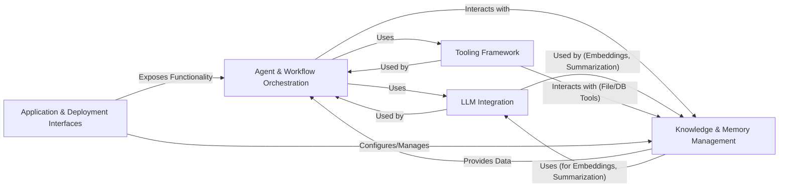

## Component Details

Final Architecture Analysis for `agno`

### Agent & Workflow Orchestration
This is the central execution engine of Agno. It manages the lifecycle, execution flow, and collaborative interactions of individual AI agents and teams. It also defines and executes multi-step, often asynchronous, workflows, ensuring the orderly progression of tasks and acting as the primary coordinator for AI behaviors within the system.

**Related Classes/Methods**:

- <a href="https://github.com/agno-agi/agno/blob/master/libs/agno/agno/agent/agent.py#L86-L7933" target="_blank" rel="noopener noreferrer">`agno.agent.agent.Agent` (86:7933)</a>
- <a href="https://github.com/agno-agi/agno/blob/master/libs/agno/agno/team/team.py#L89-L7606" target="_blank" rel="noopener noreferrer">`agno.team.team.Team` (89:7606)</a>
- <a href="https://github.com/agno-agi/agno/blob/master/libs/agno/agno/workflow/workflow.py#L28-L908" target="_blank" rel="noopener noreferrer">`agno.workflow.workflow.Workflow` (28:908)</a>

### LLM Integration
Provides a unified and standardized interface for interacting with various Large Language Models (LLMs) from different providers (e.g., OpenAI, Google Gemini, Anthropic). It abstracts away provider-specific details, offering capabilities for text generation, function calling, and multimodal interactions, serving as the foundational AI intelligence layer.

**Related Classes/Methods**:

- <a href="https://github.com/agno-agi/agno/blob/master/libs/agno/agno/models/base.py#L225-L1668" target="_blank" rel="noopener noreferrer">`agno.models.base.Model` (225:1668)</a>
- <a href="https://github.com/agno-agi/agno/blob/master/libs/agno/agno/models/openai/chat.py#L32-L718" target="_blank" rel="noopener noreferrer">`agno.models.openai.chat.OpenAIChat` (32:718)</a>
- <a href="https://github.com/agno-agi/agno/blob/master/libs/agno/agno/models/google/gemini.py#L42-L864" target="_blank" rel="noopener noreferrer">`agno.models.google.gemini.Gemini` (42:864)</a>

### Tooling Framework
This component manages the registration, discovery, and execution of all external and internal tools available to agents and workflows. It enables the Agno system to interact with diverse external systems, data sources, and communication platforms, including web services, file systems, databases, and various communication channels.

**Related Classes/Methods**:

- <a href="https://github.com/agno-agi/agno/blob/master/libs/agno/agno/tools/toolkit.py#L7-L145" target="_blank" rel="noopener noreferrer">`agno.tools.toolkit.Toolkit` (7:145)</a>
- <a href="https://github.com/agno-agi/agno/blob/master/libs/agno/agno/tools/function.py#L61-L402" target="_blank" rel="noopener noreferrer">`agno.tools.function.Function` (61:402)</a>
- <a href="https://github.com/agno-agi/agno/blob/master/libs/agno/agno/tools/duckduckgo.py#L12-L93" target="_blank" rel="noopener noreferrer">`agno.tools.duckduckgo.DuckDuckGoTools` (12:93)</a>
- <a href="https://github.com/agno-agi/agno/blob/master/libs/agno/agno/tools/file.py#L8-L76" target="_blank" rel="noopener noreferrer">`agno.tools.file.FileTools` (8:76)</a>

### Knowledge & Memory Management
Responsible for the ingestion, processing (chunking, embedding), storage, and retrieval of structured and unstructured knowledge from various sources using vector databases and semantic search. It also manages the long-term and short-term memory of agents and teams, including conversational history, user-specific memories, and session summaries, providing a unified interface for persisting application data.

**Related Classes/Methods**:

- <a href="https://github.com/agno-agi/agno/blob/master/libs/agno/agno/knowledge/agent.py#L14-L665" target="_blank" rel="noopener noreferrer">`agno.knowledge.agent.AgentKnowledge` (14:665)</a>
- <a href="https://github.com/agno-agi/agno/blob/master/libs/agno/agno/document/reader/base.py#L10-L53" target="_blank" rel="noopener noreferrer">`agno.document.reader.base.Reader` (10:53)</a>
- <a href="https://github.com/agno-agi/agno/blob/master/libs/agno/agno/embedder/base.py#L5-L14" target="_blank" rel="noopener noreferrer">`agno.embedder.base.Embedder` (5:14)</a>
- <a href="https://github.com/agno-agi/agno/blob/master/libs/agno/agno/vectordb/base.py#L6-L95" target="_blank" rel="noopener noreferrer">`agno.vectordb.base.VectorDb` (6:95)</a>
- <a href="https://github.com/agno-agi/agno/blob/master/libs/agno/agno/memory/v2/memory.py#L80-L1112" target="_blank" rel="noopener noreferrer">`agno.memory.v2.memory.Memory` (80:1112)</a>
- <a href="https://github.com/agno-agi/agno/blob/master/libs/agno/agno/storage/base.py#L6-L59" target="_blank" rel="noopener noreferrer">`agno.storage.base.Storage` (6:59)</a>

### Application & Deployment Interfaces
This component provides the external interfaces for interacting with the Agno system. It includes web APIs (FastAPI, AGUI), integrations with chat platforms (Slack, WhatsApp), and command-line tools for project setup, configuration, and infrastructure management. It defines how users and external systems access and deploy Agno applications.

**Related Classes/Methods**:

- <a href="https://github.com/agno-agi/agno/blob/master/libs/agno/agno/app/base.py#L18-L207" target="_blank" rel="noopener noreferrer">`agno.app.base.BaseAPIApp` (18:207)</a>
- <a href="https://github.com/agno-agi/agno/blob/master/libs/agno/agno/cli/entrypoint.py#L0-L0" target="_blank" rel="noopener noreferrer">`agno.cli.entrypoint` (0:0)</a>
- <a href="https://github.com/agno-agi/agno/blob/master/libs/agno/agno/workspace/operator.py#L0-L0" target="_blank" rel="noopener noreferrer">`agno.workspace.operator` (0:0)</a>
- <a href="https://github.com/agno-agi/agno/blob/master/libs/agno/agno/infra/base.py#L8-L143" target="_blank" rel="noopener noreferrer">`agno.infra.base.InfraBase` (8:143)</a>

### [FAQ](https://github.com/CodeBoarding/GeneratedOnBoardings/tree/main?tab=readme-ov-file#faq)