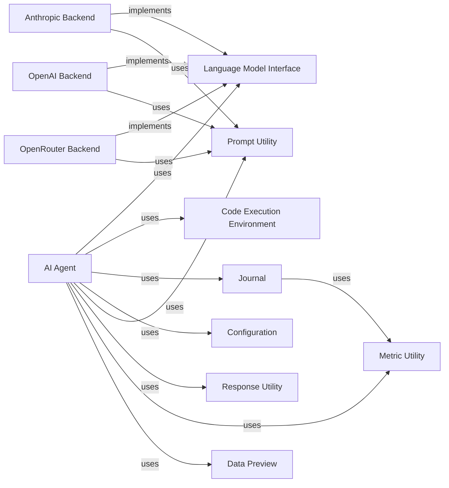

## Component Details

The AI Agent subsystem forms the intelligent core of the project, orchestrating the entire process of problem-solving, code generation, debugging, and solution refinement. It acts as the central decision-making unit, interacting with various specialized components to achieve its goals. The fundamental nature of these components lies in their direct contribution to the agent's ability to perceive, reason, act, and learn within the system.

### AI Agent
The primary orchestrator of the system. It is responsible for planning, generating code, debugging, and refining solutions. It manages the overall workflow, making decisions based on interactions with other components like the Language Model Interface, Journal, and Code Execution Environment.

**Related Classes/Methods**:

- <a href="https://github.com/WecoAI/aideml/blob/master/aide/agent.py#L0-L0" target="_blank" rel="noopener noreferrer">`aide.agent` (0:0)</a>

### Language Model Interface
An abstract interface defining how the system interacts with various large language models (LLMs). It provides a unified API for the AI Agent to send prompts and receive completions, abstracting away the specifics of different LLM backends (e.g., Anthropic, OpenAI, OpenRouter).

**Related Classes/Methods**:

- `aide.backend` (0:0)
- <a href="https://github.com/WecoAI/aideml/blob/master/aide/backend/backend_anthropic.py#L0-L0" target="_blank" rel="noopener noreferrer">`aide.backend.backend_anthropic` (0:0)</a>
- <a href="https://github.com/WecoAI/aideml/blob/master/aide/backend/backend_openai.py#L0-L0" target="_blank" rel="noopener noreferrer">`aide.backend.backend_openai` (0:0)</a>
- <a href="https://github.com/WecoAI/aideml/blob/master/aide/backend/backend_openrouter.py#L0-L0" target="_blank" rel="noopener noreferrer">`aide.backend.backend_openrouter` (0:0)</a>

### Journal
Manages the history of generated solutions (nodes), including their plans, code, execution results, and analysis. It provides mechanisms for the AI Agent to retrieve good or buggy nodes and generate summaries of the development process, effectively serving as the agent's memory and learning repository.

**Related Classes/Methods**:

- <a href="https://github.com/WecoAI/aideml/blob/master/aide/journal.py#L0-L0" target="_blank" rel="noopener noreferrer">`aide.journal` (0:0)</a>

### Code Execution Environment
Responsible for executing the Python code generated by the AI Agent in a controlled environment. It captures standard output, errors, and execution time, providing the crucial feedback loop necessary for the agent to test, validate, and debug its generated solutions.

**Related Classes/Methods**:

- <a href="https://github.com/WecoAI/aideml/blob/master/aide/interpreter.py#L0-L0" target="_blank" rel="noopener noreferrer">`aide.interpreter` (0:0)</a>

### Configuration
Manages the system's configuration settings, including agent-specific parameters, execution timeouts, and choices of language models. It provides structured access to various operational parameters that dictate the behavior and constraints of the AI Agent.

**Related Classes/Methods**:

- <a href="https://github.com/WecoAI/aideml/blob/master/aide/utils/config.py#L0-L0" target="_blank" rel="noopener noreferrer">`aide.utils.config` (0:0)</a>

### Prompt Utility
Provides common utility functions for compiling prompts into a standardized format (e.g., Markdown) before they are sent to the Language Model Interface. This ensures consistency and optimal formatting for LLM consumption.

**Related Classes/Methods**:

- <a href="https://github.com/WecoAI/aideml/blob/master/aide/backend/utils.py#L0-L0" target="_blank" rel="noopener noreferrer">`aide.backend.utils` (0:0)</a>

### Response Utility
Offers utility functions for parsing and extracting specific information, such as code blocks or natural language text, from the raw responses received from the Language Model Interface. This allows the AI Agent to interpret and act upon the LLM's output.

**Related Classes/Methods**:

- <a href="https://github.com/WecoAI/aideml/blob/master/aide/utils/response.py#L0-L0" target="_blank" rel="noopener noreferrer">`aide.utils.response` (0:0)</a>

### Metric Utility
Handles the representation, comparison, and evaluation of performance metrics. It defines how metrics are stored and how "worst" values are handled, which is crucial for the AI Agent's self-assessment and decision-making regarding solution quality.

**Related Classes/Methods**:

- <a href="https://github.com/WecoAI/aideml/blob/master/aide/utils/metric.py#L0-L0" target="_blank" rel="noopener noreferrer">`aide.utils.metric` (0:0)</a>

### Data Preview
Generates a concise preview or overview of the input data. This preview is then provided to the AI Agent to help it understand the data structure and content before generating solutions, ensuring the agent has sufficient context.

**Related Classes/Methods**:

- <a href="https://github.com/WecoAI/aideml/blob/master/aide/utils/data_preview.py#L0-L0" target="_blank" rel="noopener noreferrer">`aide.utils.data_preview` (0:0)</a>

### Anthropic Backend
Provides the concrete implementation for interacting with the Anthropic LLM service, adhering to the Language Model Interface.

**Related Classes/Methods**:

- <a href="https://github.com/WecoAI/aideml/blob/master/aide/backend/backend_anthropic.py#L0-L0" target="_blank" rel="noopener noreferrer">`aide.backend.backend_anthropic` (0:0)</a>

### OpenAI Backend
Provides the concrete implementation for interacting with the OpenAI LLM service, adhering to the Language Model Interface.

**Related Classes/Methods**:

- <a href="https://github.com/WecoAI/aideml/blob/master/aide/backend/backend_openai.py#L0-L0" target="_blank" rel="noopener noreferrer">`aide.backend.backend_openai` (0:0)</a>

### OpenRouter Backend
Provides the concrete implementation for interacting with the OpenRouter LLM service, adhering to the Language Model Interface.

**Related Classes/Methods**:

- <a href="https://github.com/WecoAI/aideml/blob/master/aide/backend/backend_openrouter.py#L0-L0" target="_blank" rel="noopener noreferrer">`aide.backend.backend_openrouter` (0:0)</a>

### [FAQ](https://github.com/CodeBoarding/GeneratedOnBoardings/tree/main?tab=readme-ov-file#faq)