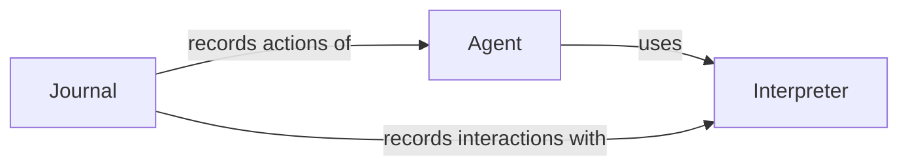

## Component Details

Abstract Components Overview

### Interpreter
This component is the heart of the Code Execution Environment. It provides a secure, isolated, and controlled sandbox for executing Python code generated by the Agent. It manages the entire execution lifecycle, including process creation, input/output redirection (capturing stdout and stderr), enforcing execution timeouts, and robustly handling exceptions. It simulates a standalone Python REPL, ensuring that potentially untrusted or resource-intensive code does not compromise the main application.

**Related Classes/Methods**:

- <a href="https://github.com/WecoAI/aideml/blob/master/aide/interpreter.py#L1-L1" target="_blank" rel="noopener noreferrer">`aide.interpreter.Interpreter` (1:1)</a>

### Agent
The Agent is the intelligent entity responsible for generating Python code as part of its problem-solving process. It acts as the primary consumer of the Code Execution Environment. The Agent relies on the Interpreter to execute its generated solutions, observe their effects, and use the feedback to refine its strategies and generate further code.

**Related Classes/Methods**:

- <a href="https://github.com/WecoAI/aideml/blob/master/aide/agent.py#L46-L338" target="_blank" rel="noopener noreferrer">`aide.agent.Agent` (46:338)</a>

### Journal
The Journal component is crucial for logging, debugging, and reproducing agent runs. It records the entire interaction flow, including the Python code executed by the Interpreter, the standard output and error streams received, and any exceptions encountered during execution. It also logs the actions and decisions made by the Agent, providing a comprehensive audit trail of the experiment.

**Related Classes/Methods**:

- <a href="https://github.com/WecoAI/aideml/blob/master/aide/journal.py#L1-L1" target="_blank" rel="noopener noreferrer">`aide.journal.Journal` (1:1)</a>

### [FAQ](https://github.com/CodeBoarding/GeneratedOnBoardings/tree/main?tab=readme-ov-file#faq)