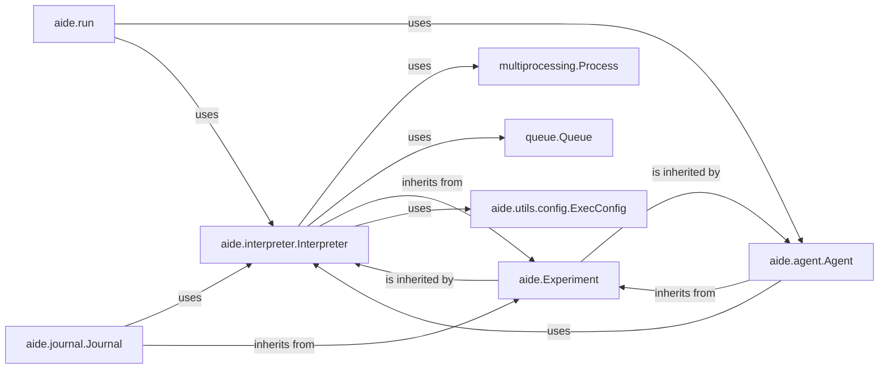

## Component Details

The `Code Execution Interpreter` subsystem is designed to provide a secure and isolated environment for executing Python code. It is a critical component for any system that requires dynamic code execution, especially in scenarios involving agents or automated experiments where untrusted code might be generated. Its primary purpose is to safely run code, capture all outputs and errors, and report them back for analysis, ensuring the stability and integrity of the main application.

### aide.interpreter.Interpreter
The central component responsible for managing the lifecycle of code execution. It creates isolated processes, handles inter-process communication, enforces execution limits (like time), captures standard output/error, and returns results. It acts as the primary interface for executing Python code within the `aide` framework.

**Related Classes/Methods**:

- <a href="https://github.com/WecoAI/aideml/blob/master/aide/interpreter.py#L1-L1" target="_blank" rel="noopener noreferrer">`aide.interpreter.Interpreter` (1:1)</a>

### aide.Experiment
A foundational base class within the `aide` project, providing common functionalities and structure for various experimental components. The `Interpreter` inherits from this class, suggesting it integrates into a broader experiment management framework.

**Related Classes/Methods**:

- `aide.Experiment` (1:1)

### multiprocessing.Process
A Python standard library component used by the `Interpreter` to create and manage separate processes. This is crucial for achieving the sandboxed execution environment, isolating the executed code from the main application process.

**Related Classes/Methods**:

- `multiprocessing.Process` (1:1)

### queue.Queue
Another Python standard library component utilized by the `Interpreter` for inter-process communication (IPC). It facilitates the exchange of data, commands, and results between the main process and the isolated child process where the code is executed.

**Related Classes/Methods**:

- `queue.Queue` (1:1)

### aide.agent.Agent
Represents the "Experiment Orchestration & Agent" component. This component is responsible for generating Python code and then utilizing the `Code Execution Interpreter` to execute that code as part of an experiment or task. It orchestrates the overall flow of an experiment.

**Related Classes/Methods**:

- <a href="https://github.com/WecoAI/aideml/blob/master/aide/agent.py#L46-L338" target="_blank" rel="noopener noreferrer">`aide.agent.Agent` (46:338)</a>

### aide.journal.Journal
A component likely responsible for logging, tracking, and persisting the results and events of experiments, including those generated by the `Code Execution Interpreter`. It inherits from `aide.Experiment` and `aide.agent.Agent`, indicating its deep integration with the experiment and agent workflows.

**Related Classes/Methods**:

- <a href="https://github.com/WecoAI/aideml/blob/master/aide/journal.py#L1-L1" target="_blank" rel="noopener noreferrer">`aide.journal.Journal` (1:1)</a>

### aide.utils.config.ExecConfig
A configuration class specifically designed to hold parameters and settings relevant to code execution. The `Interpreter` likely uses instances of this class to configure its behavior, such as execution time limits, memory constraints, or other environment settings.

**Related Classes/Methods**:

- <a href="https://github.com/WecoAI/aideml/blob/master/aide/utils/config.py#L55-L58" target="_blank" rel="noopener noreferrer">`aide.utils.config.ExecConfig` (55:58)</a>

### aide.run
This component is likely a high-level entry point or orchestrator for running `aide` experiments or processes. It would initiate and manage the overall execution flow, potentially invoking the `aide.agent.Agent` which, in turn, uses the `Code Execution Interpreter`.

**Related Classes/Methods**:

- <a href="https://github.com/WecoAI/aideml/blob/master/aide/run.py#L55-L143" target="_blank" rel="noopener noreferrer">`aide.run` (55:143)</a>

### [FAQ](https://github.com/CodeBoarding/GeneratedOnBoardings/tree/main?tab=readme-ov-file#faq)