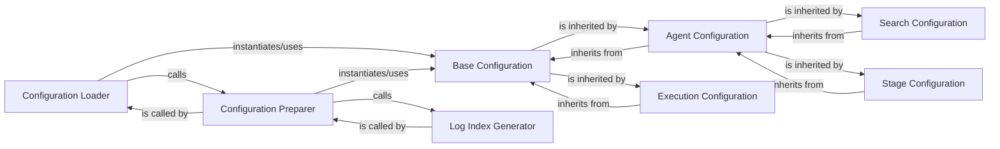

## Component Details

The `Configuration Management` subsystem in `aide.utils.config` is responsible for centralizing, loading, parsing, and distributing application-wide and experiment-specific configurations. It ensures that all components of the AIDE system operate with consistent and properly prepared settings. The chosen components are fundamental because they cover both the structural definition of configuration data (via classes) and the operational processes of loading and preparing this data (via functions).

### Base Configuration
The foundational abstract base class (`aide.utils.config.Config`) that defines the common structure and properties for all configuration objects. It serves as the root of the configuration class hierarchy and inherits from `aide.agent.Agent`, indicating a deep integration where configurations might be managed by or embody agent-like characteristics.

**Related Classes/Methods**:

- <a href="https://github.com/WecoAI/aideml/blob/master/aide/utils/config.py#L62-L80" target="_blank" rel="noopener noreferrer">`aide.utils.config.Config` (62:80)</a>

### Agent Configuration
A specialized configuration class (`aide.utils.config.AgentConfig`) that encapsulates parameters specific to the behavior, capabilities, and operational settings of agents within the `aideml` system.

**Related Classes/Methods**:

- <a href="https://github.com/WecoAI/aideml/blob/master/aide/utils/config.py#L42-L51" target="_blank" rel="noopener noreferrer">`aide.utils.config.AgentConfig` (42:51)</a>

### Execution Configuration
A specialized configuration class (`aide.utils.config.ExecConfig`) that defines parameters related to the overall execution environment, process settings, and runtime behavior of the `aideml` system.

**Related Classes/Methods**:

- <a href="https://github.com/WecoAI/aideml/blob/master/aide/utils/config.py#L55-L58" target="_blank" rel="noopener noreferrer">`aide.utils.config.ExecConfig` (55:58)</a>

### Search Configuration
A specialized configuration class (`aide.utils.config.SearchConfig`) that holds parameters for various search algorithms, strategies, or optimization techniques employed within the system, particularly those related to agent decision-making or problem-solving.

**Related Classes/Methods**:

- <a href="https://github.com/WecoAI/aideml/blob/master/aide/utils/config.py#L35-L38" target="_blank" rel="noopener noreferrer">`aide.utils.config.SearchConfig` (35:38)</a>

### Stage Configuration
A specialized configuration class (`aide.utils.config.StageConfig`) that defines parameters for different operational stages or phases of the system's execution, allowing for distinct settings and behaviors at various points in a workflow.

**Related Classes/Methods**:

- <a href="https://github.com/WecoAI/aideml/blob/master/aide/utils/config.py#L29-L31" target="_blank" rel="noopener noreferrer">`aide.utils.config.StageConfig` (29:31)</a>

### Configuration Loader
The primary interface (`aide.utils.config.load_cfg`) for initiating the configuration loading process. It handles the initial loading of configuration files and delegates to other functions for further preparation.

**Related Classes/Methods**:

- <a href="https://github.com/WecoAI/aideml/blob/master/aide/utils/config.py#L104-L106" target="_blank" rel="noopener noreferrer">`aide.utils.config.load_cfg` (104:106)</a>

### Configuration Preparer
Responsible for pre-processing the loaded configuration data (`aide.utils.config.prep_cfg`). This includes crucial tasks such as generating unique log indices to ensure proper tracking and organization of experimental runs or system states, and potentially validating or transforming configuration values.

**Related Classes/Methods**:

- <a href="https://github.com/WecoAI/aideml/blob/master/aide/utils/config.py#L109-L143" target="_blank" rel="noopener noreferrer">`aide.utils.config.prep_cfg` (109:143)</a>

### Log Index Generator
A utility component (`aide.utils.config._get_next_logindex`) that provides a mechanism to generate the next available log index. This ensures unique identifiers for each configuration instance or experimental run, which is vital for logging, tracking, and reproducibility.

**Related Classes/Methods**:

- <a href="https://github.com/WecoAI/aideml/blob/master/aide/utils/config.py#L83-L92" target="_blank" rel="noopener noreferrer">`aide.utils.config._get_next_logindex` (83:92)</a>

### [FAQ](https://github.com/CodeBoarding/GeneratedOnBoardings/tree/main?tab=readme-ov-file#faq)