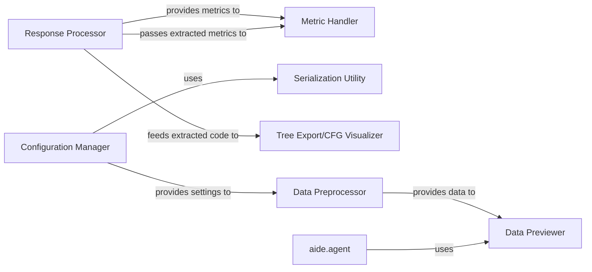

## Component Details

This subsystem, `Configuration & Utilities`, serves as a foundational collection of shared helper modules within the AIDE project. It provides essential cross-cutting functionalities such as configuration management, data handling, response parsing, data serialization, and visualization tools. These components are fundamental because they ensure the smooth operation, data integrity, and analytical capabilities of the broader AIDE system, particularly supporting core components like `aide.agent` and `aide.journal`.

### Configuration Manager
This component is responsible for loading, preparing, and managing various system configurations. It defines structured configuration objects (e.g., `AgentConfig`, `ExecConfig`, `SearchConfig`, `StageConfig`) that dictate the behavior of different parts of the AIDE system. The class hierarchy confirms that `AgentConfig`, `ExecConfig`, `SearchConfig`, and `StageConfig` all inherit from `Config`, establishing a unified and extensible configuration structure.

**Related Classes/Methods**:

- <a href="https://github.com/WecoAI/aideml/blob/master/aide/utils/config.py#L0-L0" target="_blank" rel="noopener noreferrer">`aide.utils.config` (0:0)</a>

### Data Previewer
Provides utilities for exploring file systems, generating hierarchical file trees, and previewing the content of various data files (e.g., CSV, JSON). It helps users understand the structure and content of their datasets, which is crucial for debugging and analysis within the AIDE environment.

**Related Classes/Methods**:

- <a href="https://github.com/WecoAI/aideml/blob/master/aide/utils/data_preview.py#L0-L0" target="_blank" rel="noopener noreferrer">`aide.utils.data_preview` (0:0)</a>

### Metric Handler
Defines and manages metric values, with a specific focus on tracking "worst" metric values. This component is crucial for evaluating performance, tracking progress, or identifying critical thresholds within experiments, providing a standardized way to handle performance indicators. The class hierarchy shows `WorstMetricValue` inheriting from `MetricValue`, indicating specialized metric tracking capabilities.

**Related Classes/Methods**:

- <a href="https://github.com/WecoAI/aideml/blob/master/aide/utils/metric.py#L0-L0" target="_blank" rel="noopener noreferrer">`aide.utils.metric` (0:0)</a>

### Response Processor
This component is designed to extract and format structured data (like JSON objects) and code snippets from text-based responses. It also includes functionality to validate extracted Python scripts, ensuring the integrity and usability of outputs from various sources, including agent responses.

**Related Classes/Methods**:

- <a href="https://github.com/WecoAI/aideml/blob/master/aide/utils/response.py#L0-L0" target="_blank" rel="noopener noreferrer">`aide.utils.response` (0:0)</a>

### Serialization Utility
Offers standard functions for serializing Python objects into JSON format and deserializing JSON back into Python objects. It facilitates data persistence and interchange across different parts of the system, enabling the saving and loading of states, configurations, and other data structures.

**Related Classes/Methods**:

- <a href="https://github.com/WecoAI/aideml/blob/master/aide/utils/serialize.py#L0-L0" target="_blank" rel="noopener noreferrer">`aide.utils.serialize` (0:0)</a>

### Tree Export/CFG Visualizer
Transforms internal control flow graph (CFG) representations into human-readable tree structures and generates HTML visualizations. This aids in understanding the execution paths and logical flow of code, particularly useful for analysis, debugging, and reporting on the behavior of interpreted scripts.

**Related Classes/Methods**:

- <a href="https://github.com/WecoAI/aideml/blob/master/aide/utils/tree_export.py#L0-L0" target="_blank" rel="noopener noreferrer">`aide.utils.tree_export` (0:0)</a>

### Data Preprocessor
Handles initial data preparation tasks, including extracting data from archives and performing necessary cleanup operations on datasets. While currently defined within `aide.utils.__init__.py`, these functions represent a distinct and essential data preparation responsibility, ensuring data is in a usable format for other components.

**Related Classes/Methods**:

- `aide.utils` (0:0)

### aide.agent
A core component of the AIDE system that uses other utilities.

**Related Classes/Methods**: _None_

### [FAQ](https://github.com/CodeBoarding/GeneratedOnBoardings/tree/main?tab=readme-ov-file#faq)