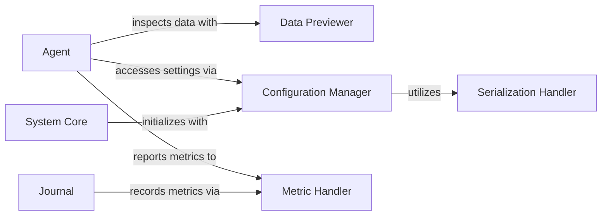

## Component Details

The `Data Utilities` component serves as a foundational layer within the `aideml` system, providing essential services for data handling, system configuration, and performance measurement. It ensures that data is in a usable format, system behaviors are consistently managed, and experimental outcomes are accurately evaluated. This overarching component is composed of several specialized sub-components, each addressing a critical aspect of the system's operation.

These components are fundamental because they collectively provide the essential infrastructure for data management, system configuration, and performance evaluation, which are critical for any robust and adaptable machine learning or agent-based system. They ensure data integrity, system flexibility, and measurable outcomes.

### Data Previewer
This component is responsible for exploring and generating human-readable previews of data files within a given directory structure. It includes functionalities for traversing file trees, determining file sizes and lengths, and specifically previewing content from CSV and JSON files. It is essential for initial data understanding, debugging, and ensuring data is in a usable format for other components, particularly the agent.

**Related Classes/Methods**:

- <a href="https://github.com/WecoAI/aideml/blob/master/aide/utils/data_preview.py#L1-L1" target="_blank" rel="noopener noreferrer">`aide.utils.data_preview` (1:1)</a>

### Serialization Handler
This component manages the conversion of Python objects into a storable format (serialization) and vice-versa (deserialization), with a primary focus on JSON. It is a foundational utility vital for persisting configurations, model states, or intermediate results across the system, ensuring data integrity and reusability.

**Related Classes/Methods**:

- <a href="https://github.com/WecoAI/aideml/blob/master/aide/utils/serialize.py#L1-L1" target="_blank" rel="noopener noreferrer">`aide.utils.serialize` (1:1)</a>

### Configuration Manager
This component provides a structured and hierarchical mechanism for defining, loading, and managing various operational parameters and settings for the `aideml` system. It encompasses configurations for agents, execution environments, search strategies, and different experiment stages, ensuring consistent and adaptable system behavior. The `Config` class and its specialized subclasses (`AgentConfig`, `ExecConfig`, `SearchConfig`, `StageConfig`) are central to its functionality.

**Related Classes/Methods**:

- <a href="https://github.com/WecoAI/aideml/blob/master/aide/utils/config.py#L1-L1" target="_blank" rel="noopener noreferrer">`aide.utils.config` (1:1)</a>

### Metric Handler
This component is responsible for defining, managing, and calculating metrics used to evaluate the performance and outcomes of experiments or agent behaviors. It includes a base `MetricValue` and specialized metrics like `WorstMetricValue`, providing a standardized and extensible way to assess system efficacy and track progress.

**Related Classes/Methods**:

- <a href="https://github.com/WecoAI/aideml/blob/master/aide/utils/metric.py#L1-L1" target="_blank" rel="noopener noreferrer">`aide.utils.metric` (1:1)</a>

### Agent
Represents the `aide.agent` component responsible for processing and execution.

**Related Classes/Methods**: _None_

### Journal
Represents the `aide.journal` component responsible for logging and reporting.

**Related Classes/Methods**: _None_

### System Core
Represents core system components like `aide`, `aide.run`, and `aide.journal2report` that initialize and manage global system settings.

**Related Classes/Methods**: _None_

### [FAQ](https://github.com/CodeBoarding/GeneratedOnBoardings/tree/main?tab=readme-ov-file#faq)