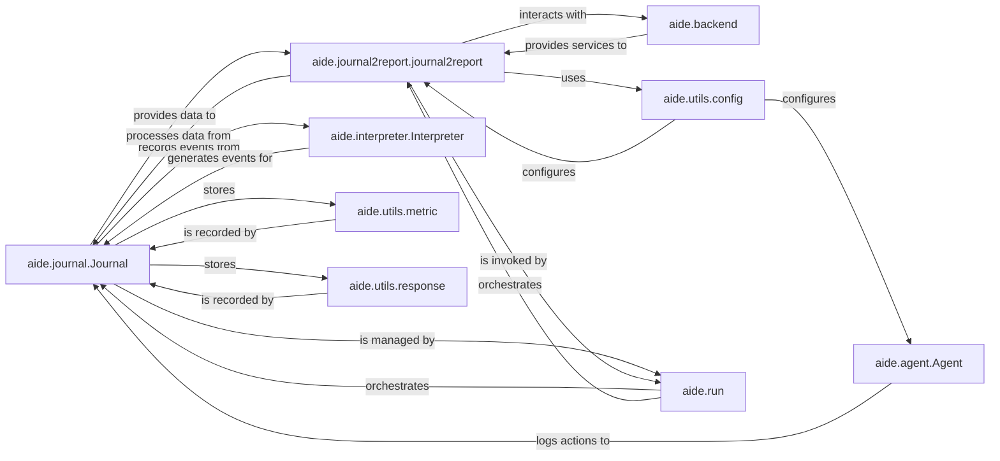

## Component Details

Abstract Components Overview of the aide system.

### aide.journal.Journal
This is the **core component** of the subsystem. It acts as the central data structure, maintaining a chronological list of `Node` objects that encapsulate every significant step and outcome of an experiment. It serves as the definitive record of the experiment's history. Source code verification confirms it inherits from `DataClassJsonMixin` and not from `aide.Experiment` or `aide.agent.Agent`.

**Related Classes/Methods**:

- <a href="https://github.com/WecoAI/aideml/blob/master/aide/journal.py#L135-L192" target="_blank" rel="noopener noreferrer">`aide.journal.Journal` (135:192)</a>

### aide.journal2report.journal2report
This function is responsible for transforming the raw, structured data within a `Journal` instance into a human-readable technical report, typically in Markdown format. It often leverages external language models for synthesizing the content.

**Related Classes/Methods**:

- <a href="https://github.com/WecoAI/aideml/blob/master/aide/journal2report.py#L5-L30" target="_blank" rel="noopener noreferrer">`aide.journal2report.journal2report` (5:30)</a>

### aide.agent.Agent
Represents the intelligent entity that performs actions and makes decisions within the experiment. Its interactions and internal states are meticulously logged by the `Journal`.

**Related Classes/Methods**:

- <a href="https://github.com/WecoAI/aideml/blob/master/aide/agent.py#L46-L338" target="_blank" rel="noopener noreferrer">`aide.agent.Agent` (46:338)</a>

### aide.interpreter.Interpreter
The component responsible for executing code and commands within the experiment environment. The `Journal` captures the inputs, outputs, and any errors from these executions.

**Related Classes/Methods**:

- <a href="https://github.com/WecoAI/aideml/blob/master/aide/interpreter.py#L1-L1" target="_blank" rel="noopener noreferrer">`aide.interpreter.Interpreter` (1:1)</a>

### aide.utils.metric
Provides data structures and utilities for defining, collecting, and managing various performance metrics relevant to the experiment. These metrics are a key part of the data stored in the `Journal`.

**Related Classes/Methods**:

- <a href="https://github.com/WecoAI/aideml/blob/master/aide/utils/metric.py#L1-L1" target="_blank" rel="noopener noreferrer">`aide.utils.metric` (1:1)</a>

### aide.utils.response
Offers standardized structures and utilities for handling and storing different types of responses generated during an experiment, such as model outputs, user inputs, or code execution results.

**Related Classes/Methods**:

- <a href="https://github.com/WecoAI/aideml/blob/master/aide/utils/response.py#L1-L1" target="_blank" rel="noopener noreferrer">`aide.utils.response` (1:1)</a>

### aide.backend
Represents the underlying services or models (e.g., large language models) that the `aide` system interacts with. It's particularly crucial for tasks requiring external computational power or intelligence, such as synthesizing reports.

**Related Classes/Methods**:

- `aide.backend` (1:1)

### aide.utils.config
Manages and provides configuration settings across different parts of the `aide` system. This includes parameters for agent behavior, interpreter settings, and report generation.

**Related Classes/Methods**:

- <a href="https://github.com/WecoAI/aideml/blob/master/aide/utils/config.py#L1-L1" target="_blank" rel="noopener noreferrer">`aide.utils.config` (1:1)</a>

### aide.run
This is a high-level function or module that orchestrates the entire experiment execution. It initializes the `Journal`, manages the agent's lifecycle, and triggers the report generation process.

**Related Classes/Methods**:

- <a href="https://github.com/WecoAI/aideml/blob/master/aide/run.py#L55-L143" target="_blank" rel="noopener noreferrer">`aide.run` (55:143)</a>

### [FAQ](https://github.com/CodeBoarding/GeneratedOnBoardings/tree/main?tab=readme-ov-file#faq)