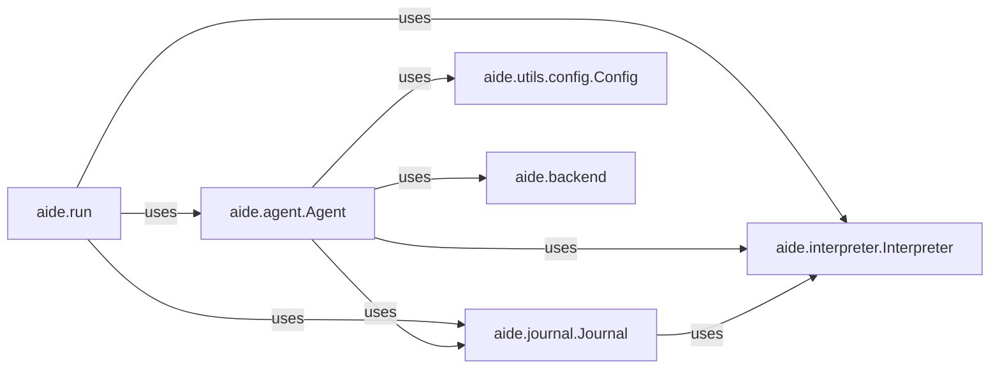

## Component Details

One paragraph explaining the functionality which is represented by this graph. What the main flow is and what is its purpose.

### aide.run
This module serves as the primary entry point and orchestrator for initiating and managing the entire experiment lifecycle. It brings together and coordinates the `Agent`, `Interpreter`, and `Journal` components to execute an AIDE experiment.

**Related Classes/Methods**:

- <a href="https://github.com/WecoAI/aideml/blob/master/aide/run.py#L55-L143" target="_blank" rel="noopener noreferrer">`aide.run` (55:143)</a>

### aide.agent.Agent
This is the core intelligent component embodying the decision-making process of an AIDE experiment. It is responsible for planning, iterative problem-solving, and potentially generating code. It interacts with the `Interpreter` to execute its plans and the `Journal` to record its actions and observations.

**Related Classes/Methods**:

- <a href="https://github.com/WecoAI/aideml/blob/master/aide/agent.py#L46-L338" target="_blank" rel="noopener noreferrer">`aide.agent.Agent` (46:338)</a>

### aide.interpreter.Interpreter
The primary orchestrator for running experimental sessions. It manages the entire lifecycle of code execution, from setting up child processes and handling standard I/O redirection to executing the session logic and processing exceptions. It acts as the runtime environment for the agent's generated code or commands.

**Related Classes/Methods**:

- <a href="https://github.com/WecoAI/aideml/blob/master/aide/interpreter.py#L91-L311" target="_blank" rel="noopener noreferrer">`aide.interpreter.Interpreter` (91:311)</a>

### aide.journal.Journal
This component is responsible for maintaining a comprehensive record of the experiment's progress. It logs events, collects results, and tracks metrics, providing crucial data for analysis, debugging, and report generation. It interacts with both the `Interpreter` and the `Agent`.

**Related Classes/Methods**:

- <a href="https://github.com/WecoAI/aideml/blob/master/aide/journal.py#L135-L192" target="_blank" rel="noopener noreferrer">`aide.journal.Journal` (135:192)</a>

### aide.utils.config.Config
A foundational class for managing various configuration settings throughout the `aideml` system. It provides a structured and extensible way to define and access parameters for different components, particularly crucial for configuring the `Agent` and its behavior.

**Related Classes/Methods**:

- <a href="https://github.com/WecoAI/aideml/blob/master/aide/utils/config.py#L62-L80" target="_blank" rel="noopener noreferrer">`aide.utils.config.Config` (62:80)</a>

### aide.backend
This package provides a standardized interface and concrete implementations for interacting with various Large Language Model (LLM) providers (e.g., Anthropic, OpenAI, OpenRouter). It abstracts the complexities of communicating with external AI models, allowing the `Agent` to leverage different LLMs seamlessly.

**Related Classes/Methods**:

- `aide.backend` (1:1)

### [FAQ](https://github.com/CodeBoarding/GeneratedOnBoardings/tree/main?tab=readme-ov-file#faq)