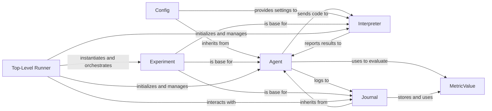

## Component Details

Abstract Components Overview of the `aide` project, detailing key components and their relationships.

### Experiment
The `Experiment` class serves as a foundational abstract base for key components within the `aide` project, including `Agent`, `Interpreter`, and `Journal`. It likely defines common interfaces and shared functionalities for managing the lifecycle and core operations of an AI experiment. While its direct source code was not previously found, its role as a base class is confirmed by the class hierarchy, indicating its importance in structuring the overall experiment flow.

**Related Classes/Methods**:

- `aide.Experiment` (0:0)

### Top-Level Runner
This function serves as the primary entry point for initiating and orchestrating the entire `aideml` process from a command-line or programmatic perspective. It sets up the experiment environment, manages the execution loop, and handles reporting, including interactions with the Journaling System for visualization and live data generation.

**Related Classes/Methods**:

- <a href="https://github.com/WecoAI/aideml/blob/master/aide/run.py#L55-L143" target="_blank" rel="noopener noreferrer">`aide.run.run` (55:143)</a>

### Agent
Represents the intelligent AI agent responsible for generating, improving, and debugging code solutions. It interacts with the `Journal` to record its progress and decisions and utilizes the `Interpreter` to execute generated code. The class hierarchy confirms that `Agent` inherits from `Experiment`, positioning it as a core participant in the experiment's execution.

**Related Classes/Methods**:

- <a href="https://github.com/WecoAI/aideml/blob/master/aide/agent.py#L46-L338" target="_blank" rel="noopener noreferrer">`aide.agent.Agent` (46:338)</a>

### Interpreter
Provides a simulated Python REPL environment for executing agent-generated code. It manages a separate process for execution, handles timeouts, captures output, and reports exceptions. As confirmed by the class hierarchy, `Interpreter` inherits from `Experiment`, indicating its direct involvement in the experiment's execution phase.

**Related Classes/Methods**:

- <a href="https://github.com/WecoAI/aideml/blob/master/aide/interpreter.py#L0-L0" target="_blank" rel="noopener noreferrer">`aide.interpreter.Interpreter` (0:0)</a>

### Journal
Responsible for logging, tracking, and reporting the progress and results of experiments and agent activities. It stores a collection of `Node` objects, representing different stages or attempts in the solution development. The class hierarchy confirms its inheritance from both `Experiment` and `Agent`, highlighting its deep integration into both the overall experiment flow and the agent's decision-making process.

**Related Classes/Methods**:

- <a href="https://github.com/WecoAI/aideml/blob/master/aide/journal.py#L0-L0" target="_blank" rel="noopener noreferrer">`aide.journal.Journal` (0:0)</a>

### Config
The base class for managing and providing configuration settings for various components. The class hierarchy confirms that `Config` inherits from `Agent`, suggesting a strong coupling between configuration parameters and the agent's behavior and operational parameters. Specialized configuration classes like `AgentConfig`, `ExecConfig`, `SearchConfig`, and `StageConfig` further extend its functionality.

**Related Classes/Methods**:

- <a href="https://github.com/WecoAI/aideml/blob/master/aide/utils/config.py#L62-L80" target="_blank" rel="noopener noreferrer">`aide.utils.config.Config` (62:80)</a>

### MetricValue
Used to define and evaluate performance metrics, providing a quantitative assessment of experiment or agent outcomes. `WorstMetricValue` is a specialized subclass.

**Related Classes/Methods**:

- <a href="https://github.com/WecoAI/aideml/blob/master/aide/utils/metric.py#L10-L61" target="_blank" rel="noopener noreferrer">`aide.utils.metric.MetricValue` (10:61)</a>

### [FAQ](https://github.com/CodeBoarding/GeneratedOnBoardings/tree/main?tab=readme-ov-file#faq)