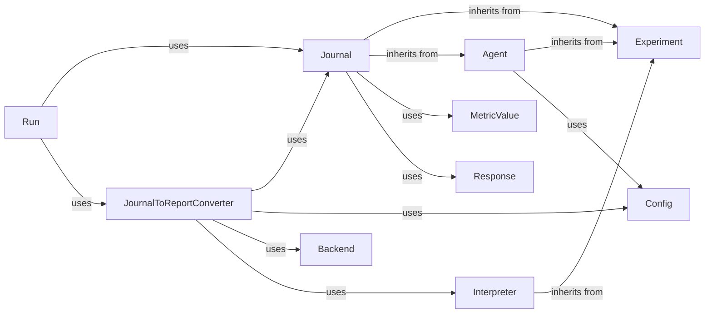

## Component Details

One paragraph explaining the functionality which is represented by this graph. What the main flow is and what is its purpose.

### Journal
This component is responsible for the real-time recording of detailed logs of the agent's actions, observations, and intermediate results throughout an experiment. It acts as the primary data capture mechanism for the experiment's execution flow. Its inheritance from `Experiment` and `Agent` indicates its deep integration into the core experiment and agent execution logic, allowing it to capture experiment-level and agent-specific data.

**Related Classes/Methods**:

- <a href="https://github.com/WecoAI/aideml/blob/master/aide/journal.py#L1-L1" target="_blank" rel="noopener noreferrer">`aide.journal.Journal` (1:1)</a>

### JournalToReportConverter
This component processes the raw data collected by the `Journal` component, transforming it into comprehensive reports and visual representations. It handles data aggregation, formatting, and interaction with backend services for advanced reporting features.

**Related Classes/Methods**:

- <a href="https://github.com/WecoAI/aideml/blob/master/aide/journal2report.py#L1-L1" target="_blank" rel="noopener noreferrer">`aide.journal2report.JournalToReportConverter` (1:1)</a>

### Experiment
This is a foundational component representing the overall experiment context. It provides the structure and environment within which agents operate and data is collected. The `Journal` component integrates with `Experiment` to capture experiment-level data.

**Related Classes/Methods**:

- `aide.Experiment` (1:1)

### Agent
This component represents the intelligent agent whose actions, observations, and internal states are the primary subject of journaling. The `Journal` component integrates with `Agent` to capture agent-specific data.

**Related Classes/Methods**:

- <a href="https://github.com/WecoAI/aideml/blob/master/aide/agent.py#L46-L338" target="_blank" rel="noopener noreferrer">`aide.agent.Agent` (46:338)</a>

### Config
This component provides configuration settings for various parts of the system, including agent behavior and reporting parameters. It ensures that both the agent's operations (which are logged) and the reporting process are customizable.

**Related Classes/Methods**:

- <a href="https://github.com/WecoAI/aideml/blob/master/aide/utils/config.py#L62-L80" target="_blank" rel="noopener noreferrer">`aide.utils.config.Config` (62:80)</a>

### MetricValue
This component represents a quantifiable measure or metric collected during the experiment. Instances of `MetricValue` are recorded by the `Journal` to track performance and other key indicators.

**Related Classes/Methods**:

- <a href="https://github.com/WecoAI/aideml/blob/master/aide/utils/metric.py#L10-L61" target="_blank" rel="noopener noreferrer">`aide.utils.metric.MetricValue` (10:61)</a>

### Response
This component encapsulates responses or outputs generated during the agent's execution. These responses are logged by the `Journal` to provide a detailed record of the agent's interactions and outcomes.

**Related Classes/Methods**:

- <a href="https://github.com/WecoAI/aideml/blob/master/aide/utils/response.py#L1-L1" target="_blank" rel="noopener noreferrer">`aide.utils.response` (1:1)</a>

### Interpreter
This component is responsible for executing and interpreting agent actions within the experiment environment. Its execution data is crucial for the `Journal` to log detailed steps and for the `JournalToReportConverter` to generate comprehensive reports on the experiment's execution flow.

**Related Classes/Methods**:

- <a href="https://github.com/WecoAI/aideml/blob/master/aide/interpreter.py#L1-L1" target="_blank" rel="noopener noreferrer">`aide.interpreter.Interpreter` (1:1)</a>

### Backend
This component represents external services or systems that `JournalToReportConverter` interacts with for advanced data processing, storage, or visualization of reports. It enables more sophisticated reporting capabilities beyond simple file generation.

**Related Classes/Methods**:

- `aide.backend` (1:1)

### Run
This component acts as the orchestrator for the entire experiment execution. It initiates and coordinates the journaling and reporting processes, ensuring that data is captured and reports are generated at appropriate stages of the experiment.

**Related Classes/Methods**:

- <a href="https://github.com/WecoAI/aideml/blob/master/aide/run.py#L55-L143" target="_blank" rel="noopener noreferrer">`aide.run` (55:143)</a>

### [FAQ](https://github.com/CodeBoarding/GeneratedOnBoardings/tree/main?tab=readme-ov-file#faq)