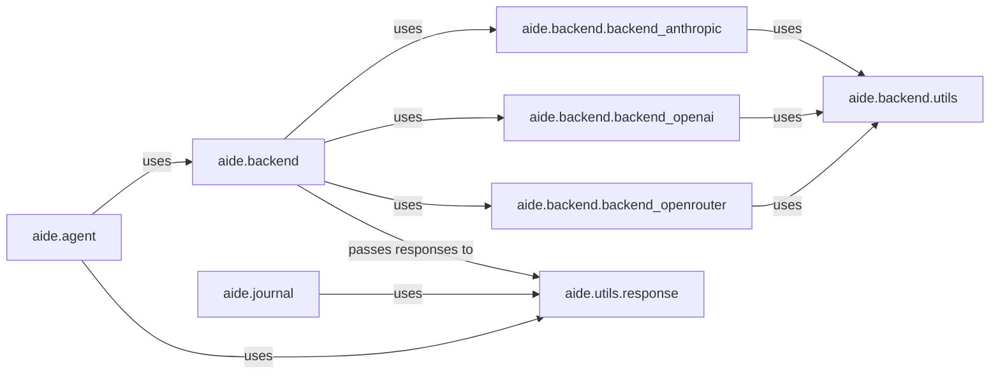

## Component Details

Analysis of the LLM Interaction Layer in aide

### aide.backend
Serves as the central dispatcher for all LLM interactions, providing a unified API for the rest of the system to communicate with various LLMs. It abstracts away the specifics of different LLM providers.

**Related Classes/Methods**:

- `aide.backend` (1:1)

### aide.backend.backend_anthropic
Encapsulates the logic for interacting with the Anthropic LLM API, including request formatting, sending requests, and handling raw responses specific to Anthropic.

**Related Classes/Methods**:

- <a href="https://github.com/WecoAI/aideml/blob/master/aide/backend/backend_anthropic.py#L1-L1" target="_blank" rel="noopener noreferrer">`aide.backend.backend_anthropic` (1:1)</a>

### aide.backend.backend_openai
Manages all communication with the OpenAI LLM API, handling the nuances of request and response formats for OpenAI models.

**Related Classes/Methods**:

- <a href="https://github.com/WecoAI/aideml/blob/master/aide/backend/backend_openai.py#L1-L1" target="_blank" rel="noopener noreferrer">`aide.backend.backend_openai` (1:1)</a>

### aide.backend.backend_openrouter
Provides the interface for integrating with the OpenRouter service, which acts as a proxy to multiple LLMs, simplifying access to a diverse range of models.

**Related Classes/Methods**:

- <a href="https://github.com/WecoAI/aideml/blob/master/aide/backend/backend_openrouter.py#L1-L1" target="_blank" rel="noopener noreferrer">`aide.backend.backend_openrouter` (1:1)</a>

### aide.backend.utils
Contains shared utility functions and helper classes used across different LLM backend implementations (e.g., API key management, common error handling, rate limiting).

**Related Classes/Methods**:

- <a href="https://github.com/WecoAI/aideml/blob/master/aide/backend/utils.py#L1-L1" target="_blank" rel="noopener noreferrer">`aide.backend.utils` (1:1)</a>

### aide.utils.response
Specializes in parsing and structuring the raw text outputs received from LLMs, extracting meaningful data such as code blocks, JSON objects, or other predefined formats for downstream consumption.

**Related Classes/Methods**:

- <a href="https://github.com/WecoAI/aideml/blob/master/aide/utils/response.py#L1-L1" target="_blank" rel="noopener noreferrer">`aide.utils.response` (1:1)</a>

### aide.agent
An external component that leverages the LLM Interaction Layer to send prompts to LLMs and receive processed responses, likely for decision-making or task execution.

**Related Classes/Methods**:

- <a href="https://github.com/WecoAI/aideml/blob/master/aide/agent.py#L1-L1" target="_blank" rel="noopener noreferrer">`aide.agent` (1:1)</a>

### aide.journal
An external component that interacts with the LLM Interaction Layer to log or record LLM interactions and their responses, crucial for debugging, auditing, or analysis.

**Related Classes/Methods**:

- <a href="https://github.com/WecoAI/aideml/blob/master/aide/journal.py#L1-L1" target="_blank" rel="noopener noreferrer">`aide.journal` (1:1)</a>

### [FAQ](https://github.com/CodeBoarding/GeneratedOnBoardings/tree/main?tab=readme-ov-file#faq)