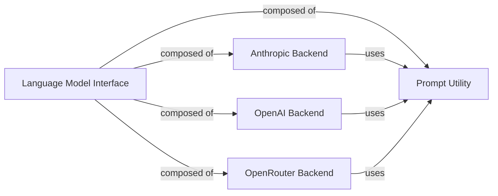

## Component Details

This subsystem, named `Language Model Interface`, is designed to abstract and standardize interactions with various large language model (LLM) providers. Its primary purpose is to provide a unified interface for prompt compilation, making API calls to different LLMs, and parsing their responses, thereby decoupling the core application logic from specific LLM implementations.

### Language Model Interface
This is the overarching conceptual component that serves as the primary abstraction layer for all LLM-related operations. It orchestrates the interaction with various LLM backends and ensures consistent prompt handling. It is fundamental because it provides a single, unified entry point for the rest of the `aide` project to interact with diverse LLMs without needing to know the specifics of each provider.

**Related Classes/Methods**:

- `aide/backend/backend.py` (1:1)
- <a href="https://github.com/WecoAI/aideml/blob/master/aide/backend/utils.py#L1-L1" target="_blank" rel="noopener noreferrer">`aide/backend/utils.py` (1:1)</a>

### Anthropic Backend
This component is responsible for all direct interactions with the Anthropic AI model. It handles the specifics of sending formatted queries to the Anthropic API, managing the Anthropic client, and processing the responses. It is fundamental as it encapsulates the unique integration details for Anthropic, allowing the `Language Model Interface` to remain provider-agnostic.

**Related Classes/Methods**:

- <a href="https://github.com/WecoAI/aideml/blob/master/aide/backend/backend_anthropic.py#L1-L1" target="_blank" rel="noopener noreferrer">`aide/backend/backend_anthropic.py` (1:1)</a>

### OpenAI Backend
This component manages all direct interactions with the OpenAI AI model. Its responsibilities include configuring the OpenAI client, sending queries to the OpenAI API, and handling the responses. It is fundamental because it isolates the OpenAI-specific API calls and client management from the rest of the system.

**Related Classes/Methods**:

- <a href="https://github.com/WecoAI/aideml/blob/master/aide/backend/backend_openai.py#L1-L1" target="_blank" rel="noopener noreferrer">`aide/backend/backend_openai.py` (1:1)</a>

### OpenRouter Backend
This component facilitates all direct interactions with the OpenRouter service, which acts as a unified API gateway for various models. It handles sending queries to the OpenRouter API and setting up the OpenRouter client. It is fundamental as it provides flexibility by allowing access to a multitude of models through a single, standardized interface provided by OpenRouter.

**Related Classes/Methods**:

- <a href="https://github.com/WecoAI/aideml/blob/master/aide/backend/backend_openrouter.py#L1-L1" target="_blank" rel="noopener noreferrer">`aide/backend/backend_openrouter.py` (1:1)</a>

### Prompt Utility
This component provides common utility functions primarily focused on compiling prompts into a standardized Markdown format. This ensures consistency in prompt formatting across different LLM backends, regardless of the specific LLM provider. It is fundamental because it centralizes prompt formatting logic, preventing duplication and ensuring that all LLM backends receive prompts in a consistent and expected structure.

**Related Classes/Methods**:

- <a href="https://github.com/WecoAI/aideml/blob/master/aide/backend/utils.py#L1-L1" target="_blank" rel="noopener noreferrer">`aide/backend/utils.py` (1:1)</a>

### [FAQ](https://github.com/CodeBoarding/GeneratedOnBoardings/tree/main?tab=readme-ov-file#faq)