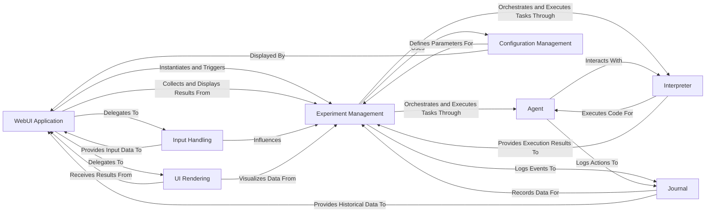

## Component Details

The `User Interface` subsystem, primarily driven by the `WebUI Application`, provides a comprehensive Streamlit-based graphical interface for users to interact with the AIDE system. Its core purpose is to facilitate experiment configuration, data input, execution initiation, and the real-time display of progress and final results, including visualizations.

### WebUI Application
The primary entry point and orchestrator of the Streamlit UI. It manages the application's lifecycle, from environment setup and session state configuration to page layout and coordination of user interactions. It acts as the central hub, delegating specific UI tasks and initiating the core experiment execution.

**Related Classes/Methods**:

- `WebUI Application` (1:1)

### Input Handling
A sub-component of `WebUI Application` responsible for managing all user inputs. This includes handling file uploads (user-provided and examples) and capturing experiment parameters (goal, evaluation, steps). It prepares and validates this data for the `Experiment Management` component.

**Related Classes/Methods**:

- `WebUI Application:Input Handling` (1:1)

### UI Rendering
A sub-component of `WebUI Application` dedicated to the visual presentation of the user interface and experiment results. It handles rendering various UI sections, displaying live experiment progress, and presenting comprehensive final results like solution code, configuration, journal, and performance visualizations.

**Related Classes/Methods**:

- `WebUI Application:UI Rendering` (1:1)

### Experiment Management
Encapsulates the core logic for defining, initializing, and executing an AI-driven experiment. It coordinates the activities of the `Agent`, `Interpreter`, and `Journal` to achieve the experiment's goal. The `WebUI Application` interacts with this component to initiate and monitor experiments.

**Related Classes/Methods**:

- `aide.Experiment` (1:1)

### Agent
Represents the intelligent agent that performs tasks, makes decisions, and generates solutions within an experiment. It interacts with the `Interpreter` to execute code and the `Journal` to record its actions and progress.

**Related Classes/Methods**:

- <a href="https://github.com/WecoAI/aideml/blob/master/aide/agent.py#L46-L338" target="_blank" rel="noopener noreferrer">`aide.agent.Agent` (46:338)</a>

### Interpreter
Responsible for interpreting and executing the actions or code generated by the `Agent`. It acts as a bridge between the `Agent`'s high-level decisions and the system's operational capabilities, allowing the agent to interact with the environment.

**Related Classes/Methods**:

- <a href="https://github.com/WecoAI/aideml/blob/master/aide/interpreter.py#L1-L1" target="_blank" rel="noopener noreferrer">`aide.interpreter.Interpreter` (1:1)</a>

### Journal
Manages the logging, tracking, and persistence of experiment progress, intermediate results, and final outcomes. It provides a historical record of the experiment's execution, including steps, code, metrics, and identified issues.

**Related Classes/Methods**:

- <a href="https://github.com/WecoAI/aideml/blob/master/aide/journal.py#L1-L1" target="_blank" rel="noopener noreferrer">`aide.journal.Journal` (1:1)</a>

### Configuration Management
A set of classes (`AgentConfig`, `ExecConfig`, `SearchConfig`, `StageConfig`, `Config`) responsible for defining and managing various parameters and settings for experiments, agents, and execution environments. It ensures that experiments run with the correct and desired configurations.

**Related Classes/Methods**:

- <a href="https://github.com/WecoAI/aideml/blob/master/aide/utils/config.py#L62-L80" target="_blank" rel="noopener noreferrer">`aide.utils.config.Config` (62:80)</a>

### [FAQ](https://github.com/CodeBoarding/GeneratedOnBoardings/tree/main?tab=readme-ov-file#faq)