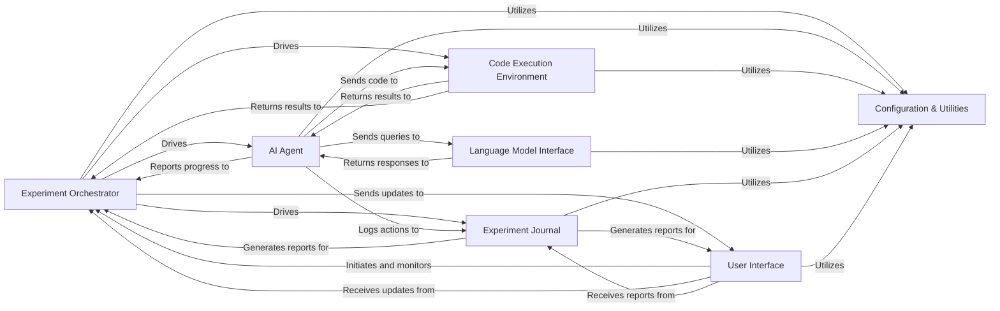

## Component Details

The `aideml` system is designed around a core AI agent that interacts with a code execution environment and language models to perform experiments, all orchestrated by a central experiment manager and presented via a user interface. A dedicated journaling component ensures comprehensive logging and reporting.

### Experiment Orchestrator
The top-level manager responsible for the entire lifecycle of an AI experiment. It initializes the experiment, coordinates the AI Agent, Code Execution Environment, and Experiment Journal, and oversees the overall execution flow.

**Related Classes/Methods**:

- <a href="https://github.com/WecoAI/aideml/blob/master/aide/__init__.py#L22-L61" target="_blank" rel="noopener noreferrer">`aide.__init__.Experiment` (22:61)</a>
- <a href="https://github.com/WecoAI/aideml/blob/master/aide/run.py#L55-L143" target="_blank" rel="noopener noreferrer">`aide.run.run` (55:143)</a>

### AI Agent
The intelligent core of the system, responsible for the AI's decision-making process. It plans, generates code, debugs, and refines solutions by interacting with the Language Model Interface and the Code Execution Environment.

**Related Classes/Methods**:

- <a href="https://github.com/WecoAI/aideml/blob/master/aide/agent.py#L46-L338" target="_blank" rel="noopener noreferrer">`aide.agent.Agent` (46:338)</a>

### Code Execution Environment
Provides a secure and isolated sandbox for executing Python code generated by the AI Agent. It manages the execution process, captures standard output/error, and handles exceptions.

**Related Classes/Methods**:

- <a href="https://github.com/WecoAI/aideml/blob/master/aide/interpreter.py#L0-L0" target="_blank" rel="noopener noreferrer">`aide.interpreter.Interpreter` (0:0)</a>

### Language Model Interface
Abstracts interactions with various large language model (LLM) providers. It handles prompt compilation, API calls to LLMs, and parsing their responses.

**Related Classes/Methods**:

- `aide.backend.backend` (0:0)
- <a href="https://github.com/WecoAI/aideml/blob/master/aide/backend/utils.py#L0-L0" target="_blank" rel="noopener noreferrer">`aide.backend.utils` (0:0)</a>

### Experiment Journal
Responsible for recording the entire interaction history of an experiment, including agent steps, code executions, and model responses. It also provides utilities for converting this journal into rich reports and visualizations.

**Related Classes/Methods**:

- <a href="https://github.com/WecoAI/aideml/blob/master/aide/journal.py#L0-L0" target="_blank" rel="noopener noreferrer">`aide.journal.Journal` (0:0)</a>
- <a href="https://github.com/WecoAI/aideml/blob/master/aide/journal.py#L0-L0" target="_blank" rel="noopener noreferrer">`aide.journal.journal_to_rich_tree` (0:0)</a>

### User Interface
A Streamlit-based graphical interface that allows users to interact with the system. Users can configure experiments, upload data, initiate runs, and view live progress and final results and visualizations.

**Related Classes/Methods**:

- <a href="https://github.com/WecoAI/aideml/blob/master/aide/webui/app.py#L27-L607" target="_blank" rel="noopener noreferrer">`aide.webui.app.WebUI` (27:607)</a>

### Configuration & Utilities
A collection of shared helper modules providing common functionalities such as configuration loading and management, data preview, response parsing, data serialization, and tree visualization.

**Related Classes/Methods**:

- `aide.utils` (0:0)

### [FAQ](https://github.com/CodeBoarding/GeneratedOnBoardings/tree/main?tab=readme-ov-file#faq)