```mermaid
graph LR
    Experiment_Orchestration_Agent["Experiment Orchestration & Agent"]
    Code_Execution_Interpreter["Code Execution Interpreter"]
    LLM_Interaction_Layer["LLM Interaction Layer"]
    Configuration_Management["Configuration Management"]
    Journaling_Reporting["Journaling & Reporting"]
    Data_Utilities["Data Utilities"]
    Web_User_Interface["Web User Interface"]
    Experiment_Orchestration_Agent -- "triggers and manages" --> Code_Execution_Interpreter
    Experiment_Orchestration_Agent -- "sends prompts to and receives responses from" --> LLM_Interaction_Layer
    Code_Execution_Interpreter -- "receives code snippets from" --> Experiment_Orchestration_Agent
    Code_Execution_Interpreter -- "provides execution results to" --> Experiment_Orchestration_Agent
    LLM_Interaction_Layer -- "receives prompts from" --> Experiment_Orchestration_Agent
    LLM_Interaction_Layer -- "provides responses to" --> Experiment_Orchestration_Agent
    Configuration_Management -- "provides settings to" --> Experiment_Orchestration_Agent
    Configuration_Management -- "provides settings to" --> Web_User_Interface
    Journaling_Reporting -- "receives logged data from" --> Experiment_Orchestration_Agent
    Journaling_Reporting -- "provides logged data for visualization and reporting to" --> Web_User_Interface
    Data_Utilities -- "provides preprocessed input data to" --> Experiment_Orchestration_Agent
    Data_Utilities -- "used by" --> Web_User_Interface
    Web_User_Interface -- "initiates and monitors" --> Experiment_Orchestration_Agent
    Web_User_Interface -- "requests visualizations and data previews from" --> Journaling_Reporting
    Web_User_Interface -- "requests visualizations and data previews from" --> Data_Utilities
    click Experiment_Orchestration_Agent href "https://github.com/CodeBoarding/GeneratedOnBoardings/blob/main//aideml/Experiment_Orchestration_Agent.md" "Details"
    click Code_Execution_Interpreter href "https://github.com/CodeBoarding/GeneratedOnBoardings/blob/main//aideml/Code_Execution_Interpreter.md" "Details"
    click LLM_Interaction_Layer href "https://github.com/CodeBoarding/GeneratedOnBoardings/blob/main//aideml/LLM_Interaction_Layer.md" "Details"
    click Configuration_Management href "https://github.com/CodeBoarding/GeneratedOnBoardings/blob/main//aideml/Configuration_Management.md" "Details"
    click Journaling_Reporting href "https://github.com/CodeBoarding/GeneratedOnBoardings/blob/main//aideml/Journaling_Reporting.md" "Details"
    click Data_Utilities href "https://github.com/CodeBoarding/GeneratedOnBoardings/blob/main//aideml/Data_Utilities.md" "Details"
```

## Component Details

High-level data flow overview for `aideml` project, consolidating insights from Control Flow Graph (CFG) and Source Code analysis.

### Experiment Orchestration & Agent
This central component manages the entire lifecycle of an AIDE experiment, from setup and execution to result collection. It also embodies the intelligent agent's core decision-making process, including planning, iterative problem-solving, and code generation.

**Related Classes/Methods**:

- <a href="https://github.com/WecoAI/aideml/blob/master/aide/run.py#L55-L143" target="_blank" rel="noopener noreferrer">`aide.run` (55:143)</a>
- `aide.Experiment` (1:1)
- <a href="https://github.com/WecoAI/aideml/blob/master/aide/agent.py#L1-L1" target="_blank" rel="noopener noreferrer">`aide.agent` (1:1)</a>

### Code Execution Interpreter
Responsible for executing Python code generated by the `Experiment Orchestration & Agent` within a sandboxed environment. It captures execution outputs, errors, and provides them back to the agent for analysis.

**Related Classes/Methods**:

- <a href="https://github.com/WecoAI/aideml/blob/master/aide/interpreter.py#L1-L1" target="_blank" rel="noopener noreferrer">`aide.interpreter` (1:1)</a>

### LLM Interaction Layer
Provides a unified interface for interacting with various Large Language Models (LLMs). It handles the compilation of prompts, sending requests to the LLMs, and parsing structured information (like code blocks or JSON objects) from the raw text responses.

**Related Classes/Methods**:

- `aide.backend` (1:1)
- <a href="https://github.com/WecoAI/aideml/blob/master/aide/utils/response.py#L1-L1" target="_blank" rel="noopener noreferrer">`aide.utils.response` (1:1)</a>

### Configuration Management
Manages the loading, parsing, and distribution of application-wide and experiment-specific configurations. It acts as a central source for settings used across various components of the AIDE system.

**Related Classes/Methods**:

- <a href="https://github.com/WecoAI/aideml/blob/master/aide/utils/config.py#L1-L1" target="_blank" rel="noopener noreferrer">`aide.utils.config` (1:1)</a>

### Journaling & Reporting
This component is responsible for recording detailed logs of the agent's actions, observations, and intermediate results throughout an experiment. It also facilitates the generation of comprehensive reports and creates visual representations from the collected experiment data.

**Related Classes/Methods**:

- <a href="https://github.com/WecoAI/aideml/blob/master/aide/journal.py#L1-L1" target="_blank" rel="noopener noreferrer">`aide.journal` (1:1)</a>
- <a href="https://github.com/WecoAI/aideml/blob/master/aide/journal2report.py#L5-L30" target="_blank" rel="noopener noreferrer">`aide.journal2report` (5:30)</a>
- <a href="https://github.com/WecoAI/aideml/blob/master/aide/utils/tree_export.py#L1-L1" target="_blank" rel="noopener noreferrer">`aide.utils.tree_export` (1:1)</a>

### Data Utilities
Offers general utilities for data handling, including previewing datasets, serialization (e.g., JSON), and basic data preprocessing. It ensures data is in a usable format for the agent and other components.

**Related Classes/Methods**:

- <a href="https://github.com/WecoAI/aideml/blob/master/aide/utils/data_preview.py#L1-L1" target="_blank" rel="noopener noreferrer">`aide.utils.data_preview` (1:1)</a>
- <a href="https://github.com/WecoAI/aideml/blob/master/aide/utils/serialize.py#L1-L1" target="_blank" rel="noopener noreferrer">`aide.utils.serialize` (1:1)</a>

### Web User Interface
Provides a web-based graphical interface for users to interact with the AIDE system. Users can configure experiments, upload data, initiate and monitor experiments, and view live results and visualizations.

**Related Classes/Methods**:

- <a href="https://github.com/WecoAI/aideml/blob/master/aide/webui/app.py#L1-L1" target="_blank" rel="noopener noreferrer">`aide.webui.app` (1:1)</a>

### [FAQ](https://github.com/CodeBoarding/GeneratedOnBoardings/tree/main?tab=readme-ov-file#faq)