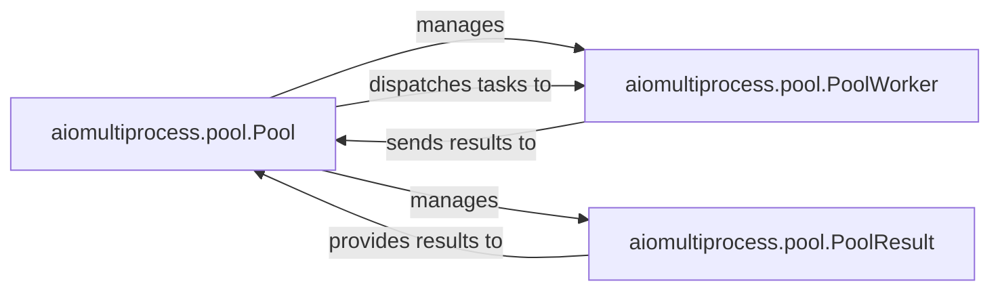

## Details

The `aiomultiprocess.pool` subsystem provides an asynchronous multiprocessing pool for executing CPU-bound tasks. The `Pool` component acts as the central manager, responsible for creating and overseeing `PoolWorker` processes. It dispatches tasks to these workers and manages the collection of results through `PoolResult` objects. Each `PoolWorker` executes tasks in a separate process, leveraging `asyncio` for internal concurrency, and sends its results back to the `Pool`. The `PoolResult` component serves as an asynchronous proxy, allowing the `Pool` to retrieve and provide task outcomes efficiently. This architecture ensures parallel execution of tasks while maintaining an asynchronous interface for the user.

### aiomultiprocess.pool.Pool
The central orchestrator of the worker pool, running in the main process. It manages the lifecycle of worker processes, dispatches tasks, and aggregates results, providing a unified interface for users. This component directly aligns with the "Process Pool Manager" and "Result Aggregator" expected components.

**Related Classes/Methods**:

- <a href="https://github.com/omnilib/aiomultiprocess/blob/main/aiomultiprocess/pool.py#L148-L379" target="_blank" rel="noopener noreferrer">`aiomultiprocess.pool.Pool`:148-379</a>

### aiomultiprocess.pool.PoolWorker
Represents an individual worker process within the pool. Each worker is a separate operating system process capable of executing CPU-bound tasks in parallel, while also leveraging `asyncio` internally for efficient I/O concurrency. This component directly aligns with the "Worker Processes" expected component.

**Related Classes/Methods**:

- <a href="https://github.com/omnilib/aiomultiprocess/blob/main/aiomultiprocess/pool.py#L44-L118" target="_blank" rel="noopener noreferrer">`aiomultiprocess.pool.PoolWorker`:44-118</a>

### aiomultiprocess.pool.PoolResult
A component responsible for handling and providing access to the results of tasks executed by the worker pool. It acts as an intermediary for the `Pool` to manage the asynchronous retrieval of task outcomes.

**Related Classes/Methods**:

- <a href="https://github.com/omnilib/aiomultiprocess/blob/main/aiomultiprocess/pool.py#L121-L145" target="_blank" rel="noopener noreferrer">`aiomultiprocess.pool.PoolResult`:121-145</a>

### [FAQ](https://github.com/CodeBoarding/GeneratedOnBoardings/tree/main?tab=readme-ov-file#faq)