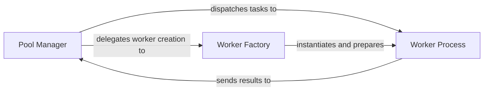

## Details

This subsystem focuses on the core mechanics of managing and executing tasks in parallel using a combination of multiprocessing and asyncio. It adheres to the Worker Pool architectural pattern, central to a concurrency and parallel processing library.

### Pool Manager [[Expand]](./Pool_Manager.md)
The `aiomultiprocess.pool.Pool` component acts as the central orchestrator of the process pool. It is responsible for managing the lifecycle of worker processes, distributing tasks to them, and collecting their results. It serves as the primary interface for users to interact with the parallel execution capabilities.

**Related Classes/Methods**:

- <a href="https://github.com/omnilib/aiomultiprocess/blob/main/aiomultiprocess/pool.py#L148-L379" target="_blank" rel="noopener noreferrer">`aiomultiprocess.pool.Pool`:148-379</a>

### Worker Process [[Expand]](./Worker_Process.md)
An independent Python process, represented by `aiomultiprocess.pool.PoolWorker`, designed to execute tasks. Each worker maintains its own `asyncio` event loop, enabling internal concurrency for I/O-bound operations, while operating in a separate process to achieve true CPU parallelism, bypassing the Global Interpreter Lock (GIL). It handles inter-process communication (IPC) for receiving tasks and sending results.

**Related Classes/Methods**:

- <a href="https://github.com/omnilib/aiomultiprocess/blob/main/aiomultiprocess/pool.py#L44-L118" target="_blank" rel="noopener noreferrer">`aiomultiprocess.pool.PoolWorker`:44-118</a>

### Worker Factory
The `aiomultiprocess.pool.create_worker` function is responsible for the instantiation and initial setup of `Worker Process` instances. It encapsulates the logic for preparing a new process to join the pool, ensuring it's ready to receive and execute tasks.

**Related Classes/Methods**:

- <a href="https://github.com/omnilib/aiomultiprocess/blob/main/aiomultiprocess/pool.py#L244-L262" target="_blank" rel="noopener noreferrer">`aiomultiprocess.pool.create_worker`:244-262</a>

### [FAQ](https://github.com/CodeBoarding/GeneratedOnBoardings/tree/main?tab=readme-ov-file#faq)