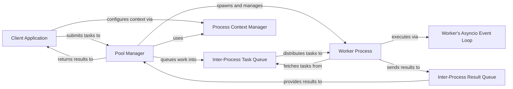

## Details

The `aiomultiprocess` library facilitates asynchronous multiprocessing by orchestrating tasks between a `Client Application` and a pool of `Worker Processes`. The `Client Application` initiates parallel tasks by submitting them to the `Pool Manager`, which acts as the central coordinator. The `Pool Manager` leverages the `Process Context Manager` to configure and manage the lifecycle of `Worker Processes`. Tasks are dispatched from the `Pool Manager` to `Worker Processes` via the `Inter-Process Task Queue`. Each `Worker Process` fetches tasks from this queue and executes them asynchronously, utilizing its internal `Worker's Asyncio Event Loop` for concurrent I/O operations. Upon completion, results are sent back from the `Worker Processes` to the `Pool Manager` through the `Inter-Process Result Queue`, which then returns the aggregated results to the `Client Application`. This architecture ensures efficient, non-blocking parallel execution of tasks.

### Client Application
The user's code that defines and submits parallel processing tasks, and consumes their results. It serves as the entry point for interacting with the aiomultiprocess pool. This component represents external user-defined code and does not have a specific source reference within the aiomultiprocess library.

**Related Classes/Methods**: _None_

### Pool Manager [[Expand]](./Pool_Manager.md)
The central orchestrator of the worker pool, running in the main process. It manages the lifecycle of worker processes, dispatches tasks, and aggregates results.

**Related Classes/Methods**:

- <a href="https://github.com/omnilib/aiomultiprocess/blob/main/aiomultiprocess/pool.py#L148-L379" target="_blank" rel="noopener noreferrer">`aiomultiprocess.pool.Pool`:148-379</a>

### Inter-Process Task Queue
A dedicated communication channel (implemented using multiprocessing.Queue) responsible for holding tasks submitted by the Pool Manager, awaiting consumption by Worker Processes. This component utilizes a standard Python library class, hence no specific file reference within the project.

**Related Classes/Methods**: _None_

### Inter-Process Result Queue
A dedicated communication channel (implemented using multiprocessing.Queue) for Worker Processes to send their completed task results and exceptions back to the Pool Manager. This component utilizes a standard Python library class, hence no specific file reference within the project.

**Related Classes/Methods**: _None_

### Worker Process [[Expand]](./Worker_Process.md)
An independent Python process spawned by the Pool Manager, designed to execute tasks. Each worker maintains its own asyncio event loop for internal concurrency.

**Related Classes/Methods**:

- <a href="https://github.com/omnilib/aiomultiprocess/blob/main/aiomultiprocess/pool.py#L44-L118" target="_blank" rel="noopener noreferrer">`aiomultiprocess.pool.PoolWorker`:44-118</a>

### Worker's Asyncio Event Loop
The asynchronous event loop running within each Worker Process. This enables a single worker process to concurrently handle multiple I/O-bound coroutines, maximizing efficiency. This component represents the standard asyncio module, hence no specific file reference within the project.

**Related Classes/Methods**: _None_

### Process Context Manager
The underlying mechanism for configuring the multiprocessing start method (e.g., 'fork', 'spawn', 'forkserver') and managing the process creation context.

**Related Classes/Methods**:

- <a href="https://github.com/omnilib/aiomultiprocess/blob/main/aiomultiprocess/core.py#L65-L72" target="_blank" rel="noopener noreferrer">`aiomultiprocess.core.set_context`:65-72</a>
- <a href="https://github.com/omnilib/aiomultiprocess/blob/main/aiomultiprocess/core.py#L59-L62" target="_blank" rel="noopener noreferrer">`aiomultiprocess.core.get_context`:59-62</a>

### [FAQ](https://github.com/CodeBoarding/GeneratedOnBoardings/tree/main?tab=readme-ov-file#faq)