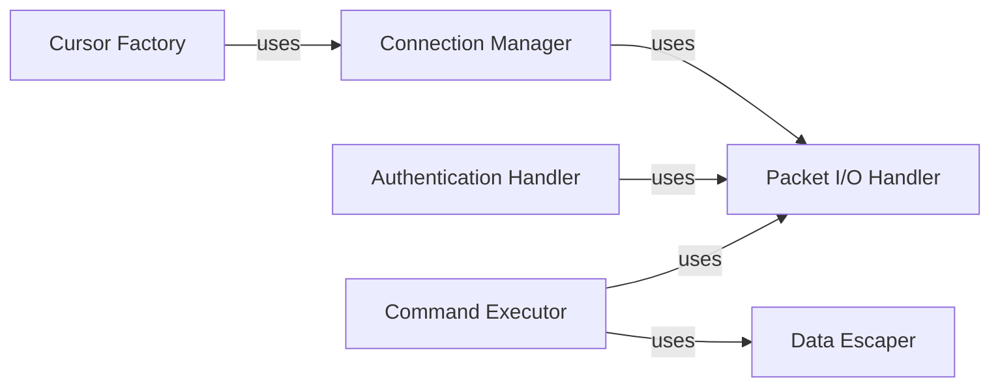

## Details

The `Asynchronous Connection` subsystem, primarily centered around the `aiomysql.connection` module and the `aiomysql.connection.Connection` class, is responsible for establishing and maintaining direct asynchronous communication with the MySQL server. It acts as the low-level asynchronous interface, handling network connections, authentication, command dispatch, and raw response processing.

### Connection Manager
Manages the entire lifecycle of the asynchronous MySQL connection, including its establishment, maintenance (e.g., keeping it alive), and graceful termination. This component ensures efficient resource handling and adherence to asynchronous patterns.

**Related Classes/Methods**:

- <a href="https://github.com/aio-libs/aiomysql/blob/master/aiomysql/connection.py" target="_blank" rel="noopener noreferrer">`aiomysql.connection.Connection:connect`</a>
- <a href="https://github.com/aio-libs/aiomysql/blob/master/aiomysql/connection.py" target="_blank" rel="noopener noreferrer">`aiomysql.connection.Connection:_connect`</a>
- <a href="https://github.com/aio-libs/aiomysql/blob/master/aiomysql/connection.py" target="_blank" rel="noopener noreferrer">`aiomysql.connection.Connection:ensure_closed`</a>
- <a href="https://github.com/aio-libs/aiomysql/blob/master/aiomysql/connection.py" target="_blank" rel="noopener noreferrer">`aiomysql.connection.Connection:close`</a>
- <a href="https://github.com/aio-libs/aiomysql/blob/master/aiomysql/connection.py" target="_blank" rel="noopener noreferrer">`aiomysql.connection.Connection:__aexit__`</a>
- <a href="https://github.com/aio-libs/aiomysql/blob/master/aiomysql/connection.py" target="_blank" rel="noopener noreferrer">`aiomysql.connection.Connection:__del__`</a>
- <a href="https://github.com/aio-libs/aiomysql/blob/master/aiomysql/connection.py" target="_blank" rel="noopener noreferrer">`aiomysql.connection.Connection:ping`</a>

### Packet I/O Handler
Handles the low-level asynchronous network communication by reading and writing MySQL protocol packets. It is responsible for the raw data exchange between the client and the MySQL server, including initial parsing of query results.

**Related Classes/Methods**:

- <a href="https://github.com/aio-libs/aiomysql/blob/master/aiomysql/connection.py" target="_blank" rel="noopener noreferrer">`aiomysql.connection.Connection:write_packet`</a>
- <a href="https://github.com/aio-libs/aiomysql/blob/master/aiomysql/connection.py" target="_blank" rel="noopener noreferrer">`aiomysql.connection.Connection:_read_packet`</a>
- <a href="https://github.com/aio-libs/aiomysql/blob/master/aiomysql/connection.py" target="_blank" rel="noopener noreferrer">`aiomysql.connection.Connection:_read_bytes`</a>
- <a href="https://github.com/aio-libs/aiomysql/blob/master/aiomysql/connection.py" target="_blank" rel="noopener noreferrer">`aiomysql.connection.Connection:_read_ok_packet`</a>
- <a href="https://github.com/aio-libs/aiomysql/blob/master/aiomysql/connection.py" target="_blank" rel="noopener noreferrer">`aiomysql.connection.Connection:_read_query_result`</a>
- <a href="https://github.com/aio-libs/aiomysql/blob/master/aiomysql/connection.py" target="_blank" rel="noopener noreferrer">`aiomysql.connection.Connection:next_result`</a>
- <a href="https://github.com/aio-libs/aiomysql/blob/master/aiomysql/connection.py" target="_blank" rel="noopener noreferrer">`aiomysql.connection.Connection:read`</a>
- <a href="https://github.com/aio-libs/aiomysql/blob/master/aiomysql/connection.py" target="_blank" rel="noopener noreferrer">`aiomysql.connection.Connection:init_unbuffered_query`</a>
- <a href="https://github.com/aio-libs/aiomysql/blob/master/aiomysql/connection.py" target="_blank" rel="noopener noreferrer">`aiomysql.connection.Connection:_read_load_local_packet`</a>
- <a href="https://github.com/aio-libs/aiomysql/blob/master/aiomysql/connection.py" target="_blank" rel="noopener noreferrer">`aiomysql.connection.Connection:_read_result_packet`</a>
- <a href="https://github.com/aio-libs/aiomysql/blob/master/aiomysql/connection.py" target="_blank" rel="noopener noreferrer">`aiomysql.connection.Connection:_read_rowdata_packet_unbuffered`</a>
- <a href="https://github.com/aio-libs/aiomysql/blob/master/aiomysql/connection.py" target="_blank" rel="noopener noreferrer">`aiomysql.connection.Connection:_read_rowdata_packet`</a>
- <a href="https://github.com/aio-libs/aiomysql/blob/master/aiomysql/connection.py" target="_blank" rel="noopener noreferrer">`aiomysql.connection.Connection:_finish_unbuffered_query`</a>

### Authentication Handler
Manages the secure authentication handshake process with the MySQL server. It handles different authentication methods and ensures that the connection is securely established before any commands are executed.

**Related Classes/Methods**:

- <a href="https://github.com/aio-libs/aiomysql/blob/master/aiomysql/connection.py" target="_blank" rel="noopener noreferrer">`aiomysql.connection.Connection:_request_authentication`</a>
- <a href="https://github.com/aio-libs/aiomysql/blob/master/aiomysql/connection.py" target="_blank" rel="noopener noreferrer">`aiomysql.connection.Connection:_process_auth`</a>
- <a href="https://github.com/aio-libs/aiomysql/blob/master/aiomysql/connection.py" target="_blank" rel="noopener noreferrer">`aiomysql.connection.Connection:caching_sha2_2_password_auth`</a>
- <a href="https://github.com/aio-libs/aiomysql/blob/master/aiomysql/connection.py" target="_blank" rel="noopener noreferrer">`aiomysql.connection.Connection:sha256_password_auth`</a>

### Command Executor
Responsible for executing SQL commands and queries against the MySQL server. It handles the formatting and sending of commands, as well as the initial processing of responses, including transaction management (begin, commit, rollback).

**Related Classes/Methods**:

- <a href="https://github.com/aio-libs/aiomysql/blob/master/aiomysql/connection.py" target="_blank" rel="noopener noreferrer">`aiomysql.connection.Connection:_execute_command`</a>
- <a href="https://github.com/aio-libs/aiomysql/blob/master/aiomysql/connection.py" target="_blank" rel="noopener noreferrer">`aiomysql.connection.Connection:query`</a>
- <a href="https://github.com/aio-libs/aiomysql/blob/master/aiomysql/connection.py" target="_blank" rel="noopener noreferrer">`aiomysql.connection.Connection:begin`</a>
- <a href="https://github.com/aio-libs/aiomysql/blob/master/aiomysql/connection.py" target="_blank" rel="noopener noreferrer">`aiomysql.connection.Connection:commit`</a>
- <a href="https://github.com/aio-libs/aiomysql/blob/master/aiomysql/connection.py" target="_blank" rel="noopener noreferrer">`aiomysql.connection.Connection:rollback`</a>
- <a href="https://github.com/aio-libs/aiomysql/blob/master/aiomysql/connection.py" target="_blank" rel="noopener noreferrer">`aiomysql.connection.Connection:select_db`</a>
- <a href="https://github.com/aio-libs/aiomysql/blob/master/aiomysql/connection.py" target="_blank" rel="noopener noreferrer">`aiomysql.connection.Connection:kill`</a>
- <a href="https://github.com/aio-libs/aiomysql/blob/master/aiomysql/connection.py" target="_blank" rel="noopener noreferrer">`aiomysql.connection.Connection:set_charset`</a>

### Data Escaper
Provides utility functions for safely escaping Python values into SQL literal representations. Its primary role is to prevent SQL injection vulnerabilities by properly sanitizing input before it is sent to the database.

**Related Classes/Methods**:

- <a href="https://github.com/aio-libs/aiomysql/blob/master/aiomysql/connection.py" target="_blank" rel="noopener noreferrer">`aiomysql.connection.Connection:escape`</a>
- <a href="https://github.com/aio-libs/aiomysql/blob/master/aiomysql/connection.py" target="_blank" rel="noopener noreferrer">`aiomysql.connection.Connection:literal`</a>

### Cursor Factory
Creates and provides cursor objects, which serve as the primary interface for users to execute SQL commands and fetch results from the database. It abstracts the underlying connection details from the user's query execution logic.

**Related Classes/Methods**:

- <a href="https://github.com/aio-libs/aiomysql/blob/master/aiomysql/connection.py" target="_blank" rel="noopener noreferrer">`aiomysql.connection.Connection:cursor`</a>

### [FAQ](https://github.com/CodeBoarding/GeneratedOnBoardings/tree/main?tab=readme-ov-file#faq)