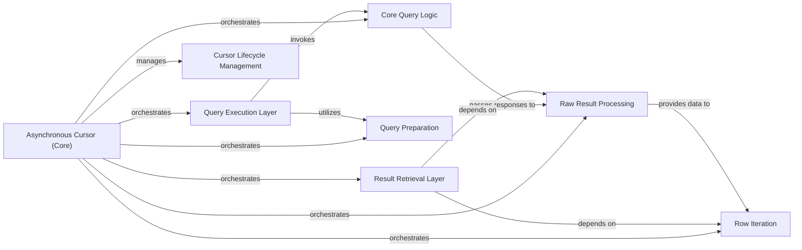

## Details

The `Asynchronous Cursor` subsystem in `aiomysql` provides a high-level asynchronous interface for executing SQL queries and retrieving results, abstracting underlying connection details and handling result set processing.

### Asynchronous Cursor (Core)
The central component providing the high-level asynchronous interface for database operations. It orchestrates the flow of query execution and result retrieval, acting as an adapter over the underlying connection.

**Related Classes/Methods**:

- <a href="https://github.com/aio-libs/aiomysql/blob/master/aiomysql/cursors.py#L26-L517" target="_blank" rel="noopener noreferrer">`aiomysql.cursors.Cursor`:26-517</a>

### Query Execution Layer
Handles the asynchronous initiation and management of SQL command execution against the database.

**Related Classes/Methods**:

- <a href="https://github.com/aio-libs/aiomysql/blob/master/aiomysql/cursors.py#L218-L244" target="_blank" rel="noopener noreferrer">`aiomysql.cursors.execute`:218-244</a>
- <a href="https://github.com/aio-libs/aiomysql/blob/master/aiomysql/cursors.py#L246-L290" target="_blank" rel="noopener noreferrer">`aiomysql.cursors.executemany`:246-290</a>

### Result Retrieval Layer
Provides various asynchronous mechanisms to retrieve data rows from the executed query's result set.

**Related Classes/Methods**:

- <a href="https://github.com/aio-libs/aiomysql/blob/master/aiomysql/cursors.py#L626-L633" target="_blank" rel="noopener noreferrer">`aiomysql.cursors.fetchone`:626-633</a>
- <a href="https://github.com/aio-libs/aiomysql/blob/master/aiomysql/cursors.py#L647-L669" target="_blank" rel="noopener noreferrer">`aiomysql.cursors.fetchmany`:647-669</a>
- <a href="https://github.com/aio-libs/aiomysql/blob/master/aiomysql/cursors.py#L635-L645" target="_blank" rel="noopener noreferrer">`aiomysql.cursors.fetchall`:635-645</a>

### Query Preparation
Safely prepares a SQL query string by escaping arguments, crucial for preventing SQL injection vulnerabilities.

**Related Classes/Methods**:

- <a href="https://github.com/aio-libs/aiomysql/blob/master/aiomysql/cursors.py#L205-L216" target="_blank" rel="noopener noreferrer">`aiomysql.cursors.mogrify`:205-216</a>

### Core Query Logic
Orchestrates the low-level asynchronous sending of a query to the database and handles the initial receipt of the raw database response.

**Related Classes/Methods**:

- <a href="https://github.com/aio-libs/aiomysql/blob/master/aiomysql/cursors.py#L613-L618" target="_blank" rel="noopener noreferrer">`aiomysql.cursors._query`:613-618</a>

### Raw Result Processing
Parses the raw database response (byte stream) into a structured, internal format suitable for further processing.

**Related Classes/Methods**:

- <a href="https://github.com/aio-libs/aiomysql/blob/master/aiomysql/cursors.py#L559-L571" target="_blank" rel="noopener noreferrer">`aiomysql.cursors._do_get_result`:559-571</a>

### Row Iteration
Facilitates the asynchronous reading and processing of individual rows from the structured result set.

**Related Classes/Methods**:

- <a href="https://github.com/aio-libs/aiomysql/blob/master/aiomysql/cursors.py#L620-L624" target="_blank" rel="noopener noreferrer">`aiomysql.cursors._read_next`:620-624</a>

### Cursor Lifecycle Management
Manages the state and resources of the cursor, ensuring proper cleanup and release of associated resources.

**Related Classes/Methods**:

- <a href="https://github.com/aio-libs/aiomysql/blob/master/aiomysql/cursors.py#L599-L611" target="_blank" rel="noopener noreferrer">`aiomysql.cursors.close`:599-611</a>

### [FAQ](https://github.com/CodeBoarding/GeneratedOnBoardings/tree/main?tab=readme-ov-file#faq)