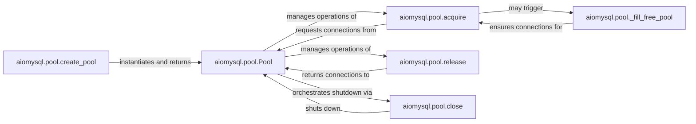

## Details

The `aiomysql.pool` subsystem provides robust asynchronous database connection pooling. At its core, the `Pool` component efficiently manages a collection of `aiomysql` connections, optimizing resource utilization and handling concurrent access. The `create_pool` function serves as the entry point for pool initialization. Clients interact with the pool by calling `acquire` to retrieve a connection and `release` to return it, facilitating connection reuse. An internal `_fill_free_pool` mechanism proactively maintains the desired number of available connections. The subsystem ensures proper resource cleanup through the `close` function, which gracefully shuts down the entire pool. This design promotes efficient, scalable, and reliable database interactions within asynchronous applications.

### aiomysql.pool.Pool
The core component responsible for managing the lifecycle, availability, and limits of `aiomysql` connections. It orchestrates connection reuse, handles concurrent access, and maintains the pool of free and used connections.

**Related Classes/Methods**:

- <a href="https://github.com/aio-libs/aiomysql/blob/master/aiomysql/pool.py#L33-L270" target="_blank" rel="noopener noreferrer">`aiomysql.pool.Pool`:33-270</a>

### aiomysql.pool.create_pool
A factory function that initializes and returns a new `Pool` instance. It abstracts the pool creation process, allowing users to configure pool parameters without direct `Pool` class instantiation.

**Related Classes/Methods**:

- <a href="https://github.com/aio-libs/aiomysql/blob/master/aiomysql/pool.py#L13-L17" target="_blank" rel="noopener noreferrer">`aiomysql.pool.create_pool`:13-17</a>

### aiomysql.pool.acquire
Provides the asynchronous interface for users to obtain an available database connection from the pool. It manages waiting for connections if none are immediately available and ensures proper connection handover.

**Related Classes/Methods**:

- <a href="https://github.com/aio-libs/aiomysql/blob/master/aiomysql/pool.py#L132-L135" target="_blank" rel="noopener noreferrer">`aiomysql.pool.acquire`:132-135</a>

### aiomysql.pool.release
Returns a previously acquired database connection back to the pool, making it available for reuse. It ensures the connection is properly returned and its state is reset if necessary.

**Related Classes/Methods**:

- <a href="https://github.com/aio-libs/aiomysql/blob/master/aiomysql/pool.py#L207-L231" target="_blank" rel="noopener noreferrer">`aiomysql.pool.release`:207-231</a>

### aiomysql.pool.close
Initiates the graceful asynchronous shutdown of the connection pool. It ensures all managed connections are properly closed and resources are released.

**Related Classes/Methods**:

- <a href="https://github.com/aio-libs/aiomysql/blob/master/aiomysql/pool.py#L89-L97" target="_blank" rel="noopener noreferrer">`aiomysql.pool.close`:89-97</a>

### aiomysql.pool._fill_free_pool
An internal mechanism to proactively create and add new connections to the pool. It ensures the pool maintains a minimum number of available connections and adheres to configured size limits.

**Related Classes/Methods**:

- <a href="https://github.com/aio-libs/aiomysql/blob/master/aiomysql/pool.py#L152-L201" target="_blank" rel="noopener noreferrer">`aiomysql.pool._fill_free_pool`:152-201</a>

### [FAQ](https://github.com/CodeBoarding/GeneratedOnBoardings/tree/main?tab=readme-ov-file#faq)