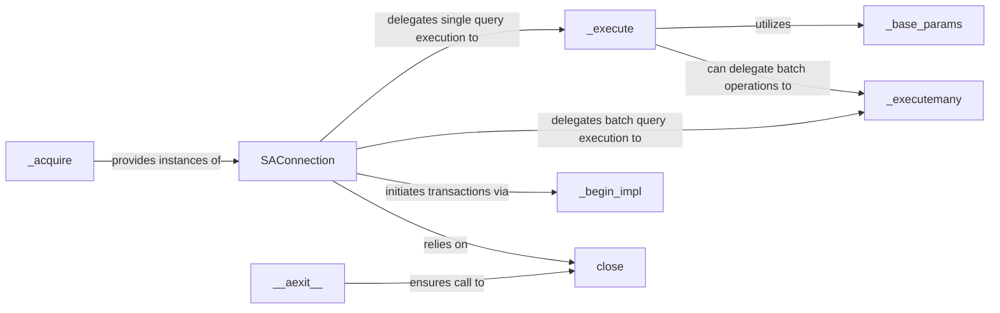

## Details

The SQLAlchemy Connection Adapter subsystem in aiomysql

### SAConnection
The core adapter class that provides a SQLAlchemy-compliant asynchronous connection interface. It manages SQL query execution, transaction management, and resource cleanup, acting as the primary interface for SQLAlchemy operations.

**Related Classes/Methods**:

- <a href="https://github.com/aio-libs/aiomysql/blob/master/aiomysql/sa/connection.py#L20-L385" target="_blank" rel="noopener noreferrer">`SAConnection`:20-385</a>

### _execute
Responsible for asynchronously executing a single SQL statement. It handles parameter processing and can delegate to batch execution when multiple parameters are provided for a single statement.

**Related Classes/Methods**:

- <a href="https://github.com/aio-libs/aiomysql/blob/master/aiomysql/sa/connection.py#L135-L183" target="_blank" rel="noopener noreferrer">`_execute`:135-183</a>

### _executemany
Optimizes the execution of multiple SQL statements or a single statement with multiple parameter sets. This component is crucial for performance in batch operations, such as bulk inserts or updates.

**Related Classes/Methods**:

- <a href="https://github.com/aio-libs/aiomysql/blob/master/aiomysql/sa/connection.py#L93-L133" target="_blank" rel="noopener noreferrer">`_executemany`:93-133</a>

### _acquire
Manages the acquisition of SAConnection instances, typically from a connection pool. This ensures efficient reuse and management of database connections.

**Related Classes/Methods**:

- <a href="https://github.com/aio-libs/aiomysql/blob/master/aiomysql/pool.py#L137-L150" target="_blank" rel="noopener noreferrer">`_acquire`:137-150</a>

### _begin_impl
Implements the asynchronous logic for initiating a database transaction. This ensures that a series of database operations are treated as a single, atomic unit.

**Related Classes/Methods**:

- <a href="https://github.com/aio-libs/aiomysql/blob/master/aiomysql/sa/connection.py#L237-L242" target="_blank" rel="noopener noreferrer">`_begin_impl`:237-242</a>

### _base_params
Processes and validates SQL parameters before execution. This component ensures data integrity and helps prevent common issues like SQL injection by properly formatting and escaping parameters.

**Related Classes/Methods**:

- <a href="https://github.com/aio-libs/aiomysql/blob/master/aiomysql/sa/connection.py#L71-L91" target="_blank" rel="noopener noreferrer">`_base_params`:71-91</a>

### close
Asynchronously terminates the underlying database connection. This releases associated resources back to the connection pool or the operating system, preventing resource leaks.

**Related Classes/Methods**:

- <a href="https://github.com/aio-libs/aiomysql/blob/master/aiomysql/pool.py#L89-L97" target="_blank" rel="noopener noreferrer">`close`:89-97</a>

### __aexit__
Provides asynchronous context management for SAConnection instances. It ensures that the close method is automatically called upon exiting an async with block, guaranteeing resource cleanup even in the presence of exceptions.

**Related Classes/Methods**:

- <a href="https://github.com/aio-libs/aiomysql/blob/master/aiomysql/pool.py#L268-L270" target="_blank" rel="noopener noreferrer">`__aexit__`:268-270</a>

### [FAQ](https://github.com/CodeBoarding/GeneratedOnBoardings/tree/main?tab=readme-ov-file#faq)