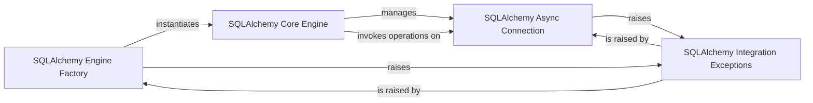

## Details

The `SQLAlchemy Engine Integration` subsystem in `aiomysql` provides the necessary components to allow SQLAlchemy applications to interact with MySQL asynchronously using `aiomysql`. This subsystem acts as an adapter layer, translating SQLAlchemy's synchronous-oriented operations into `aiomysql`'s asynchronous patterns.

### SQLAlchemy Engine Factory
This module serves as the primary entry point for SQLAlchemy applications. It provides the `create_engine` function, which is responsible for initializing and configuring SQLAlchemy-compatible database engines that leverage `aiomysql` for asynchronous operations. It also handles the initial setup and management of the engine's lifecycle, including its eventual closure.

**Related Classes/Methods**:

- <a href="https://github.com/aio-libs/aiomysql/blob/master/aiomysql/sa/engine.py" target="_blank" rel="noopener noreferrer">`aiomysql.sa.engine:create_engine`</a>

### SQLAlchemy Core Engine
This class represents the core SQLAlchemy engine within the `aiomysql.sa` integration. It encapsulates the connection pooling mechanism and manages dialect-specific behaviors necessary for SQLAlchemy to interact correctly with MySQL via `aiomysql`. It is responsible for acquiring and releasing asynchronous database connections.

**Related Classes/Methods**:

- <a href="https://github.com/aio-libs/aiomysql/blob/master/aiomysql/sa/engine.py" target="_blank" rel="noopener noreferrer">`aiomysql.sa.engine.Engine`</a>

### SQLAlchemy Async Connection
This class is an asynchronous database connection object that acts as the bridge between SQLAlchemy's execution layer and `aiomysql`'s low-level connection. It translates SQLAlchemy's operations into `aiomysql` calls and manages the asynchronous flow of query execution and transaction handling.

**Related Classes/Methods**:

- <a href="https://github.com/aio-libs/aiomysql/blob/master/aiomysql/sa/connection.py#L20-L385" target="_blank" rel="noopener noreferrer">`aiomysql.sa.connection.SAConnection`:20-385</a>

### SQLAlchemy Integration Exceptions
Provides a specific exception type for argument validation and error handling within the SQLAlchemy integration layer. This ensures that invalid parameters or configurations are caught and reported appropriately, contributing to the robustness of the integration.

**Related Classes/Methods**:

- <a href="https://github.com/aio-libs/aiomysql/blob/master/aiomysql/sa/exc.py#L8-L12" target="_blank" rel="noopener noreferrer">`aiomysql.sa.exc.ArgumentError`:8-12</a>

### [FAQ](https://github.com/CodeBoarding/GeneratedOnBoardings/tree/main?tab=readme-ov-file#faq)