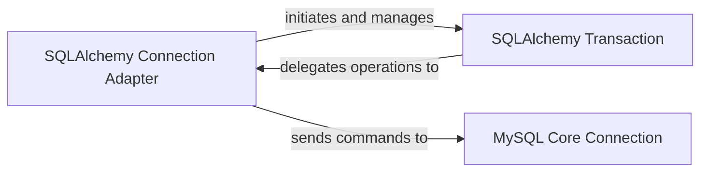

## Details

The `aiomysql` transaction management subsystem orchestrates database transactions through a layered architecture. The `SQLAlchemy Connection Adapter` serves as the entry point, initiating and managing `SQLAlchemy Transaction` objects in response to SQLAlchemy's transaction requests. The `SQLAlchemy Transaction` component, while managing the transaction's lifecycle and state, delegates the actual commit and rollback operations back to the `SQLAlchemy Connection Adapter`. Finally, the `SQLAlchemy Connection Adapter` translates these high-level requests into specific database commands, which are then sent to the `MySQL Core Connection` for direct execution against the MySQL server. This design ensures a clear separation of concerns, with the adapter handling the SQLAlchemy integration, the transaction object managing its state, and the core connection interacting directly with the database.

### SQLAlchemy Connection Adapter [[Expand]](./SQLAlchemy_Connection_Adapter.md)
This component (`aiomysql.sa.connection.SAConnection`) serves as the primary interface between SQLAlchemy's connection objects and `aiomysql`'s transaction capabilities. It is responsible for initiating various transaction types (standard, nested, two-phase) by creating and managing `SQLAlchemy Transaction` objects. It acts as an adapter, translating SQLAlchemy's transaction requests into operations that `aiomysql` can handle, ultimately sending commands to the `MySQL Core Connection`.

**Related Classes/Methods**:

- <a href="https://github.com/aio-libs/aiomysql/blob/master/aiomysql/sa/connection.py#L20-L385" target="_blank" rel="noopener noreferrer">`aiomysql.sa.connection.SAConnection`:20-385</a>

### SQLAlchemy Transaction
This component (`aiomysql.sa.transaction.Transaction`) manages the state and lifecycle of an individual SQLAlchemy transaction. It provides high-level asynchronous methods (`commit()`, `rollback()`, `prepare()`) for transaction control, including support for two-phase commits. It delegates the actual execution of transaction commands (like `COMMIT` or `ROLLBACK`) to its associated `SQLAlchemy Connection Adapter`. It ensures proper resource cleanup upon exiting its asynchronous context (`__aexit__`). Its focus is solely on the transaction's state and high-level operations.

**Related Classes/Methods**:

- <a href="https://github.com/aio-libs/aiomysql/blob/master/aiomysql/sa/transaction.py#L6-L90" target="_blank" rel="noopener noreferrer">`aiomysql.sa.transaction.Transaction`:6-90</a>

### MySQL Core Connection
This component (`aiomysql.connection.Connection`) is responsible for executing the fundamental database commands related to transaction management (`BEGIN`, `COMMIT`, `ROLLBACK`, `SAVEPOINT`). It represents the lowest layer in this subsystem, directly communicating with the MySQL server to perform physical transaction operations.

**Related Classes/Methods**: _None_

### [FAQ](https://github.com/CodeBoarding/GeneratedOnBoardings/tree/main?tab=readme-ov-file#faq)