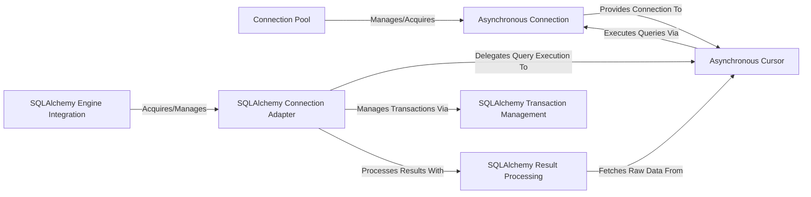

## Details

The `aiomysql` architecture is a layered, asynchronous database driver designed for Python applications. It primarily consists of a `Connection Pool` for efficient resource management, providing `Asynchronous Connection` objects that handle direct, low-level asynchronous communication with the MySQL server. `Asynchronous Cursor` objects offer a higher-level interface for query execution and result processing. An optional, yet significant, layer provides seamless integration with SQLAlchemy, featuring a `SQLAlchemy Engine Integration` as the entry point, `SQLAlchemy Connection Adapter` for translating SQLAlchemy operations, `SQLAlchemy Transaction Management` for transaction control, and `SQLAlchemy Result Processing` for ORM-compatible result handling. This design emphasizes asynchronous operations, resource efficiency, and clear separation of concerns, making it ideal for high-performance, concurrent database interactions in an `asyncio` environment.

### Connection Pool [[Expand]](./Connection_Pool.md)
Manages a pool of `aiomysql` connections, providing efficient reuse, limiting concurrent connections, and handling connection lifecycle (creation, release, closure). This is central to resource efficiency.

**Related Classes/Methods**:

- <a href="https://github.com/aio-libs/aiomysql/blob/master/aiomysql/pool.py" target="_blank" rel="noopener noreferrer">`aiomysql.pool`</a>

### Asynchronous Connection [[Expand]](./Asynchronous_Connection.md)
Handles the direct asynchronous communication with the MySQL server. This includes establishing the network connection, authentication, sending commands, and receiving raw responses. It acts as the low-level asynchronous interface to the database.

**Related Classes/Methods**:

- <a href="https://github.com/aio-libs/aiomysql/blob/master/aiomysql/connection.py" target="_blank" rel="noopener noreferrer">`aiomysql.connection`</a>

### Asynchronous Cursor [[Expand]](./Asynchronous_Cursor.md)
Provides a high-level asynchronous interface for executing SQL queries and retrieving results. It abstracts the underlying connection details and handles result set processing.

**Related Classes/Methods**:

- <a href="https://github.com/aio-libs/aiomysql/blob/master/aiomysql/cursors.py" target="_blank" rel="noopener noreferrer">`aiomysql.cursors`</a>

### SQLAlchemy Engine Integration [[Expand]](./SQLAlchemy_Engine_Integration.md)
The primary entry point for SQLAlchemy applications. It is responsible for creating and managing SQLAlchemy-compatible database engines that utilize `aiomysql` for asynchronous operations.

**Related Classes/Methods**:

- <a href="https://github.com/aio-libs/aiomysql/blob/master/aiomysql/sa/engine.py" target="_blank" rel="noopener noreferrer">`aiomysql.sa.engine`</a>

### SQLAlchemy Connection Adapter [[Expand]](./SQLAlchemy_Connection_Adapter.md)
Wraps the core `aiomysql` asynchronous connection to provide a SQLAlchemy-compliant connection interface. It translates SQLAlchemy's connection requests into `aiomysql`'s asynchronous operations.

**Related Classes/Methods**:

- <a href="https://github.com/aio-libs/aiomysql/blob/master/aiomysql/sa/connection.py" target="_blank" rel="noopener noreferrer">`aiomysql.sa.connection`</a>

### SQLAlchemy Transaction Management [[Expand]](./SQLAlchemy_Transaction_Management.md)
Manages the transaction lifecycle (begin, commit, rollback) within the SQLAlchemy integration layer, ensuring atomicity and consistency of database operations.

**Related Classes/Methods**:

- <a href="https://github.com/aio-libs/aiomysql/blob/master/aiomysql/sa/transaction.py" target="_blank" rel="noopener noreferrer">`aiomysql.sa.transaction`</a>

### SQLAlchemy Result Processing
Transforms raw query results obtained from `aiomysql` cursors into SQLAlchemy `ResultProxy` objects, enabling ORM-style result access and row manipulation.

**Related Classes/Methods**:

- <a href="https://github.com/aio-libs/aiomysql/blob/master/aiomysql/sa/result.py" target="_blank" rel="noopener noreferrer">`aiomysql.sa.result`</a>

### [FAQ](https://github.com/CodeBoarding/GeneratedOnBoardings/tree/main?tab=readme-ov-file#faq)