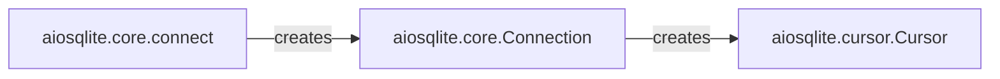

## Details

The Asynchronous API Layer forms the primary public interface for asyncio applications interacting with aiosqlite. It exposes async/await methods for connecting to the database and initiating operations, serving as the direct entry point for all asynchronous interactions with the aiosqlite library. This layer abstracts the underlying synchronous sqlite3 operations, providing a non-blocking, asyncio-compatible interface.

### aiosqlite.core.connect
This asynchronous function serves as the initial entry point for users to establish a connection to an SQLite database. It is responsible for setting up the asynchronous connection object that will manage interactions with the database.

**Related Classes/Methods**:

- <a href="https://github.com/omnilib/aiosqlite/blob/main/aiosqlite/core.py#L359-L384" target="_blank" rel="noopener noreferrer">`aiosqlite.core.connect`:359-384</a>

### aiosqlite.core.Connection
Represents an asynchronous database connection. This component provides core methods for transaction control (e.g., `commit`, `rollback`), direct SQL execution (e.g., `execute`, `executemany`, `executescript`), and acts as a factory for `aiosqlite.cursor.Cursor` objects. It encapsulates the asynchronous management and proxying of the underlying synchronous `sqlite3` connection.

**Related Classes/Methods**:

- <a href="https://github.com/omnilib/aiosqlite/blob/main/aiosqlite/core.py#L45-L356" target="_blank" rel="noopener noreferrer">`aiosqlite.core.Connection`:45-356</a>

### aiosqlite.cursor.Cursor
Provides the asynchronous interface for executing SQL queries and fetching results. It offers methods like `execute`, `executemany`, `executescript`, `fetchone`, `fetchmany`, and `fetchall`, and supports asynchronous iteration over query results. This component acts as a proxy for the synchronous `sqlite3` cursor, handling the asynchronous execution and result retrieval.

**Related Classes/Methods**:

- <a href="https://github.com/omnilib/aiosqlite/blob/main/aiosqlite/cursor.py" target="_blank" rel="noopener noreferrer">`aiosqlite.cursor.Cursor`</a>

### [FAQ](https://github.com/CodeBoarding/GeneratedOnBoardings/tree/main?tab=readme-ov-file#faq)