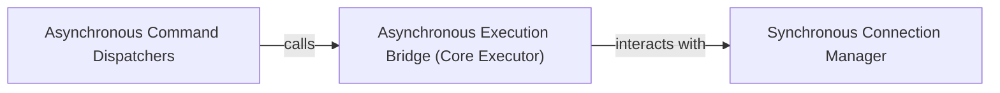

## Details

The Asynchronous Execution Bridge subsystem is responsible for seamlessly translating asynchronous database requests from the aiosqlite public API into blocking sqlite3 operations, executing them in a separate thread to prevent the asyncio event loop from being blocked. It acts as the core concurrency management layer, ensuring that the synchronous sqlite3 calls do not impede the asynchronous flow of the application.

### Asynchronous Execution Bridge (Core Executor)
This is the central mechanism that bridges asynchronous calls to synchronous `sqlite3` operations. It utilizes `asyncio.to_thread` to execute blocking database calls (like `execute`, `commit`, `rollback`, `close`) in a separate thread, ensuring the `asyncio` event loop remains non-blocked. It serves as the single entry point for all actual synchronous database interactions.

**Related Classes/Methods**:

- <a href="https://github.com/omnilib/aiosqlite/blob/main/aiosqlite/core.py" target="_blank" rel="noopener noreferrer">`aiosqlite.core:_execute`</a>

### Asynchronous Command Dispatchers
This component represents the asynchronous methods exposed by `aiosqlite` (e.g., `cursor._execute`, `connection.commit`, `connection.rollback`, `connection.close`) that prepare and delegate their respective synchronous operations to the `Asynchronous Execution Bridge (Core Executor)`. They act as the initial asynchronous entry points for database commands.

**Related Classes/Methods**:

- <a href="https://github.com/omnilib/aiosqlite/blob/main/aiosqlite/cursor.py" target="_blank" rel="noopener noreferrer">`aiosqlite.cursor:_execute`</a>
- <a href="https://github.com/omnilib/aiosqlite/blob/main/aiosqlite/core.py" target="_blank" rel="noopener noreferrer">`aiosqlite.core:commit`</a>
- <a href="https://github.com/omnilib/aiosqlite/blob/main/aiosqlite/core.py" target="_blank" rel="noopener noreferrer">`aiosqlite.core:rollback`</a>
- <a href="https://github.com/omnilib/aiosqlite/blob/main/aiosqlite/core.py" target="_blank" rel="noopener noreferrer">`aiosqlite.core:close`</a>

### Synchronous Connection Manager
This component is responsible for holding and managing the underlying synchronous `sqlite3.Connection` object. It provides the actual database handle that the `Asynchronous Execution Bridge (Core Executor)` uses to perform blocking operations.

**Related Classes/Methods**:

- <a href="https://github.com/omnilib/aiosqlite/blob/main/aiosqlite/core.py" target="_blank" rel="noopener noreferrer">`aiosqlite.core:_conn`</a>

### [FAQ](https://github.com/CodeBoarding/GeneratedOnBoardings/tree/main?tab=readme-ov-file#faq)