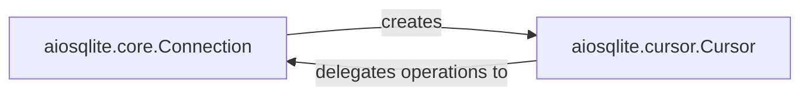

## Details

The `aiosqlite` subsystem provides an asynchronous interface for SQLite database interactions, built around two central components: `aiosqlite.core.Connection` and `aiosqlite.cursor.Cursor`. The `Connection` component manages the lifecycle of the database connection, including establishment, transaction control, and closure. It serves as the entry point for obtaining `Cursor` instances. The `Cursor` component, in turn, is responsible for executing SQL statements and fetching results. A critical aspect of this architecture is the delegation pattern, where the `Cursor` component relies on the `Connection`'s internal mechanisms to perform the actual synchronous database operations, thereby maintaining the asynchronous nature of the `aiosqlite` library. This clear separation of concerns allows for efficient and non-blocking database access within asynchronous Python applications.

### aiosqlite.core.Connection
This component serves as the primary asynchronous interface for establishing and managing a SQLite database connection. It acts as an asyncio-compatible wrapper and proxy for the synchronous `sqlite3.Connection` object. Its responsibilities include asynchronously connecting to and closing the database, managing transaction lifecycle (commit/rollback), and acting as a factory for `aiosqlite.cursor.Cursor` instances. It delegates all actual synchronous database operations to an underlying execution mechanism.

**Related Classes/Methods**:

- <a href="https://github.com/omnilib/aiosqlite/blob/main/aiosqlite/core.py#L45-L356" target="_blank" rel="noopener noreferrer">`aiosqlite.core.Connection`:45-356</a>

### aiosqlite.cursor.Cursor
This component provides the asynchronous interface for executing SQL statements and fetching results. It is an asyncio-compatible wrapper and proxy for the synchronous `sqlite3.Cursor` object. Its responsibilities include asynchronously executing SQL queries (e.g., execute, executemany, executescript), fetching results (fetchone, fetchmany, fetchall), and supporting asynchronous iteration over query results. It delegates all SQL execution and data retrieval operations to its parent `aiosqlite.core.Connection`'s underlying execution mechanism.

**Related Classes/Methods**: _None_

### [FAQ](https://github.com/CodeBoarding/GeneratedOnBoardings/tree/main?tab=readme-ov-file#faq)