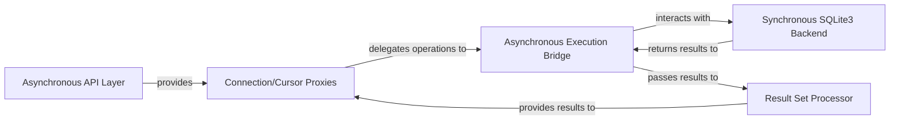

## Details

The `aiosqlite` library acts as an asynchronous wrapper for the synchronous Python `sqlite3` module, enabling non-blocking database interactions within `asyncio` applications. Its architecture is composed of an **Asynchronous API Layer** that serves as the primary user interface, which then leverages **Connection/Cursor Proxies** to manage asynchronous database sessions. These proxies offload blocking operations to an **Asynchronous Execution Bridge**, a critical component that executes synchronous `sqlite3` calls in a separate thread to prevent event loop blocking. The **Asynchronous Execution Bridge** directly interfaces with the **Synchronous SQLite3 Backend** (the standard `sqlite3` module), receiving raw results. For data retrieval, a **Result Set Processor** handles the asynchronous fetching and formatting of query results, delivering them back to the **Connection/Cursor Proxies** for consumption by the application. This layered design effectively isolates blocking I/O, providing a seamless asynchronous experience for SQLite database operations.

### Asynchronous API Layer [[Expand]](./Asynchronous_API_Layer.md)
The primary public interface for `asyncio` applications, exposing `async`/`await` methods for connecting to the database and initiating operations. It serves as the entry point for all asynchronous interactions with `aiosqlite`.

**Related Classes/Methods**:

- <a href="https://github.com/omnilib/aiosqlite/blob/main/aiosqlite/core.py#L359-L384" target="_blank" rel="noopener noreferrer">`aiosqlite.core.connect`:359-384</a>
- <a href="https://github.com/omnilib/aiosqlite/blob/main/aiosqlite/core.py#L45-L356" target="_blank" rel="noopener noreferrer">`aiosqlite.core.Connection`:45-356</a>
- <a href="https://github.com/omnilib/aiosqlite/blob/main/aiosqlite/cursor.py" target="_blank" rel="noopener noreferrer">`aiosqlite.cursor.Cursor`</a>

### Connection/Cursor Proxies [[Expand]](./Connection_Cursor_Proxies.md)
`asyncio`-compatible wrappers around the synchronous `sqlite3.Connection` and `sqlite3.Cursor` objects. They manage the lifecycle of the underlying synchronous resources, expose asynchronous methods for database operations, and implement `async with` context management to ensure proper resource acquisition and release.

**Related Classes/Methods**:

- <a href="https://github.com/omnilib/aiosqlite/blob/main/aiosqlite/core.py" target="_blank" rel="noopener noreferrer">`aiosqlite.core.Connection.__aenter__`</a>
- <a href="https://github.com/omnilib/aiosqlite/blob/main/aiosqlite/core.py" target="_blank" rel="noopener noreferrer">`aiosqlite.core.Connection.__aexit__`</a>
- <a href="https://github.com/omnilib/aiosqlite/blob/main/aiosqlite/core.py" target="_blank" rel="noopener noreferrer">`aiosqlite.core.Connection.cursor`</a>
- <a href="https://github.com/omnilib/aiosqlite/blob/main/aiosqlite/core.py" target="_blank" rel="noopener noreferrer">`aiosqlite.core.Connection.commit`</a>
- <a href="https://github.com/omnilib/aiosqlite/blob/main/aiosqlite/core.py" target="_blank" rel="noopener noreferrer">`aiosqlite.core.Connection.rollback`</a>
- <a href="https://github.com/omnilib/aiosqlite/blob/main/aiosqlite/cursor.py" target="_blank" rel="noopener noreferrer">`aiosqlite.cursor.Cursor.__aenter__`</a>
- <a href="https://github.com/omnilib/aiosqlite/blob/main/aiosqlite/cursor.py" target="_blank" rel="noopener noreferrer">`aiosqlite.cursor.Cursor.__aexit__`</a>
- <a href="https://github.com/omnilib/aiosqlite/blob/main/aiosqlite/cursor.py" target="_blank" rel="noopener noreferrer">`aiosqlite.cursor.Cursor.execute`</a>
- <a href="https://github.com/omnilib/aiosqlite/blob/main/aiosqlite/cursor.py" target="_blank" rel="noopener noreferrer">`aiosqlite.cursor.Cursor.fetchone`</a>
- <a href="https://github.com/omnilib/aiosqlite/blob/main/aiosqlite/cursor.py" target="_blank" rel="noopener noreferrer">`aiosqlite.cursor.Cursor.fetchmany`</a>
- <a href="https://github.com/omnilib/aiosqlite/blob/main/aiosqlite/cursor.py" target="_blank" rel="noopener noreferrer">`aiosqlite.cursor.Cursor.fetchall`</a>
- <a href="https://github.com/omnilib/aiosqlite/blob/main/aiosqlite/cursor.py" target="_blank" rel="noopener noreferrer">`aiosqlite.cursor.Cursor.__aiter__`</a>

### Asynchronous Execution Bridge [[Expand]](./Asynchronous_Execution_Bridge.md)
The core internal mechanism responsible for bridging asynchronous calls from the `Connection/Cursor Proxies` to the synchronous `sqlite3` operations. It utilizes `asyncio.to_thread` or similar threading mechanisms to execute blocking database calls in a separate thread, preventing the `asyncio` event loop from being blocked.

**Related Classes/Methods**:

- <a href="https://github.com/omnilib/aiosqlite/blob/main/aiosqlite/core.py#L112-L122" target="_blank" rel="noopener noreferrer">`aiosqlite.core._execute`:112-122</a>
- <a href="https://github.com/omnilib/aiosqlite/blob/main/aiosqlite/cursor.py#L30-L32" target="_blank" rel="noopener noreferrer">`aiosqlite.cursor._execute`:30-32</a>
- <a href="https://github.com/omnilib/aiosqlite/blob/main/aiosqlite/core.py#L161-L174" target="_blank" rel="noopener noreferrer">`aiosqlite.core.close`:161-174</a>
- <a href="https://github.com/omnilib/aiosqlite/blob/main/aiosqlite/core.py#L153-L155" target="_blank" rel="noopener noreferrer">`aiosqlite.core.commit`:153-155</a>
- <a href="https://github.com/omnilib/aiosqlite/blob/main/aiosqlite/core.py#L157-L159" target="_blank" rel="noopener noreferrer">`aiosqlite.core.rollback`:157-159</a>

### Result Set Processor
Handles the asynchronous retrieval, processing, and transformation of raw query results obtained from the `Synchronous SQLite3 Backend` (via the `Asynchronous Execution Bridge`) into `asyncio`-friendly iterators or lists for the `Cursor Proxy`.

**Related Classes/Methods**:

- <a href="https://github.com/omnilib/aiosqlite/blob/main/aiosqlite/cursor.py" target="_blank" rel="noopener noreferrer">`aiosqlite.cursor.Cursor.fetchone`</a>
- <a href="https://github.com/omnilib/aiosqlite/blob/main/aiosqlite/cursor.py" target="_blank" rel="noopener noreferrer">`aiosqlite.cursor.Cursor.fetchmany`</a>
- <a href="https://github.com/omnilib/aiosqlite/blob/main/aiosqlite/cursor.py" target="_blank" rel="noopener noreferrer">`aiosqlite.cursor.Cursor.fetchall`</a>
- <a href="https://github.com/omnilib/aiosqlite/blob/main/aiosqlite/cursor.py" target="_blank" rel="noopener noreferrer">`aiosqlite.cursor.Cursor._fetch_chunked`</a>
- <a href="https://github.com/omnilib/aiosqlite/blob/main/aiosqlite/cursor.py" target="_blank" rel="noopener noreferrer">`aiosqlite.cursor.Cursor.__aiter__`</a>

### Synchronous SQLite3 Backend
Represents the standard Python `sqlite3` module and the underlying SQLite database. This is where all blocking I/O operations and direct database interactions occur. It is external to `aiosqlite`'s direct control flow but is the ultimate target of its operations.

**Related Classes/Methods**:

### [FAQ](https://github.com/CodeBoarding/GeneratedOnBoardings/tree/main?tab=readme-ov-file#faq)