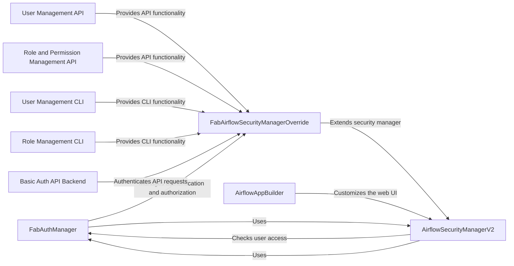

## Component Details

The API and User Interface component provides the entry point for users and external systems to interact with Airflow. It encompasses the web UI built with Flask App Builder (FAB), REST API endpoints, authentication and authorization mechanisms, and CLI commands for managing users, roles, and permissions. The component leverages FAB for UI generation and security management, offering features like user authentication, role-based access control, and permission synchronization. It exposes API endpoints for managing Airflow resources and provides CLI tools for administrative tasks.

### FabAuthManager
The FabAuthManager class is responsible for managing authentication and authorization within Airflow, integrating with Flask App Builder (FAB). It provides methods for checking user authorization against various resources (DAGs, connections, variables, etc.) and for retrieving API endpoints. It interacts with the security manager to enforce access control policies.
- **Related Classes/Methods**: `airflow.providers.fab.src.airflow.providers.fab.auth_manager.fab_auth_manager.FabAuthManager`

### FabAirflowSecurityManagerOverride
The FabAirflowSecurityManagerOverride class extends FAB's security manager to provide Airflow-specific security features. It handles user authentication via various methods (LDAP, OAuth, database), manages roles and permissions, and synchronizes permissions for DAGs. It interacts with the FAB database to manage users, roles, and permissions.
- **Related Classes/Methods**: `airflow.providers.fab.src.airflow.providers.fab.auth_manager.security_manager.override.FabAirflowSecurityManagerOverride`

### AirflowSecurityManagerV2
The AirflowSecurityManagerV2 class is used in the Airflow web UI to handle security-related tasks. It checks user access to different resources and integrates with the FabAuthManager to determine authorization. It interacts with Flask App Builder to manage user sessions and authentication.
- **Related Classes/Methods**: `airflow.providers.fab.src.airflow.providers.fab.www.security_manager.AirflowSecurityManagerV2`

### AirflowAppBuilder
The AirflowAppBuilder class extends FAB's AppBuilder to customize the Airflow web UI. It adds views, menus, and permissions to the UI. It interacts with Flask App Builder to build the web UI.
- **Related Classes/Methods**: `airflow.providers.fab.src.airflow.providers.fab.www.extensions.init_appbuilder.AirflowAppBuilder`

### User Management API
These API endpoints provide functionality for managing users via the Airflow API. They handle requests to create, read, update, and delete users. They interact with the security manager to enforce access control policies and the FAB database to manage user data.
- **Related Classes/Methods**: `airflow.providers.fab.src.airflow.providers.fab.auth_manager.api_endpoints.user_endpoint`

### Role and Permission Management API
These API endpoints provide functionality for managing roles and permissions via the Airflow API. They handle requests to create, read, update, and delete roles. They interact with the security manager to enforce access control policies and the FAB database to manage role and permission data.
- **Related Classes/Methods**: `airflow.providers.fab.src.airflow.providers.fab.auth_manager.api_endpoints.role_and_permission_endpoint`

### User Management CLI
These CLI commands provide command-line interface for managing users. They interact with the security manager and the FAB database to perform the requested operations.
- **Related Classes/Methods**: `airflow.providers.fab.src.airflow.providers.fab.auth_manager.cli_commands.user_command`

### Role Management CLI
These CLI commands provide command-line interface for managing roles. They interact with the security manager and the FAB database to perform the requested operations.
- **Related Classes/Methods**: `airflow.providers.fab.src.airflow.providers.fab.auth_manager.cli_commands.role_command`

### Basic Auth API Backend
Implements Basic Auth for the Airflow API. It handles user authentication and authorization for API requests. It interacts with the security manager to validate user credentials and permissions.
- **Related Classes/Methods**: `airflow.providers.fab.src.airflow.providers.fab.auth_manager.api.auth.backend.basic_auth`
