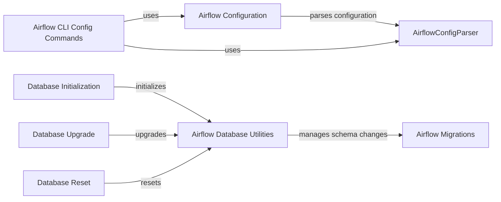

## Component Details

The Configuration and Metadata Storage subsystem in Airflow is responsible for managing the application's settings and the metadata associated with its operations. It handles loading configuration from files and environment variables, providing a consistent interface for accessing these settings. Additionally, it manages the Airflow metadata database, ensuring that information about DAGs, tasks, and runs is stored and accessed reliably. The subsystem also includes tools for initializing, upgrading, and managing the database schema.

### Airflow Configuration
This component provides a centralized way to access Airflow's configuration settings. It reads configuration values from the airflow.cfg file and environment variables, allowing different parts of the application to retrieve configuration parameters. It relies on AirflowConfigParser to parse the configuration file.
- **Related Classes/Methods**: `airflow.configuration`

### AirflowConfigParser
This component is responsible for parsing the airflow.cfg configuration file. It provides methods for reading, writing, and validating configuration values. It is used by the Airflow Configuration component to manage the configuration settings.
- **Related Classes/Methods**: `airflow.configuration.AirflowConfigParser`

### Airflow CLI Config Commands
This component implements the `airflow config` CLI commands, providing users with tools to view, edit, and validate Airflow's configuration. It uses AirflowConfigParser to interact with the configuration and provides subcommands like `show_config`, `get_value`, `lint_config`, and `update_config`.
- **Related Classes/Methods**: `airflow.cli.commands.config_command`

### Airflow Database Utilities
This component provides utility functions for interacting with the Airflow database. It includes functions for initializing, upgrading, resetting, and downgrading the database. It uses Airflow Migrations to manage database schema changes.
- **Related Classes/Methods**: `airflow.utils.db`

### Airflow Migrations
This component handles database schema migrations, ensuring that the database schema is compatible with the current Airflow version. It is used by the Airflow Database Utilities component for database management.
- **Related Classes/Methods**: `airflow.migrations`

### Database Initialization
This component initializes the Airflow database, creating the necessary tables and schemas. It is part of the Airflow Database Utilities.
- **Related Classes/Methods**: `airflow.utils.db:initdb`

### Database Upgrade
This component upgrades the Airflow database schema to the latest version, applying any necessary changes. It is part of the Airflow Database Utilities.
- **Related Classes/Methods**: `airflow.utils.db:upgradedb`

### Database Reset
This component resets the Airflow database, deleting all data and recreating the schema. It is part of the Airflow Database Utilities.
- **Related Classes/Methods**: `airflow.utils.db:resetdb`
