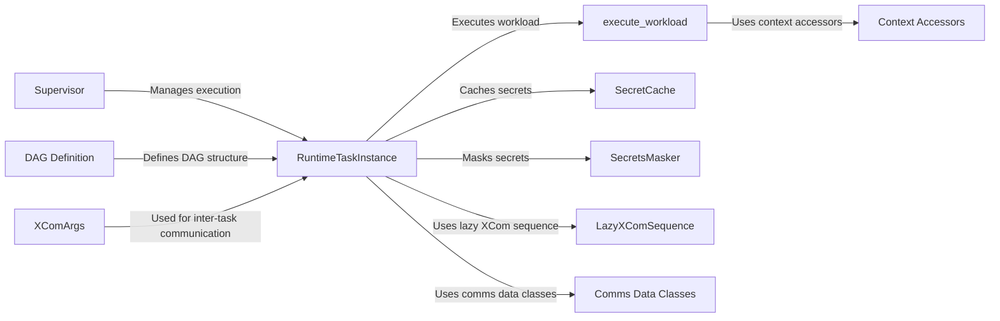

## Component Details

The Extensibility and Task SDK component in Airflow provides a framework for defining and executing tasks, emphasizing extensibility and customizability. It encompasses features like automatic XCom management, data serialization, and remote task execution. The core of this component revolves around defining DAGs, managing task execution, handling inter-task communication, and providing access to external resources like secrets and variables. It allows users to extend Airflow with custom operators, hooks, and sensors, tailoring it to specific needs and integrating with custom systems. The Task SDK simplifies task definition and execution, making Airflow more adaptable and user-friendly.

### RuntimeTaskInstance
The RuntimeTaskInstance manages the execution of a single task instance within Airflow. It handles various aspects of task execution, including template rendering, XCom interactions, and retrieving task-related information. It serves as the central point for coordinating the different components involved in executing a task.
- **Related Classes/Methods**: `airflow.task-sdk.src.airflow.sdk.execution_time.task_runner.RuntimeTaskInstance`

### execute_workload
The execute_workload function is the entry point for running the actual task's code. It receives the task's context and executes the defined workload. This function is responsible for orchestrating the execution of the task's logic and handling any exceptions that may occur.
- **Related Classes/Methods**: `airflow.task-sdk.src.airflow.sdk.execution_time.execute_workload`

### Context Accessors
Context Accessors provide a simplified way to access connections, variables, and asset-related information within the task execution context. These accessors abstract away the complexity of retrieving and manipulating these resources, making it easier for task developers to interact with external systems and data.
- **Related Classes/Methods**: `airflow.task-sdk.src.airflow.sdk.execution_time.context.ConnectionAccessor`, `airflow.task-sdk.src.airflow.sdk.execution_time.context.VariableAccessor`, `airflow.task-sdk.src.airflow.sdk.execution_time.context._AssetRefResolutionMixin`, `airflow.task-sdk.src.airflow.sdk.execution_time.context.OutletEventAccessor`, `airflow.task-sdk.src.airflow.sdk.execution_time.context._AssetEventAccessorsMixin`, `airflow.task-sdk.src.airflow.sdk.execution_time.context.OutletEventAccessors`, `airflow.task-sdk.src.airflow.sdk.execution_time.context.InletEventsAccessors`, `airflow.task-sdk.src.airflow.sdk.execution_time.context.TriggeringAssetEventsAccessor`

### SecretCache
The SecretCache component caches secrets, variables, and connection URIs to improve performance and reduce the load on the backend. By caching these resources, the system can avoid repeatedly fetching them from the backend, resulting in faster task execution times.
- **Related Classes/Methods**: `airflow.task-sdk.src.airflow.sdk.execution_time.cache.SecretCache`

### SecretsMasker
The SecretsMasker component is responsible for masking sensitive information (secrets) in logs and other outputs to prevent accidental exposure. It ensures that secrets are not inadvertently revealed during task execution, enhancing the security of the system.
- **Related Classes/Methods**: `airflow.task-sdk.src.airflow.sdk.execution_time.secrets_masker`, `airflow.task-sdk.src.airflow.sdk.execution_time.secrets_masker.SecretsMasker`, `airflow.task-sdk.src.airflow.sdk.execution_time.secrets_masker.RedactedIO`

### LazyXComSequence
The LazyXComSequence provides a lazy sequence for accessing XCom data. This is particularly useful when dealing with large amounts of data, as it avoids loading all the data into memory at once. Instead, it fetches the data on demand, improving memory efficiency.
- **Related Classes/Methods**: `airflow.task-sdk.src.airflow.sdk.execution_time.lazy_sequence.LazyXComSequence`

### Comms Data Classes
Comms Data Classes are data classes representing results and events related to assets, XComs, connections, variables, and DAG run states. These classes are used for communication and data transfer within the system, facilitating the exchange of information between different components.
- **Related Classes/Methods**: `airflow.task-sdk.src.airflow.sdk.execution_time.comms.AssetResult`, `airflow.task-sdk.src.airflow.sdk.execution_time.comms.AssetEventSourceTaskInstance`, `airflow.task-sdk.src.airflow.sdk.execution_time.comms.AssetEventResult`, `airflow.task-sdk.src.airflow.sdk.execution_time.comms.AssetEventsResult`, `airflow.task-sdk.src.airflow.sdk.execution_time.comms.AssetEventDagRunReferenceResult`, `airflow.task-sdk.src.airflow.sdk.execution_time.comms.XComResult`, `airflow.task-sdk.src.airflow.sdk.execution_time.comms.ConnectionResult`, `airflow.task-sdk.src.airflow.sdk.execution_time.comms.VariableResult`, `airflow.task-sdk.src.airflow.sdk.execution_time.comms.DagRunStateResult`, `airflow.task-sdk.src.airflow.sdk.execution_time.comms.PrevSuccessfulDagRunResult`, `airflow.task-sdk.src.airflow.sdk.execution_time.comms.TaskStatesResult`, `airflow.task-sdk.src.airflow.sdk.execution_time.comms.DeferTask`

### DAG Definition
The DAG Definition components define the structure and parameters of a DAG (Directed Acyclic Graph). These components are used to define the workflow and its parameters, including tasks, dependencies, and execution settings. It provides a way to define the overall structure of the workflow.
- **Related Classes/Methods**: `airflow.task-sdk.src.airflow.sdk.definitions.dag.DAG`, `airflow.task-sdk.src.airflow.sdk.definitions.param.Param`, `airflow.task-sdk.src.airflow.sdk.definitions.param.ParamsDict`, `airflow.task-sdk.src.airflow.sdk.definitions.param.DagParam`

### XComArgs
XComArgs represent an XCom (cross-communication) argument, allowing tasks to exchange data. Different types of XComArgs are used for different scenarios, such as mapping, zipping, and concatenating XCom values. It provides a mechanism for tasks to pass data to each other.
- **Related Classes/Methods**: `airflow.task-sdk.src.airflow.sdk.definitions.xcom_arg.XComArg`, `airflow.task-sdk.src.airflow.sdk.definitions.xcom_arg.PlainXComArg`, `airflow.task-sdk.src.airflow.sdk.definitions.xcom_arg.MapXComArg`, `airflow.task-sdk.src.airflow.sdk.definitions.xcom_arg.ZipXComArg`, `airflow.task-sdk.src.airflow.sdk.definitions.xcom_arg.ConcatXComArg`

### Supervisor
The Supervisor manages the execution of tasks in subprocesses, providing monitoring, logging, and communication capabilities. It ensures that tasks are executed in a controlled and isolated environment, enhancing the stability and security of the system.
- **Related Classes/Methods**: `airflow.task-sdk.src.airflow.sdk.execution_time.supervisor`, `airflow.task-sdk.src.airflow.sdk.execution_time.supervisor.WatchedSubprocess`, `airflow.task-sdk.src.airflow.sdk.execution_time.supervisor.ActivitySubprocess`, `airflow.task-sdk.src.airflow.sdk.execution_time.supervisor.InProcessSupervisorComms`, `airflow.task-sdk.src.airflow.sdk.execution_time.supervisor.InProcessTestSupervisor`
