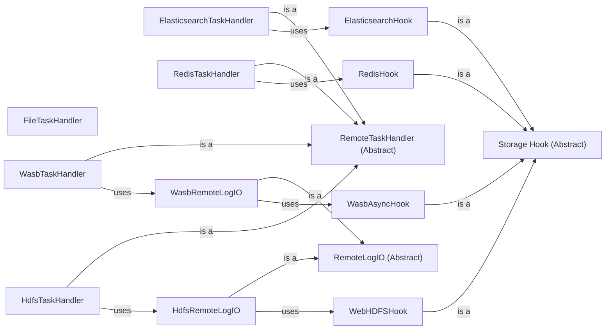

## Component Details

The Logging and Monitoring Infrastructure in Airflow provides a comprehensive solution for managing and tracking the execution of workflows. It encompasses various components responsible for handling task logs, storing them in different storage systems, and providing hooks for interacting with these systems. The infrastructure supports local file storage as well as remote storage options like Azure Blob Storage (WASB), Hadoop Distributed File System (HDFS), Elasticsearch, and Redis. This allows users to monitor the health and performance of Airflow workflows, identify potential issues, and gain insights into task execution.

### FileTaskHandler
The FileTaskHandler is responsible for handling task logs that are stored in local files. It provides methods for logging messages to files and retrieving the content of these log files. This handler is the default option for storing task logs and is suitable for simple deployments where remote storage is not required.
- **Related Classes/Methods**: `airflow.providers.standard.src.airflow.providers.standard.log.file_task_handler.FileTaskHandler`

### RemoteTaskHandler (Abstract)
The RemoteTaskHandler serves as an abstract base class for task handlers that store logs in remote storage systems. It defines the common interface for interacting with remote storage and provides methods for reading and writing logs. Concrete implementations of this class, such as WasbTaskHandler and HdfsTaskHandler, handle the specifics of interacting with different remote storage systems.
- **Related Classes/Methods**: _None_

### WasbTaskHandler
The WasbTaskHandler handles task logs that are stored in Azure Blob Storage (WASB). It extends the RemoteTaskHandler and provides methods for reading and writing logs to WASB. This handler utilizes the WasbRemoteLogIO component for interacting with WASB.
- **Related Classes/Methods**: `airflow.providers.microsoft.azure.src.airflow.providers.microsoft.azure.log.wasb_task_handler.WasbTaskHandler`

### HdfsTaskHandler
The HdfsTaskHandler handles task logs that are stored in the Hadoop Distributed File System (HDFS). It extends the RemoteTaskHandler and provides methods for reading and writing logs to HDFS. This handler utilizes the HdfsRemoteLogIO component for interacting with HDFS.
- **Related Classes/Methods**: `airflow.providers.apache.hdfs.src.airflow.providers.apache.hdfs.log.hdfs_task_handler.HdfsTaskHandler`

### ElasticsearchTaskHandler
The ElasticsearchTaskHandler handles task logs that are stored in Elasticsearch. It provides methods for querying and retrieving logs from Elasticsearch. This handler utilizes the ElasticsearchHook component for interacting with Elasticsearch.
- **Related Classes/Methods**: `airflow.providers.elasticsearch.src.airflow.providers.elasticsearch.log.es_task_handler.ElasticsearchTaskHandler`

### RedisTaskHandler
The RedisTaskHandler handles task logs that are stored in Redis. It provides methods for reading and writing logs to Redis. This handler utilizes the RedisHook component for interacting with Redis.
- **Related Classes/Methods**: `airflow.providers.redis.src.airflow.providers.redis.log.redis_task_handler.RedisTaskHandler`

### RemoteLogIO (Abstract)
The RemoteLogIO serves as an abstract base class for components that handle the actual interaction with remote storage systems. It defines the common interface for uploading, reading, and checking the existence of log files in remote storage. Concrete implementations of this class, such as WasbRemoteLogIO and HdfsRemoteLogIO, handle the specifics of interacting with different remote storage systems.
- **Related Classes/Methods**: _None_

### WasbRemoteLogIO
The WasbRemoteLogIO provides methods for interacting with Azure Blob Storage (WASB) for remote log storage. It handles uploading, reading, and checking the existence of log files in WASB. This component utilizes the WasbAsyncHook for asynchronous interaction with WASB.
- **Related Classes/Methods**: `airflow.providers.microsoft.azure.src.airflow.providers.microsoft.azure.log.wasb_task_handler.WasbRemoteLogIO`

### HdfsRemoteLogIO
The HdfsRemoteLogIO provides methods for interacting with HDFS for remote log storage. It handles uploading, reading, and checking the existence of log files in HDFS. This component utilizes the WebHDFSHook for interacting with HDFS.
- **Related Classes/Methods**: `airflow.providers.apache.hdfs.src.airflow.providers.apache.hdfs.log.hdfs_task_handler.HdfsRemoteLogIO`

### Storage Hook (Abstract)
The Storage Hook serves as an abstract base class for components that provide hooks for interacting with different storage systems. It defines the common interface for connecting to storage systems and executing commands. Concrete implementations of this class, such as ElasticsearchHook, WebHDFSHook, RedisHook and WasbAsyncHook, handle the specifics of interacting with different storage systems.
- **Related Classes/Methods**: _None_

### ElasticsearchHook
The ElasticsearchHook provides a hook for interacting with Elasticsearch. It allows executing queries and retrieving data from Elasticsearch.
- **Related Classes/Methods**: `airflow.providers.elasticsearch.src.airflow.providers.elasticsearch.hooks.elasticsearch.ElasticsearchSQLHook`, `airflow.providers.elasticsearch.src.airflow.providers.elasticsearch.hooks.elasticsearch.ElasticsearchPythonHook`

### WebHDFSHook
The WebHDFSHook provides a hook for interacting with HDFS via WebHDFS. It allows checking for paths, loading files, and reading files from HDFS.
- **Related Classes/Methods**: `airflow.providers.apache.hdfs.src.airflow.providers.apache.hdfs.hooks.webhdfs.WebHDFSHook`

### RedisHook
The RedisHook provides a hook for interacting with Redis. It allows connecting to Redis and executing commands.
- **Related Classes/Methods**: `airflow.providers.redis.src.airflow.providers.redis.hooks.redis.RedisHook`

### WasbAsyncHook
The WasbAsyncHook provides asynchronous methods for interacting with Azure Blob Storage (WASB).
- **Related Classes/Methods**: `airflow.providers.microsoft.azure.src.airflow.providers.microsoft.azure.hooks.wasb.WasbAsyncHook`
