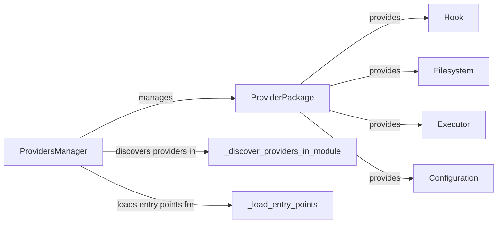

## Component Details

The Provider Ecosystem in Airflow enables the integration of external systems by managing the discovery, loading, and configuration of providers. The `ProvidersManager` is central to this process, discovering and initializing providers defined as `ProviderPackage` objects. These packages contain entry points for various Airflow components like hooks, filesystems, and executors, extending Airflow's capabilities to interact with diverse external services. The system dynamically loads these components, allowing Airflow to adapt to different environments and technologies without requiring core code modifications.

### ProvidersManager
The `ProvidersManager` is the central component responsible for managing Airflow providers. It handles the discovery, initialization, and configuration of provider packages. It determines which providers are available and makes their components accessible to Airflow.
- **Related Classes/Methods**: `airflow.providers_manager.ProvidersManager`

### ProviderPackage
A `ProviderPackage` represents a single provider, encapsulating its metadata and entry points for various Airflow components. It acts as a container for hooks, operators, sensors, and other extensions that a provider offers.
- **Related Classes/Methods**: `airflow.providers_manager.ProviderPackage`

### Hook
Hooks are interfaces to external systems. Providers register hooks that allow Airflow to interact with databases, APIs, and other services. The `ProviderPackage` makes these hooks available to Airflow through entry points.
- **Related Classes/Methods**: `airflow.providers_manager.hook`

### Filesystem
Filesystems allow Airflow to interact with different file storage systems. Providers can register filesystems that extend Airflow's ability to read and write files from various sources.
- **Related Classes/Methods**: `airflow.providers_manager.filesystem`

### Executor
Executors determine how tasks are executed in Airflow. Providers can register custom executors that allow Airflow to run tasks in different environments, such as Kubernetes or Celery.
- **Related Classes/Methods**: `airflow.providers_manager.executor`

### Configuration
Providers can supply configuration settings that customize Airflow's behavior. These settings can be used to configure connections, logging, and other aspects of Airflow.
- **Related Classes/Methods**: `airflow.providers_manager.configuration`

### _discover_providers_in_module
This function discovers providers within a given Python module by inspecting its contents for provider-related metadata. It identifies potential provider packages based on specific naming conventions or markers.
- **Related Classes/Methods**: `airflow.providers_manager._discover_providers_in_module`

### _load_entry_points
This function loads entry points for a specific type (e.g., 'apache_airflow_hooks') from a provider package. It uses the `entry_points` mechanism to dynamically load components registered by the provider.
- **Related Classes/Methods**: `airflow.providers_manager._load_entry_points`
