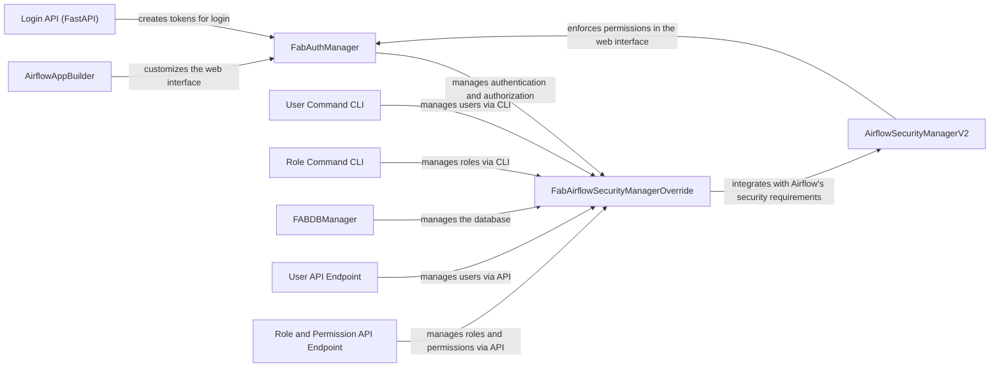

## Component Details

The Security and Access Control component in Airflow manages user authentication and authorization, ensuring that only authorized users can access and modify workflows and sensitive data. It integrates with Flask App Builder (FAB) for user management, role-based access control, and authentication via various methods like LDAP, OAuth, and database. The component also provides CLI commands and API endpoints for managing users, roles, and permissions. It protects the Airflow environment from unauthorized access and ensures data security.

### FabAuthManager
The central class for managing authentication and authorization using Flask App Builder. It provides methods for checking user permissions, retrieving API endpoints, and synchronizing roles. It serves as the main interface for interacting with FAB's security features within Airflow.
- **Related Classes/Methods**: `airflow.providers.fab.src.airflow.providers.fab.auth_manager.fab_auth_manager.FabAuthManager`

### FabAirflowSecurityManagerOverride
Overrides the default Flask App Builder security manager to integrate with Airflow's specific security requirements. It handles user creation, role management, permission synchronization, and authentication via various methods like LDAP, OAuth, and database. It customizes FAB's security manager to align with Airflow's needs.
- **Related Classes/Methods**: `airflow.providers.fab.src.airflow.providers.fab.auth_manager.security_manager.override.FabAirflowSecurityManagerOverride`

### AirflowSecurityManagerV2
Handles security checks within the Airflow web interface, determining whether a user has access to specific views or features. It interacts with the FabAuthManager to enforce permissions. It acts as a gatekeeper for web UI access.
- **Related Classes/Methods**: `airflow.providers.fab.src.airflow.providers.fab.www.security_manager.AirflowSecurityManagerV2`

### AirflowAppBuilder
Extends Flask App Builder to customize the web interface with Airflow-specific views, menus, and permissions. It initializes the application and adds views for managing Airflow resources. It tailors the FAB web interface for Airflow.
- **Related Classes/Methods**: `airflow.providers.fab.src.airflow.providers.fab.www.extensions.init_appbuilder.AirflowAppBuilder`

### User Command CLI
CLI commands for managing users, including creating, deleting, resetting passwords, and managing roles. It provides a command-line interface for user management.
- **Related Classes/Methods**: `airflow.providers.fab.src.airflow.providers.fab.auth_manager.cli_commands.user_command`

### Role Command CLI
CLI commands for managing roles, including creating, deleting, adding/removing permissions, exporting, and importing. It provides a command-line interface for role management.
- **Related Classes/Methods**: `airflow.providers.fab.src.airflow.providers.fab.auth_manager.cli_commands.role_command`

### FABDBManager
Manages database operations related to Flask App Builder, such as creating, upgrading, and downgrading the database. It handles database interactions for FAB.
- **Related Classes/Methods**: `airflow.providers.fab.src.airflow.providers.fab.auth_manager.models.db.FABDBManager`

### User API Endpoint
API endpoints for managing users, including getting, creating, updating, and deleting users. It provides an API for user management.
- **Related Classes/Methods**: `airflow.providers.fab.src.airflow.providers.fab.auth_manager.api_endpoints.user_endpoint`

### Role and Permission API Endpoint
API endpoints for managing roles and permissions, including getting, creating, updating, and deleting roles and permissions. It provides an API for role and permission management.
- **Related Classes/Methods**: `airflow.providers.fab.src.airflow.providers.fab.auth_manager.api_endpoints.role_and_permission_endpoint`

### Login API (FastAPI)
FastAPI endpoints for user login and token creation. It provides an API for user authentication and token generation.
- **Related Classes/Methods**: `airflow.providers.fab.src.airflow.providers.fab.auth_manager.api_fastapi.routes.login`, `airflow.providers.fab.src.airflow.providers.fab.auth_manager.api_fastapi.services.login.FABAuthManagerLogin`
