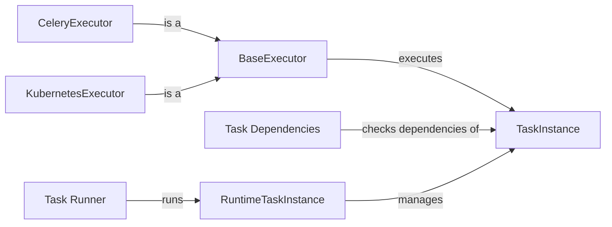

## Component Details

The Task Execution and Management component is responsible for orchestrating the execution of individual tasks within an Airflow DAG. It involves managing task instances, scheduling tasks on various executors (e.g., Celery, Kubernetes), monitoring their progress, and handling dependencies and failures. This component ensures tasks are executed in the correct order as defined in the DAG, manages cross-communication (XCom), and handles task-level retries. It interacts with executors to delegate task execution and relies on dependency checks to ensure tasks are ready to run.

### BaseExecutor
The BaseExecutor is an abstract class that defines the interface for all executors in Airflow. It provides the core methods for starting, syncing, and ending executors, as well as handling task execution and communication. Concrete executors inherit from this class and implement the specific logic for their execution environment.
- **Related Classes/Methods**: `airflow.executors.base_executor.BaseExecutor`

### CeleryExecutor
The CeleryExecutor leverages Celery, a distributed task queue, to execute tasks across a cluster of worker nodes. It extends the BaseExecutor and implements the necessary logic for interacting with Celery, including submitting tasks to the Celery queue and monitoring their progress.
- **Related Classes/Methods**: `airflow.providers.celery.src.airflow.providers.celery.executors.celery_executor.CeleryExecutor`

### KubernetesExecutor
The KubernetesExecutor utilizes Kubernetes pods to execute tasks. It extends the BaseExecutor and implements the logic for creating and managing Kubernetes pods for each task, allowing for scalable and isolated task execution within a Kubernetes cluster.
- **Related Classes/Methods**: `airflow.providers.cncf.kubernetes.src.airflow.providers.cncf.kubernetes.executors.kubernetes_executor.KubernetesExecutor`

### TaskInstance
The TaskInstance represents a specific run of a task in a DAG. It stores information about the task's state (e.g., running, success, failed), execution time, and other relevant details. It serves as the central object for tracking the progress and status of individual task executions.
- **Related Classes/Methods**: `airflow.models.taskinstance.TaskInstance`

### RuntimeTaskInstance
The RuntimeTaskInstance handles the execution of a task at runtime within the task-sdk. It is responsible for rendering templates, pulling XCom values (cross-communication), and pushing XCom values. It orchestrates the actual execution of the task logic.
- **Related Classes/Methods**: `airflow.task-sdk.src.airflow.sdk.execution_time.task_runner.RuntimeTaskInstance`

### Task Dependencies
This module contains various dependency classes that define the conditions for a task to be eligible for execution. These dependencies check for things like DAG run status, task concurrency, pool availability, and other factors. Before a TaskInstance is executed, these dependencies are evaluated to ensure that all prerequisites are met.
- **Related Classes/Methods**: `airflow.ti_deps.deps.DagrunRunningDep`, `airflow.ti_deps.deps.MappedTaskIsExpanded`, `airflow.ti_deps.deps.TaskConcurrencyDep`, `airflow.ti_deps.deps.DagTISlotsAvailableDep`, `airflow.ti_deps.deps.DagUnpausedDep`, `airflow.ti_deps.deps.MappedTaskUpstreamDep`, `airflow.ti_deps.deps.PrevDagrunDep`, `airflow.ti_deps.deps.TaskNotRunningDep`, `airflow.ti_deps.deps.RunnableExecDateDep`, `airflow.ti_deps.deps.ReadyToRescheduleDep`, `airflow.ti_deps.deps.BaseTIDep`, `airflow.ti_deps.deps.NotInRetryPeriodDep`, `airflow.ti_deps.deps.NotPreviouslySkippedDep`, `airflow.ti_deps.deps.ValidStateDep`, `airflow.ti_deps.deps.ExecDateAfterStartDateDep`, `airflow.ti_deps.deps.PoolSlotsAvailableDep`, `airflow.ti_deps.deps.TriggerRuleDep`

### Task Runner
The task runner is responsible for running the task, including startup, run, and finalize steps. It orchestrates the execution of the task logic within the RuntimeTaskInstance.
- **Related Classes/Methods**: `airflow.task-sdk.src.airflow.sdk.execution_time.task_runner:startup`, `airflow.task-sdk.src.airflow.sdk.execution_time.task_runner:run`, `airflow.task-sdk.src.airflow.sdk.execution_time.task_runner:finalize`
