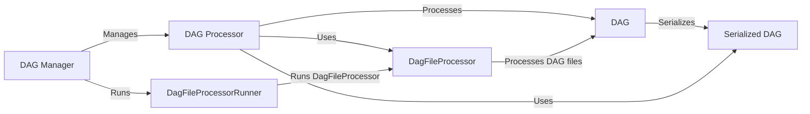

## Component Details

The Workflow Definition and Scheduling component in Airflow is responsible for defining, storing, scheduling, and executing workflows represented as DAGs (Directed Acyclic Graphs). It encompasses the core DAG model, serialization/deserialization mechanisms, and the scheduler that determines when DAGs should be executed based on defined schedules and dependencies. The component manages the lifecycle of DAGs, ensuring they are properly loaded, parsed, and updated, and orchestrates the overall execution of workflows.

### DAG
Represents a workflow as a Directed Acyclic Graph, defining the tasks to be executed and their dependencies. It provides methods for adding tasks, setting dependencies, and managing the DAG's schedule and execution context.
- **Related Classes/Methods**: `airflow.models.dag`

### Serialized DAG
Represents a serialized version of a DAG, used for storing and retrieving DAG definitions from a database or other storage. It handles the conversion of DAG objects into a format suitable for persistence and later retrieval.
- **Related Classes/Methods**: `airflow.models.serialized_dag`

### DAG Processor
Responsible for processing DAG files, parsing them, and extracting the DAG definitions. It monitors DAG files for changes and triggers DAG parsing when necessary, ensuring that DAG definitions are up-to-date.
- **Related Classes/Methods**: `airflow.dag_processing.processor`

### DAG Manager
Manages the lifecycle of DAG processors, ensuring that DAG files are continuously monitored and processed. It handles the scheduling and execution of DAG processors, maintaining a pool of processors to handle DAG parsing.
- **Related Classes/Methods**: `airflow.dag_processing.manager`

### DagFileProcessor
Responsible for parsing individual DAG files and extracting DAG objects. It handles the actual parsing of the Python files containing DAG definitions and loading the DAG objects into memory.
- **Related Classes/Methods**: `airflow.dag_processing.processor`

### DagFileProcessorRunner
Runs the DagFileProcessor in a separate process. This allows DAG parsing to happen in isolation and prevents errors in one DAG file from crashing the entire Airflow scheduler.
- **Related Classes/Methods**: `airflow.dag_processing.processor`
