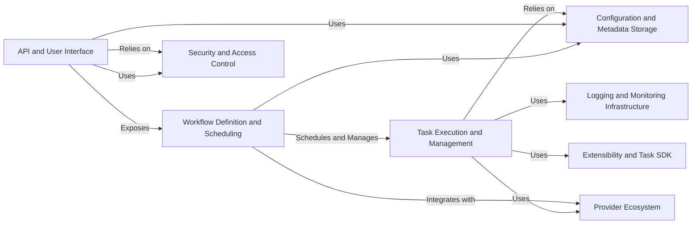

## Component Details

Airflow is a platform designed to programmatically author, schedule, and monitor workflows. It uses Directed Acyclic Graphs (DAGs) to manage workflow orchestration. Key processes include defining DAGs, scheduling tasks, executing tasks on various executors, managing task dependencies, and providing a user interface and API for monitoring and managing workflows. Security, configuration, and logging are also critical aspects of the system.

### Workflow Definition and Scheduling
This component is responsible for defining, storing, and scheduling workflows (DAGs). It includes the core DAG model, serialization/deserialization logic, and the scheduler that determines when DAGs should be executed. It manages DAG processing, ensuring DAGs are properly loaded, parsed, and updated. It also handles the overall orchestration of when workflows should run based on defined schedules and dependencies.
- **Related Classes/Methods**: `airflow.models.dag`, `airflow.dag_processing.processor`, `airflow.dag_processing.manager`, `airflow.models.serialized_dag`, `airflow.task-sdk.src.airflow.sdk.definitions.dag`

### Task Execution and Management
This component handles the execution of individual tasks within a DAG. It manages task instances, schedules tasks on executors (e.g., Celery, Kubernetes), monitors task progress, and handles dependencies and failures. It includes logic for XCom (cross-communication) management, task-level retries, and ensuring tasks are executed in the correct order according to the DAG definition. It interfaces with executors to delegate task execution.
- **Related Classes/Methods**: `airflow.executors.base_executor`, `airflow.models.taskinstance`, `airflow.ti_deps`, `airflow.task-sdk.src.airflow.sdk.execution_time.task_runner`

### API and User Interface
This component provides the API endpoints and webserver interface for interacting with Airflow. It includes routes for managing DAGs, tasks, connections, variables, and other core resources. It handles authentication and authorization for API requests and provides a user interface for monitoring and managing workflows, viewing logs, triggering DAG runs, and managing the Airflow environment.
- **Related Classes/Methods**: `airflow.api_fastapi.core_api.app`, `airflow.api_fastapi.core_api.routes`, `airflow.api_fastapi.core_api.datamodels`

### Provider Ecosystem
This component manages the integration of external systems into Airflow through providers. It includes classes and functions for discovering, loading, and configuring providers. It handles the registration of hooks, operators, sensors, and other provider-specific components, allowing Airflow to interact with a wide range of external services and technologies like databases, cloud platforms, and APIs. Providers extend Airflow's capabilities to interact with various external systems.
- **Related Classes/Methods**: `airflow.providers_manager`, `airflow.configuration`

### Security and Access Control
This component handles authentication and authorization for Airflow. It includes classes and functions for managing users, roles, and permissions. It integrates with various authentication backends, such as FAB and OpenID Connect, to ensure that only authorized users can access and modify workflows and sensitive data. It protects the Airflow environment from unauthorized access and ensures data security.
- **Related Classes/Methods**: `airflow.api_fastapi.auth.managers`, `airflow.providers.fab.src.airflow.providers.fab.auth_manager`, `airflow.security`

### Configuration and Metadata Storage
This component is responsible for loading, validating, and managing Airflow's configuration and metadata. It includes classes and functions for parsing configuration files, retrieving configuration values, applying configuration changes, and managing the Airflow metadata database (typically PostgreSQL or MySQL). This component ensures that Airflow is properly configured and that all metadata about DAGs, tasks, and runs is stored and managed consistently.
- **Related Classes/Methods**: `airflow.configuration`, `airflow.cli.commands.config_command`, `airflow.utils.db`, `airflow.migrations`

### Logging and Monitoring Infrastructure
This component handles logging and monitoring for Airflow. It includes classes and functions for configuring logging handlers, formatting log messages, retrieving task logs, and monitoring task progress. It supports remote logging to various storage systems (e.g., S3, GCS), allowing users to track the execution of workflows and identify potential issues. It provides insights into the health and performance of Airflow workflows.
- **Related Classes/Methods**: `airflow.utils.log`, `airflow.logging_config`

### Extensibility and Task SDK
This component provides a set of tools and APIs for defining and executing tasks in Airflow, focusing on extensibility. It includes features such as automatic XCom management, data serialization, and remote task execution. It provides a framework for extending Airflow with custom operators, hooks, and sensors, allowing users to tailor Airflow to their specific needs and integrate with custom systems. The Task SDK simplifies task definition and execution.
- **Related Classes/Methods**: `airflow.task-sdk.src.airflow.sdk.execution_time`, `airflow.task-sdk.src.airflow.sdk.definitions`