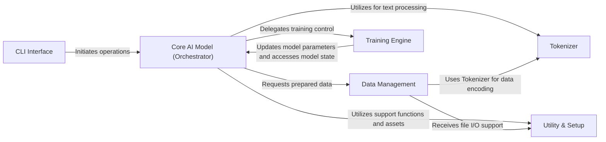

## Details

The `aitextgen` project is structured around a central `Core AI Model (Orchestrator)` that manages the lifecycle of a Hugging Face Transformer model. User interaction begins with the `CLI Interface`, which orchestrates calls to the `Core AI Model`. Data preparation is handled by `Data Management`, which relies on the `Tokenizer` for text encoding. Model training is delegated to the `Training Engine`, which in turn updates the `Core AI Model`. General support functions and asset management are provided by the `Utility & Setup` component, which is utilized by both the `Core AI Model` and `Data Management`. This modular design ensures clear separation of concerns, facilitating both development and understanding of data flow.

### CLI Interface
The primary user-facing component, providing command-line entry points for initiating training and text generation workflows. It parses user commands, validates arguments, and orchestrates calls to the Core AI Model (Orchestrator).

**Related Classes/Methods**:

- <a href="https://github.com/minimaxir/aitextgen/blob/master/aitextgen/cli.py#L24-L31" target="_blank" rel="noopener noreferrer">`aitextgen.cli.train_cli`:24-31</a>
- <a href="https://github.com/minimaxir/aitextgen/blob/master/aitextgen/cli.py#L34-L41" target="_blank" rel="noopener noreferrer">`aitextgen.cli.generate_cli`:34-41</a>

### Core AI Model (Orchestrator)
The central orchestrator of the aitextgen library. It encapsulates the underlying Hugging Face Transformer model, manages its loading, device placement (CPU/GPU), and coordinates both training and inference processes. This component acts as the main interface for interacting with the AI model.

**Related Classes/Methods**:

- <a href="https://github.com/minimaxir/aitextgen/blob/master/aitextgen/aitextgen.py#L46-L865" target="_blank" rel="noopener noreferrer">`aitextgen.aitextgen.aitextgen`:46-865</a>
- <a href="https://github.com/minimaxir/aitextgen/blob/master/aitextgen/aitextgen.py#L276-L468" target="_blank" rel="noopener noreferrer">`aitextgen.aitextgen.generate`:276-468</a>
- <a href="https://github.com/minimaxir/aitextgen/blob/master/aitextgen/aitextgen.py#L551-L766" target="_blank" rel="noopener noreferrer">`aitextgen.aitextgen.train`:551-766</a>

### Data Management
Responsible for ingesting raw text data, preparing it for model consumption, and managing dataset persistence. It interacts with the Tokenizer to encode text into numerical formats suitable for the AI model.

**Related Classes/Methods**:

- <a href="https://github.com/minimaxir/aitextgen/blob/master/aitextgen/TokenDataset.py#L22-L224" target="_blank" rel="noopener noreferrer">`aitextgen.TokenDataset.TokenDataset`:22-224</a>
- <a href="https://github.com/minimaxir/aitextgen/blob/master/aitextgen/TokenDataset.py#L266-L357" target="_blank" rel="noopener noreferrer">`aitextgen.TokenDataset.encode_tokens_from_file`:266-357</a>
- <a href="https://github.com/minimaxir/aitextgen/blob/master/aitextgen/TokenDataset.py#L360-L421" target="_blank" rel="noopener noreferrer">`aitextgen.TokenDataset.encode_tokens_from_list`:360-421</a>

### Tokenizer
Manages the tokenization process, converting raw text into numerical tokens and vice-versa. It handles loading pre-trained tokenizers and applying them to input data.

**Related Classes/Methods**:

- <a href="https://github.com/minimaxir/aitextgen/blob/master/aitextgen/tokenizers.py#L1-L1000" target="_blank" rel="noopener noreferrer">`aitextgen.tokenizers.aitextgenTokenizer`:1-1000</a>

### Training Engine
Manages the entire model training lifecycle. This includes defining the training loop, handling optimization, checkpointing model states, reporting progress, and managing layer freezing/unfreezing. It leverages PyTorch Lightning for efficient training.

**Related Classes/Methods**:

- <a href="https://github.com/minimaxir/aitextgen/blob/master/aitextgen/train.py#L17-L83" target="_blank" rel="noopener noreferrer">`aitextgen.train.ATGTransformer`:17-83</a>
- <a href="https://github.com/minimaxir/aitextgen/blob/master/aitextgen/train.py#L86-L286" target="_blank" rel="noopener noreferrer">`aitextgen.train.ATGProgressBar`:86-286</a>

### Utility & Setup
A collection of general-purpose utility functions and classes that support various aspects of the aitextgen library. This includes functionalities like downloading pre-trained models, handling file operations, and providing Google Colab-specific integrations.

**Related Classes/Methods**:

- <a href="https://github.com/minimaxir/aitextgen/blob/master/aitextgen/utils.py#L10-L42" target="_blank" rel="noopener noreferrer">`aitextgen.utils.download_gpt2`:10-42</a>
- 
- 

### [FAQ](https://github.com/CodeBoarding/GeneratedOnBoardings/tree/main?tab=readme-ov-file#faq)