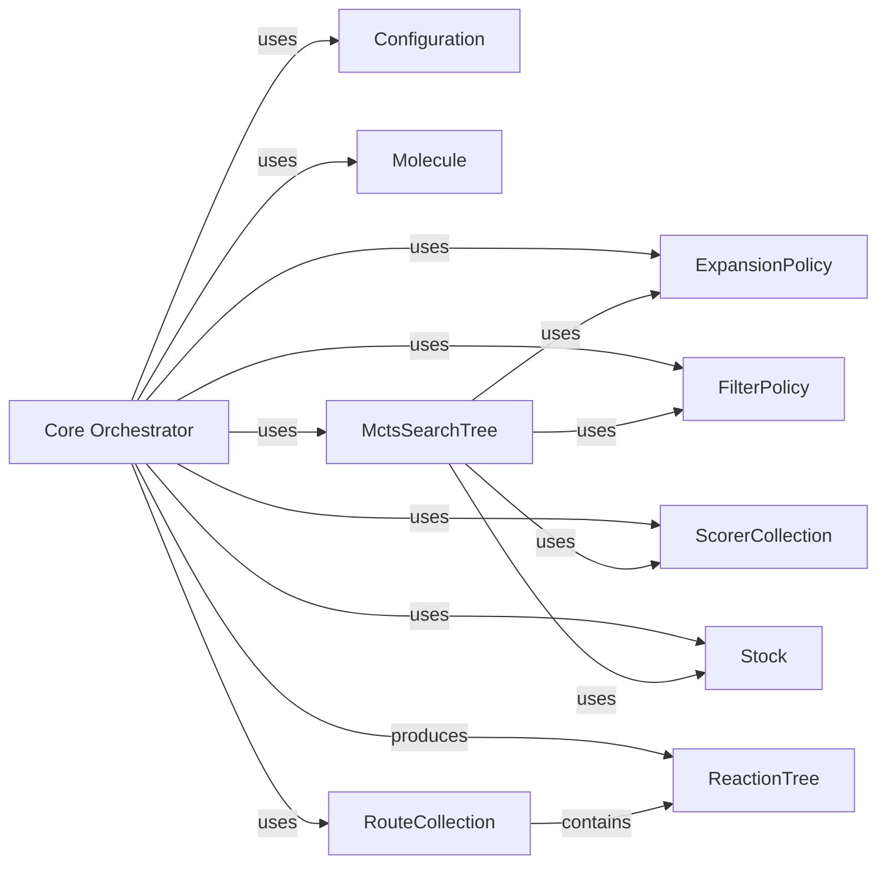

## Details

The Core Orchestrator component, primarily embodied by the aizynthfinder.aizynthfinder.AiZynthFinder class, serves as the central control unit for the entire retrosynthesis process. Its main purpose is to initiate, coordinate, and manage the complex workflow of finding synthesis routes for a target molecule. This includes setting up the search environment, executing the search algorithm, collecting and processing the results, and providing a high-level interface for user interaction.

### Core Orchestrator [[Expand]](./Core_Orchestrator.md)
The central component that initiates, coordinates, and manages the entire retrosynthesis process, from setting up the search to collecting and preparing results. It acts as the primary interface for users to interact with the aizynthfinder system.

**Related Classes/Methods**:

- <a href="https://github.com/MolecularAI/aizynthfinder/aizynthfinder/aizynthfinder.py#L1-L1" target="_blank" rel="noopener noreferrer">`aizynthfinder.aizynthfinder.AiZynthFinder` (1:1)</a>

### Configuration
Manages and provides access to all settings and parameters required for the retrosynthesis search, including policies, scorers, and search algorithm parameters.

**Related Classes/Methods**:

- <a href="https://github.com/MolecularAI/aizynthfinder/aizynthfinder/context/config.py#L1-L1" target="_blank" rel="noopener noreferrer">`aizynthfinder.context.config` (1:1)</a>

### Molecule
Represents a chemical molecule, providing properties and methods for chemical operations within the retrosynthesis process.

**Related Classes/Methods**:

- <a href="https://github.com/MolecularAI/aizynthfinder/aizynthfinder/chem/mol.py#L1-L1" target="_blank" rel="noopener noreferrer">`aizynthfinder.chem.mol` (1:1)</a>

### MctsSearchTree
Implements the Monte Carlo Tree Search algorithm, responsible for exploring the retrosynthesis search space and building the search tree.

**Related Classes/Methods**:

- <a href="https://github.com/MolecularAI/aizynthfinder/aizynthfinder/search/mcts/search.py#L1-L1" target="_blank" rel="noopener noreferrer">`aizynthfinder.search.mcts.search` (1:1)</a>

### RouteCollection
Collects, stores, and manages the discovered synthesis routes, providing functionalities for organizing and accessing the final retrosynthesis plans.

**Related Classes/Methods**:

- <a href="https://github.com/MolecularAI/aizynthfinder/aizynthfinder/analysis/routes.py#L1-L1" target="_blank" rel="noopener noreferrer">`aizynthfinder.analysis.routes` (1:1)</a>

### ExpansionPolicy
Defines the strategy for expanding nodes in the search tree by proposing new retro-reactions based on available templates or models.

**Related Classes/Methods**:

- <a href="https://github.com/MolecularAI/aizynthfinder/aizynthfinder/context/policy/policies.py#L1-L1" target="_blank" rel="noopener noreferrer">`aizynthfinder.context.policy.policies` (1:1)</a>

### FilterPolicy
Applies rules and criteria to filter out undesirable or invalid reactions and molecules during the search process, ensuring chemical feasibility and relevance.

**Related Classes/Methods**:

- <a href="https://github.com/MolecularAI/aizynthfinder/aizynthfinder/context/policy/policies.py#L1-L1" target="_blank" rel="noopener noreferrer">`aizynthfinder.context.policy.policies` (1:1)</a>

### ScorerCollection
Manages a collection of scoring functions used to evaluate the quality, cost, or other properties of molecules and reaction routes, guiding the search and ranking results.

**Related Classes/Methods**:

- <a href="https://github.com/MolecularAI/aizynthfinder/aizynthfinder/context/scoring/collection.py#L1-L1" target="_blank" rel="noopener noreferrer">`aizynthfinder.context.scoring.collection` (1:1)</a>

### Stock
Provides an interface to query and check the availability of molecules in a predefined stock or database, crucial for identifying purchasable starting materials.

**Related Classes/Methods**:

- <a href="https://github.com/MolecularAI/aizynthfinder/aizynthfinder/context/stock/stock.py#L1-L1" target="_blank" rel="noopener noreferrer">`aizynthfinder.context.stock.stock` (1:1)</a>

### ReactionTree
Represents a complete retrosynthesis pathway as a tree structure, detailing the sequence of reactions and intermediate molecules leading to the target.

**Related Classes/Methods**:

- <a href="https://github.com/MolecularAI/aizynthfinder/aizynthfinder/reactiontree.py#L1-L1" target="_blank" rel="noopener noreferrer">`aizynthfinder.reactiontree` (1:1)</a>

### [FAQ](https://github.com/CodeBoarding/GeneratedOnBoardings/tree/main?tab=readme-ov-file#faq)