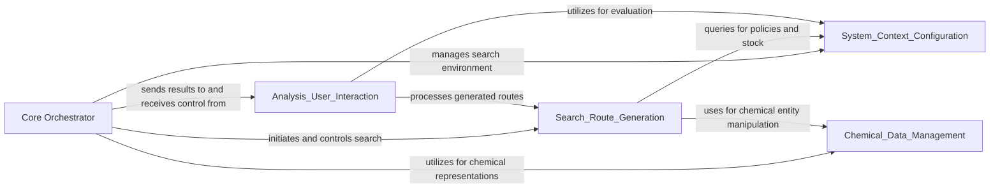

## Details

Final Architecture Overview for `aizynthfinder`

### Core Orchestrator [[Expand]](./Core_Orchestrator.md)
The central component that initiates, coordinates, and manages the entire retrosynthesis process, from setting up the search to collecting and preparing results.

**Related Classes/Methods**:

- <a href="https://github.com/MolecularAI/aizynthfinder/aizynthfinder/aizynthfinder.py#L1-L1" target="_blank" rel="noopener noreferrer">`aizynthfinder.aizynthfinder` (1:1)</a>

### [FAQ](https://github.com/CodeBoarding/GeneratedOnBoardings/tree/main?tab=readme-ov-file#faq)