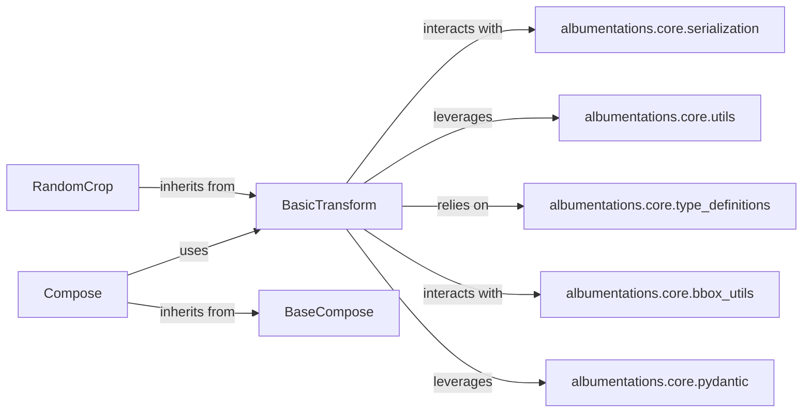

## Component Details

The `BasicTransform` subsystem forms the core of the `albumentations` library, providing a standardized, extensible framework for defining and applying image augmentation operations. It ensures consistency across various transformations and facilitates their composition into complex pipelines.

### BasicTransform
This is the foundational abstract base class for all individual image augmentation operations. It defines the common interface and contract that every transform must adhere to, including methods for applying the transformation (`apply`), generating random parameters (`get_params`), and handling serialization. It serves as the blueprint for extensibility, allowing new augmentations to be easily integrated while ensuring a consistent API across the library.

**Related Classes/Methods**:

- <a href="https://github.com/albumentations-team/albumentations/blob/master/albumentations/core/transforms_interface.py#L1-L1" target="_blank" rel="noopener noreferrer">`albumentations.core.transforms_interface.BasicTransform` (1:1)</a>

### BaseCompose
An abstract base class that provides the common interface and logic for all composition classes (e.g., `Compose`, `OneOf`). It defines how a sequence of `BasicTransform` instances should be processed, including methods for applying them in order and handling their serialization.

**Related Classes/Methods**:

- <a href="https://github.com/albumentations-team/albumentations/blob/master/albumentations/core/composition.py#L1-L1" target="_blank" rel="noopener noreferrer">`albumentations.core.composition.BaseCompose` (1:1)</a>

### Compose
A concrete composition class that inherits from `BaseCompose`. It applies a list of `BasicTransform` instances sequentially to the input data. This is the primary mechanism for building linear augmentation pipelines.

**Related Classes/Methods**:

- <a href="https://github.com/albumentations-team/albumentations/blob/master/albumentations/core/composition.py#L1-L1" target="_blank" rel="noopener noreferrer">`albumentations.core.composition.Compose` (1:1)</a>

### RandomCrop
A concrete image augmentation class that inherits from `BasicTransform`. It implements a specific image transformation (randomly cropping an image) by overriding the `apply` and `get_params` methods defined in `BasicTransform`.

**Related Classes/Methods**:

- `albumentations.augmentations.transforms.RandomCrop` (1:1)

### albumentations.core.serialization
This module provides functions and mechanisms for serializing and deserializing `BasicTransform` instances and entire augmentation pipelines. This is crucial for saving and loading pre-defined augmentation configurations.

**Related Classes/Methods**:

- <a href="https://github.com/albumentations-team/albumentations/blob/master/albumentations/core/serialization.py#L1-L1" target="_blank" rel="noopener noreferrer">`albumentations.core.serialization` (1:1)</a>

### albumentations.core.utils
A module providing various utility functions that support the application of transforms and the generation of their parameters. These functions often handle common tasks like image resizing, padding, or data type conversions, which are frequently used by `BasicTransform` implementations.

**Related Classes/Methods**:

- <a href="https://github.com/albumentations-team/albumentations/blob/master/albumentations/core/utils.py#L1-L1" target="_blank" rel="noopener noreferrer">`albumentations.core.utils` (1:1)</a>

### albumentations.core.type_definitions
This module defines common type hints and data structures used throughout the `albumentations` library, ensuring consistent type checking and clarity in function signatures, especially for parameters and return values of `BasicTransform` methods.

**Related Classes/Methods**:

- <a href="https://github.com/albumentations-team/albumentations/blob/master/albumentations/core/type_definitions.py#L1-L1" target="_blank" rel="noopener noreferrer">`albumentations.core.type_definitions` (1:1)</a>

### albumentations.core.bbox_utils
This module contains utility functions specifically designed for handling bounding box transformations. Many `BasicTransform` implementations that operate on images with associated bounding boxes will utilize these functions to ensure that the bounding box coordinates are correctly adjusted after the image transformation.

**Related Classes/Methods**:

- <a href="https://github.com/albumentations-team/albumentations/blob/master/albumentations/core/bbox_utils.py#L1-L1" target="_blank" rel="noopener noreferrer">`albumentations.core.bbox_utils` (1:1)</a>

### albumentations.core.pydantic
This module integrates Pydantic for robust parameter validation within `BasicTransform` instances. It allows transforms to define their expected parameters with type hints and validation rules, ensuring that transforms are initialized with correct and valid arguments.

**Related Classes/Methods**:

- <a href="https://github.com/albumentations-team/albumentations/blob/master/albumentations/core/pydantic.py#L1-L1" target="_blank" rel="noopener noreferrer">`albumentations.core.pydantic` (1:1)</a>

### [FAQ](https://github.com/CodeBoarding/GeneratedOnBoardings/tree/main?tab=readme-ov-file#faq)