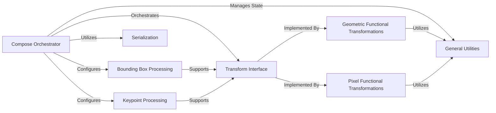

## Component Details

This analysis focuses on the `Compose` component, which serves as the central orchestrator for image augmentation pipelines. It chains together various transformations, manages data flow, and ensures consistency across the pipeline, including handling associated annotations like bounding boxes and keypoints.

### Compose Orchestrator
The core orchestration engine for image augmentation pipelines. `Compose` allows sequential or conditional application of various transformations, managing the overall flow, data preprocessing, postprocessing, and ensuring consistent random state management across the pipeline, especially in multi-worker environments. It also handles strict validation of inputs and supports serialization of the entire pipeline.

**Related Classes/Methods**:

- <a href="https://github.com/albumentations-team/albumentations/blob/master/albumentations/core/composition.py#L0-L0" target="_blank" rel="noopener noreferrer">`albumentations.core.composition.Compose` (0:0)</a>

### Transform Interface
This component defines the abstract base classes (`BasicTransform`, `DualTransform`, `ImageOnlyTransform`) that all individual transformations must adhere to. It establishes the contract for how transformations operate on different data types (images, bounding boxes, keypoints, masks), allowing `Compose` to interact with any transform in a standardized manner.

**Related Classes/Methods**:

- <a href="https://github.com/albumentations-team/albumentations/blob/master/albumentations/core/transforms_interface.py#L0-L0" target="_blank" rel="noopener noreferrer">`albumentations.core.transforms_interface.BasicTransform` (0:0)</a>
- <a href="https://github.com/albumentations-team/albumentations/blob/master/albumentations/core/transforms_interface.py#L0-L0" target="_blank" rel="noopener noreferrer">`albumentations.core.transforms_interface.DualTransform` (0:0)</a>
- <a href="https://github.com/albumentations-team/albumentations/blob/master/albumentations/core/transforms_interface.py#L0-L0" target="_blank" rel="noopener noreferrer">`albumentations.core.transforms_interface.ImageOnlyTransform` (0:0)</a>

### Bounding Box Processing
This component provides specialized classes (`BboxParams`, `BboxProcessor`) and utility functions for handling bounding box data within the augmentation pipeline. It is responsible for defining bounding box properties, and for preprocessing, validating, and postprocessing bounding box coordinates in conjunction with image transformations.

**Related Classes/Methods**:

- <a href="https://github.com/albumentations-team/albumentations/blob/master/albumentations/core/bbox_utils.py#L0-L0" target="_blank" rel="noopener noreferrer">`albumentations.core.bbox_utils.BboxParams` (0:0)</a>
- <a href="https://github.com/albumentations-team/albumentations/blob/master/albumentations/core/bbox_utils.py#L0-L0" target="_blank" rel="noopener noreferrer">`albumentations.core.bbox_utils.BboxProcessor` (0:0)</a>

### Keypoint Processing
Similar to bounding box processing, this component offers specialized classes (`KeypointParams`, `KeypointsProcessor`) and utility functions for managing keypoint data. It handles the definition of keypoint properties and the preprocessing, validation, and postprocessing of keypoint coordinates during augmentation.

**Related Classes/Methods**:

- <a href="https://github.com/albumentations-team/albumentations/blob/master/albumentations/core/keypoints_utils.py#L0-L0" target="_blank" rel="noopener noreferrer">`albumentations.core.keypoints_utils.KeypointParams` (0:0)</a>
- <a href="https://github.com/albumentations-team/albumentations/blob/master/albumentations/core/keypoints_utils.py#L0-L0" target="_blank" rel="noopener noreferrer">`albumentations.core.keypoints_utils.KeypointsProcessor` (0:0)</a>

### Serialization
This component provides the mechanisms for converting augmentation pipelines and individual transforms into a storable format (e.g., dictionary) and reconstructing them. This enables saving and loading complex augmentation configurations.

**Related Classes/Methods**:

- <a href="https://github.com/albumentations-team/albumentations/blob/master/albumentations/core/serialization.py#L0-L0" target="_blank" rel="noopener noreferrer">`albumentations.core.serialization` (0:0)</a>

### General Utilities
This component encompasses a collection of general-purpose helper functions used across various parts of the library. This includes functions for random number generation (used by `Compose` for its internal random state), data type conversions, and common data validation and manipulation operations.

**Related Classes/Methods**:

- <a href="https://github.com/albumentations-team/albumentations/blob/master/albumentations/augmentations/utils.py#L0-L0" target="_blank" rel="noopener noreferrer">`albumentations.augmentations.utils` (0:0)</a>
- <a href="https://github.com/albumentations-team/albumentations/blob/master/albumentations/core/utils.py#L0-L0" target="_blank" rel="noopener noreferrer">`albumentations.core.utils` (0:0)</a>

### Geometric Functional Transformations
This module contains low-level, functional implementations of various geometric transformations (e.g., rotation, flip, resize, affine). These functions directly operate on image data, and are typically wrapped by `BasicTransform` instances that `Compose` orchestrates.

**Related Classes/Methods**:

- <a href="https://github.com/albumentations-team/albumentations/blob/master/albumentations/augmentations/geometric/functional.py#L0-L0" target="_blank" rel="noopener noreferrer">`albumentations.augmentations.geometric.functional` (0:0)</a>

### Pixel Functional Transformations
This module provides low-level, functional implementations for pixel-level transformations (e.g., brightness, contrast, blur, noise). Similar to geometric transformations, these functions directly modify pixel values and are utilized by `BasicTransform` instances within the `Compose` pipeline.

**Related Classes/Methods**:

- <a href="https://github.com/albumentations-team/albumentations/blob/master/albumentations/augmentations/pixel/functional.py#L0-L0" target="_blank" rel="noopener noreferrer">`albumentations.augmentations.pixel.functional` (0:0)</a>

### [FAQ](https://github.com/CodeBoarding/GeneratedOnBoardings/tree/main?tab=readme-ov-file#faq)