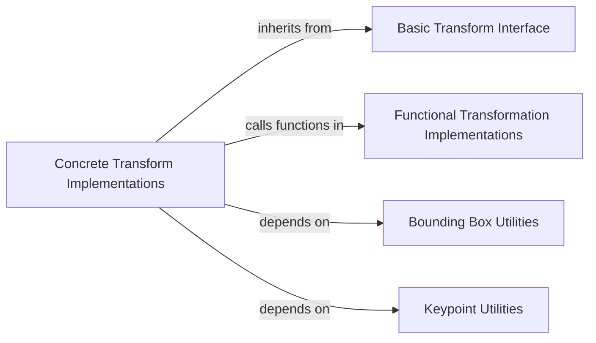

## Component Details

Here's the final component overview for `Concrete Transform Implementations`, including detailed descriptions, relevant source files, and their interactions with other fundamental components of the Albumentations library.

### Concrete Transform Implementations
This component encompasses the vast collection of specific transformation classes that inherit from `albumentations.core.transforms_interface.BasicTransform` (or its specialized subclasses like `ImageOnlyTransform` and `DualTransform`). These classes, such as `RandomCrop`, `GaussianBlur`, `ShiftScaleRotate`, `Normalize`, and `ToTensorV2`, encapsulate the logic for applying a wide array of image augmentation algorithms. They form the practical backbone of the library, providing the actual augmentation capabilities by defining how transformations are configured and applied to various data types (images, masks, bounding boxes, keypoints).

**Related Classes/Methods**:

- `GaussianBlur` (1:1)
- `RandomCrop` (1:1)
- `ShiftScaleRotate` (1:1)
- `Normalize` (1:1)
- `ToTensorV2` (1:1)

### Basic Transform Interface
This component defines the foundational interface and common application flow for all Albumentations transformations. It includes abstract base classes like `BasicTransform`, `ImageOnlyTransform`, and `DualTransform`, which establish the contract for how transformations should be structured, initialized, and how they interact with different data types (images, masks, bounding boxes, keypoints). It ensures consistency and extensibility across all concrete transformations.

**Related Classes/Methods**:

- `BasicTransform` (1:1)
- `ImageOnlyTransform` (1:1)
- `DualTransform` (1:1)

### Functional Transformation Implementations
This component consists of low-level, stateless functions that implement the core image processing algorithms. These functions perform the actual pixel manipulations, geometric transformations, or other data alterations. They are typically called by the concrete transform classes to execute the specific augmentation logic, promoting code reusability and separation of concerns.

**Related Classes/Methods**:

- `fpixel.separable_convolve` (1:1)
- `fblur.create_gaussian_kernel_1d` (1:1)
- <a href="https://github.com/albumentations-team/albumentations/blob/master/albumentations/augmentations/blur/functional.py#L1-L1" target="_blank" rel="noopener noreferrer">`functional` (1:1)</a>
- <a href="https://github.com/albumentations-team/albumentations/blob/master/albumentations/augmentations/blur/functional.py#L1-L1" target="_blank" rel="noopener noreferrer">`functional` (1:1)</a>
- <a href="https://github.com/albumentations-team/albumentations/blob/master/albumentations/augmentations/blur/functional.py#L1-L1" target="_blank" rel="noopener noreferrer">`functional` (1:1)</a>

### Bounding Box Utilities
This component provides a set of utility functions specifically designed for handling bounding box transformations. These functions manage tasks such as validating bounding box formats, converting between different formats, and applying geometric transformations (like scaling, shifting, or rotating) to bounding box coordinates. They are crucial for ensuring that bounding boxes remain consistent with the transformed images.

**Related Classes/Methods**:

- <a href="https://github.com/albumentations-team/albumentations/blob/master/albumentations/core/bbox_utils.py#L1-L1" target="_blank" rel="noopener noreferrer">`bbox_utils` (1:1)</a>

### Keypoint Utilities
Similar to bounding box utilities, this component offers utility functions for managing keypoint transformations. These functions handle tasks like validating keypoint formats, converting coordinates, and applying geometric transformations to keypoints, ensuring their correct placement relative to the transformed image.

**Related Classes/Methods**:

- <a href="https://github.com/albumentations-team/albumentations/blob/master/albumentations/core/keypoints_utils.py#L1-L1" target="_blank" rel="noopener noreferrer">`keypoints_utils` (1:1)</a>

### [FAQ](https://github.com/CodeBoarding/GeneratedOnBoardings/tree/main?tab=readme-ov-file#faq)