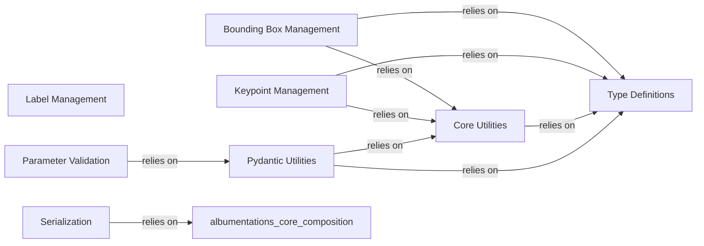

## Component Details

One paragraph explaining the functionality which is represented by this graph. What the main flow is and what is its purpose.

### Bounding Box Management
Manages all operations related to bounding boxes, including format conversion (COCO, Pascal VOC, YOLO), normalization, denormalization, filtering based on visibility and size, and applying geometric transformations. It defines BboxParams for configuration and BboxProcessor for processing.

**Related Classes/Methods**: _None_

### Keypoint Management
Handles all aspects of keypoint processing, such as format conversion (xy, yx, xya, etc.), visibility filtering, validation, and applying transformations. It provides KeypointParams for configuration and KeypointsProcessor for processing.

**Related Classes/Methods**: _None_

### Label Management
Manages the encoding, decoding, and metadata tracking of various label types (numerical, categorical). It ensures consistent label handling throughout the augmentation pipeline, including automatic encoding of string labels to numerical values.

**Related Classes/Methods**: _None_

### Core Utilities
Provides fundamental helper functions and abstract base classes (Params, DataProcessor) that are extended by other data handling components. It includes utilities for extracting image/volume shapes, formatting arguments, and serves as a central point for common functionalities.

**Related Classes/Methods**: _None_

### Type Definitions
Centralizes common type aliases, enumerations (e.g., Targets for different data types like IMAGE, BBOXES, KEYPOINTS), and constants used across the library. This ensures consistency, type safety, and reduces redundancy.

**Related Classes/Methods**: _None_

### Serialization
Enables the saving and loading of augmentation pipelines by providing mechanisms to convert transforms to and from serializable formats (dictionaries, JSON, YAML). It maintains registries for serializable and non-serializable classes to facilitate this process.

**Related Classes/Methods**: _None_

### Parameter Validation
Implements a robust parameter validation system using Pydantic models. It intercepts the initialization of transform classes to validate their parameters against schema definitions, raising appropriate errors for invalid values and providing type conversion capabilities.

**Related Classes/Methods**: _None_

### Pydantic Utilities
Offers a collection of reusable Pydantic validators and utility functions for common validation patterns. This includes ensuring numeric ranges are valid (e.g., non-decreasing, non-negative), handling type conversions, and creating standardized validation patterns, directly supporting the Parameter Validation component.

**Related Classes/Methods**: _None_

### [FAQ](https://github.com/CodeBoarding/GeneratedOnBoardings/tree/main?tab=readme-ov-file#faq)