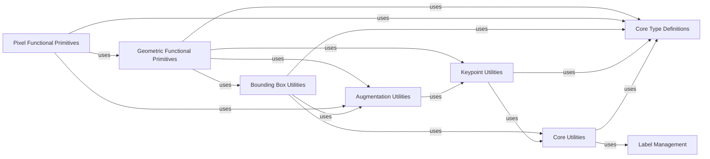

## Component Details

This overview details the Functional Primitives component within the albumentations project, along with its closely related and fundamental supporting utility components. These components collectively form the low-level computational backbone for image and annotation transformations.

### Geometric Functional Primitives
This module (`albumentations.augmentations.geometric.functional`) provides the core, stateless functions for geometric transformations (e.g., rotation, flipping, resizing, perspective, affine) applied directly to images, bounding boxes, and keypoints. It is the computational engine for all spatial augmentations.

**Related Classes/Methods**:

- <a href="https://github.com/albumentations-team/albumentations/blob/master/albumentations/augmentations/geometric/functional.py#L1-L1000" target="_blank" rel="noopener noreferrer">`albumentations.augmentations.geometric.functional` (1:1000)</a>

### Pixel Functional Primitives
This module (`albumentations.augmentations.pixel.functional`) offers low-level, stateless functions for pixel-level image manipulations (e.g., HSV shifts, solarization, posterization, blurring, noise addition). These functions directly modify pixel values without altering their spatial coordinates.

**Related Classes/Methods**:

- <a href="https://github.com/albumentations-team/albumentations/blob/master/albumentations/augmentations/pixel/functional.py#L1-L1000" target="_blank" rel="noopener noreferrer">`albumentations.augmentations.pixel.functional` (1:1000)</a>

### Bounding Box Utilities
This module (`albumentations.core.bbox_utils`) centralizes utility functions and classes (`BboxParams`, `BboxProcessor`) for managing bounding box data. It handles format conversion, normalization, denormalization, validation, and filtering of bounding boxes.

**Related Classes/Methods**:

- <a href="https://github.com/albumentations-team/albumentations/blob/master/albumentations/core/bbox_utils.py#L1-L1000" target="_blank" rel="noopener noreferrer">`albumentations.core.bbox_utils` (1:1000)</a>

### Keypoint Utilities
This module (`albumentations.core.keypoints_utils`) provides utility functions and classes (`KeypointParams`, `KeypointsProcessor`) for processing keypoint data. It includes functions for format conversion, angle normalization, validation, and filtering of keypoints.

**Related Classes/Methods**:

- <a href="https://github.com/albumentations-team/albumentations/blob/master/albumentations/core/keypoints_utils.py#L1-L1000" target="_blank" rel="noopener noreferrer">`albumentations.core.keypoints_utils` (1:1000)</a>

### Augmentation Utilities
This module (`albumentations.augmentations.utils`) contains general-purpose utility functions specifically for the `augmentations` package, such as image I/O, angle normalization decorators, and the `PCA` class for color transformations.

**Related Classes/Methods**:

- <a href="https://github.com/albumentations-team/albumentations/blob/master/albumentations/augmentations/utils.py#L1-L1000" target="_blank" rel="noopener noreferrer">`albumentations.augmentations.utils` (1:1000)</a>

### Core Utilities
This module (`albumentations.core.utils`) provides fundamental, general-purpose utility functions and abstract base classes (`Params`, `DataProcessor`) used across the entire Albumentations library for data handling, shape extraction, and serialization.

**Related Classes/Methods**:

- <a href="https://github.com/albumentations-team/albumentations/blob/master/albumentations/core/utils.py#L1-L1000" target="_blank" rel="noopener noreferrer">`albumentations.core.utils` (1:1000)</a>

### Core Type Definitions
This module (`albumentations.core.type_definitions`) defines essential type hints and constants (e.g., channel dimensions, column counts for annotations) that are used consistently across the entire Albumentations library.

**Related Classes/Methods**:

- <a href="https://github.com/albumentations-team/albumentations/blob/master/albumentations/core/type_definitions.py#L1-L1000" target="_blank" rel="noopener noreferrer">`albumentations.core.type_definitions` (1:1000)</a>

### Label Management
This module (`albumentations.core.label_manager`) is responsible for managing labels associated with augmented data, ensuring they are correctly handled during transformations.

**Related Classes/Methods**:

- <a href="https://github.com/albumentations-team/albumentations/blob/master/albumentations/core/label_manager.py#L1-L1000" target="_blank" rel="noopener noreferrer">`albumentations.core.label_manager` (1:1000)</a>

### [FAQ](https://github.com/CodeBoarding/GeneratedOnBoardings/tree/main?tab=readme-ov-file#faq)